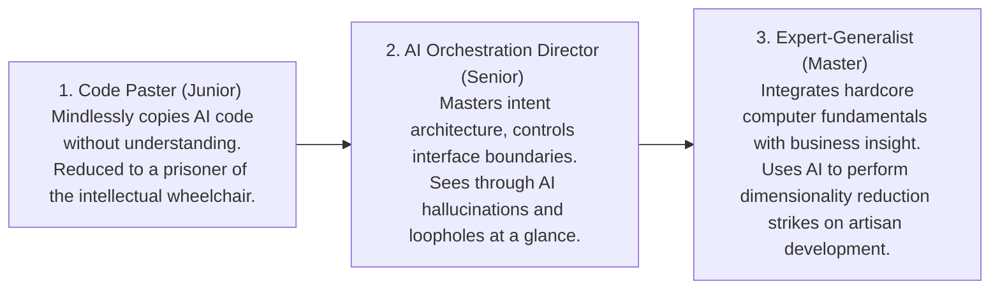

# Growing Together with AI

> "The superior man is not an implement." — "The Analects of Confucius"

The advent of every epoch-making technology is often accompanied by a utopian illusion. When large language models were opened to the public with an extremely low threshold, people cheered, believing that the resource barrier between ordinary people and geek elites had finally been broken. Since everyone can possess a super external brain that generates code with one click, shouldn't the starting line between geniuses and the mediocre be completely leveled?

However, the evolutionary logic of reality is extremely cold and counter-intuitive: the more popular AI becomes, the gap between people not only doesn't shrink, but instead widens at an exponential rate, and even in an extremely cruel way.

After AI has freed up 80% of our time dividend, we face the most severe test in our careers: will you "reinvest" this overflowing productivity back into your own brain, or will you sit in that seemingly comfortable "intellectual wheelchair" and let your core abilities gradually atrophy?

This chapter will uncover the cruel truth behind the popularization of AI and present you with a high-intensity "No-AI Offline Coding Training Schedule" and a "12-Month Skill Leap Roadmap."

## Human Folding

"Human Folding" is a metaphor heavily tinged with sociology and science fiction. It means: the popularization of super technology not only didn't "flatten" the gap in class and intellect as expected, but instead, at an exponential rate, sharply tore human society apart, even "folding" it into a cruel phenomenon of completely different dimensions.

To understand this accelerating "Human Folding," we must see through the following three extremely cruel realities:

### Upgraded Threshold
If the internet lowered the threshold for information "dissemination," AI directly reduced the marginal cost of code and information "generation" to zero. In this era flooded with "synthetic waste" and "hallucinated code" generated in batches by AI in a second, without a profound underlying knowledge base, ordinary people don't even have the ability to judge whether the AI's output is right or wrong, and can only enshrine the beautifully packaged "mediocre nonsense" of the machine as the standard; while true masters can easily penetrate the noise and pan out real gold from the gravel.

### Skill Inflation
Popularized AI allows everyone to instantly write a piece of code that runs. Many people mistakenly think this flattens the underlying skill gap, but this is a fatal illusion.

Previously, an ordinary person couldn't score 70 points, a master could score 90 points, and the output gap was 90:0. Now, AI helps the ordinary person jump directly to 70 points; but the master uses the same AI to jump to 95 points, and uses the saved time to complete 10 95-point projects in one breath. At this time, the gap between the two instantly becomes a crushing 950:70.

When the execution cost of "making it" approaches zero, the judgment of "what to make, why to make it, and to what extent is it good" becomes the only scarce commodity. And judgment comes from the classic source code you have read, the architecture pitfalls you have stepped on, and the experience you have rolled out in the mud in the past. You can never use a short prompt to instantly download the engineering taste others have accumulated over ten years.

## Intellectual Wheelchair
Faced with extremely easy-to-use AI, the crowd is polarizing.
The first type of person treats AI as an "outsourced employee": they set goals, dismantle tasks, and review results. They are getting stronger every day because AI is infinitely amplifying their subjectivity.
The second type of person treats AI as an "answer machine" and "intellectual wheelchair": when encountering slightly complex deductions, they are unwilling to think for even an extra minute, directly asking AI for the answer. The ability to think follows the biological iron law of "use it or lose it." Relying on this wheelchair long-term, the neural circuits in the brain responsible for logical reasoning will severely atrophy. In this process, they lose the ability to trial and error hands-on in the rough, thereby completely cutting off the source of "judgment." Unknowingly, they are "being trained by AI."

## The Future of Programmers
AI will not directly replace programmers, but programmers who use AI will completely eliminate programmers who do not use AI or who degenerate into appendages of AI. You need to invest the extra 80% of productivity time into the domain of "Expert-Generalist" that cannot be replaced by AI.

To complete the identity leap, you need to advance in two extreme directions:

### Advance Upwards
AI understands code, but not your users. When code becomes free, the truly expensive moats come to light: trust, distribution networks, capital, business insights. Go chat with real users, clarify every sticking point in the business flow. Knowing "what should be built" is ten thousand times more important than knowing "how to build it."

### Advance Downwards
AI can write beautiful business CRUDs, but when dealing with underlying performance tuning, concurrent race conditions, distributed consistency, and other issues, it often gives specious, fatal hallucinations. Deeply understand Linux core scheduling, database lock principles, and network protocols. When the system generated by AI crashes in a production environment, only you, with deep fundamental knowledge, can become the stabilizing force that turns the tide.

## Preventing Degeneration
Long-term reliance on the auto-completion (Tab key) and full-block code generation of large models easily triggers a terrifying software engineering sub-health phenomenon—"Technical Muscle Atrophy."

Once separated from AI assistance (for example: a highly secure, physically disconnected development environment, or a whiteboard hand-written programming interview), many originally excellent programmers will become at a loss, unable to write even basic loops, data structure conversions, or HTTP interface declarations.

To maintain your "fingertip physical memory" and the dignity of independent coding, we strongly recommend that you: proactively take out 2 hours every week, completely turn off all AI plugins and Chat windows, open a pure text editor, and perform the following high-intensity bare-typing aerobics exercises. We have designed a 4-week cycle training schedule for you:

| Training Week | Practice Subject (No-AI Exercises) | Core Assessment Points | Bare-Hand Typing Requirements (No Google / No Copilot) |
|---|---|---|---|
| Week 1: Basic Data Structures | Hand-write "Red-Black Tree Insertion" or "High-Concurrency Thread-Safe Hash Map" | Memory pointer operations, data balancing algorithms, multi-thread conflict handling. | Use only the language's native standard library, rely on no third-party packages, hand-write the correct logic. |
| Week 2: Classic Network Bottom Layer | Use native Socket API to write a simple HTTP static server from scratch. | Handshake packet parsing, TCP connection management, HTTP response header specifications. | Correctly handle client connections and manually assemble and return an HTTP/1.1 200 OK message body. |
| Week 3: Classic Async Control | Hand-write a complete state management middleware or JS async Promise chain call. | Closure state maintenance, publish-subscribe pattern, microtask queue scheduling. | Implement the underlying state machine operation mechanism of `myPromise.then().catch()` from scratch bare-handed. |
| Week 4: Bare-Hand UI Building | Hand-type on a whiteboard a complex interface with Flex/Grid nested responsive layout. | Style selector priority, box model calculation, media query breakpoints. | Without consulting any manuals, write out a high-fidelity, exquisitely grid-aligned layout bare-handed. |
Note: If you feel pain and stuttering during bare typing, don't run away; that is exactly the sign of your brain rebuilding neural synapses and resisting atrophy.

## Action Program: The 12-Month Programmer AI Cultivation Leap Roadmap
If you want to stand out in this global computing power wave, here is a customized 12-month skill refactoring roadmap for you:

### Phase 1 (Months 1 - 3): Establish Physical Defense Lines and Intent Architecture Thinking
Core Goal: Completely bid farewell to the bad habit of "mindlessly throwing commands," learn to define system boundaries.

Action Essentials:

- **Refuse Blind Copying**: When AI generates a piece of perfect logic for you, ask yourself: "What is the underlying principle of this code? What are the assumptions? When will it fail?" Code you don't understand must absolutely not be merged into the trunk.
- **Master SPET Planning Process**: Before waking up the AI to work, force yourself to write a business contract first. Integrate Git fine-grained operations into every micro-refactoring step of the AI, and proficiently master the `git reset --hard` safe regret medicine.

### Phase 2 (Months 4 - 6): Cross-Boundary Wall Breaking and Team MCP Empowerment
Core Goal: Use AI to patch up your own shortcomings, achieve full-stack crossing, and master precise feeding techniques.

Action Essentials:

- **Use AI to Break Tech Stack Barriers**: If you are frontend, try using AI to assist in writing a Python/Go backend service; and vice versa.
- **Master Tool Commands**: Master commands like `@Files`, `@Codebase`, etc., grasp the mental method of letting go of long conversations, and advanced context engineering to control Token consumption.
- **Deploy Custom Connectors**: Personally write and deploy a custom MCP Server (Model Context Protocol) for the team, connect to internal enterprise databases and private APIs, and give AI wings to the real world.

### Phase 3 (Months 7 - 9): TDD-Driven Fully Automated Verification Pipeline
Core Goal: Completely shift from "Code Reader" to "Behavior Verifier."

Action Essentials:

- **Harness Debugging Mode**: Proficiently harness the debugging mode of fully autonomous Agents (like Cline/Claude Code), let AI proactively run tests, read logs, and self-correct Bugs.
- **Deeply Implement TDD Philosophy**: Weave a high-density safety net of feature tests and contract tests, locking the non-deterministic AI in a deterministic cage.

### Phase 4 (Months 10 - 12): Multimodal Architecture Design and Cyber Digital Assets
Core Goal: Borrow the east wind of computing power to let your digital assets work for you while you sleep.

Action Essentials:

- **Master Multimodal Vision Large Models**: Achieve pixel-level one-click restoration of design drafts into code. Learn basic machine learning concepts and data cleaning, welcoming the Software 2.0 era.
- **Quickly Launch Independent Business Ideas**: In the AI era, the development cycle from an idea to a launchable MVP (Minimum Viable Product) has been compressed to hours. Quickly launch your independent business ideas or open-source tools into the real market. Let code accumulate real wealth and influence for you, completing a dimensionality reduction strike that was unimaginable in the traditional artisan era.

## Power Stems from the Fulcrum
Archimedes once said: "Give me a fulcrum, and I shall move the earth."

Large language models and fully autonomous Agent workflows are the longest and most perfect lever in the history of human software engineering so far. The lever itself does not produce any power; the power still comes from where you stand and what you want to pry.

- What real social problems do you want to solve?
- Do you possess an excellent technical taste tempered through failures and experiences?
- Do you dare to take responsibility and make the final decision in extreme uncertainty?

The longer the lever, the farther apart the world that people standing high and people standing low can pry. In the foreseeable future, AI will undertake most of the mechanical, repetitive coding work. This is absolutely not a threat, but an ultimate liberation. It liberates our brains, allowing us to focus on the parts of software engineering closest to the human soul: understanding real intent, designing elegant architectures, and making correct judgments amid complex, ambiguous constraints.

Do not sink in the intellectual wheelchair. Grip your sword tightly, and become one of those holding the super lever with an incomparably solid inner fulcrum.