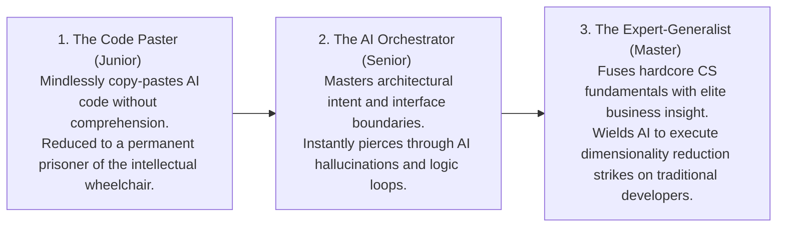

# Growing Together with AI

> "The only limit to our realization of tomorrow will be our doubts of today." — Franklin D. Roosevelt

The advent of every epoch-making technology is inevitably accompanied by a utopian illusion. When Large Language Models (LLMs) were thrust into the public domain with virtually zero technical barriers to entry, society cheered. People genuinely believed that the insurmountable wall separating ordinary individuals from elite "geek" engineers had finally been shattered. After all, if everyone possesses a super-intelligent external brain capable of generating production code with a single click, shouldn't the starting line between a genius and a mediocre developer be completely leveled?

The brutal evolutionary reality of the tech industry, however, is profoundly counter-intuitive: the more popularized AI becomes, the more the gap between individuals doesn't just fail to shrink—it violently rips open at an exponential rate.

When AI frees up 80% of your daily operational time, you face the most severe existential test of your career: Will you ruthlessly reinvest this overflowing productivity dividend back into upgrading your own cognitive architecture? Or will you slump into a comfortable "intellectual wheelchair," allowing your core engineering abilities to quietly and permanently atrophy?

This chapter strips away the utopian illusions of the AI era, exposing the cruel reality of exponential inequality. We will also provide a high-intensity "No-AI Offline Coding Regimen" and a comprehensive "12-Month Skill Leap Roadmap" to ensure you remain the apex predator in the ecosystem.

## Human Folding

"Human Folding" is a concept deeply rooted in sociology and science fiction. It posits that the mass adoption of a hyper-technology does not "flatten" society. Instead, it violently tears humanity apart at an exponential rate, "folding" the population into entirely different, mutually incomprehensible dimensions of capability and wealth.

To understand why "Human Folding" is accelerating in the software world, we must confront three extremely harsh realities:

### The Upgraded Threshold of Judgment
If the advent of the internet drove the marginal cost of information *dissemination* to zero, AI has driven the marginal cost of code *generation* to zero. In an era flooded with synthetic noise, boilerplate CRUD apps, and hallucinated code generated by the millions per second, raw output is worthless. 
Without a profound, underlying bedrock of hardcore engineering knowledge, an ordinary developer completely lacks the capability to judge whether an AI's output is brilliant or lethally flawed. They are forced to worship beautifully formatted, confident-sounding "synthetic garbage" as the gold standard. Meanwhile, true master engineers effortlessly pierce through the noise, using AI to instantly pan real gold from the gravel.

### Skill Inflation
The democratization of AI allows literally anyone to generate a script that runs. Many junior developers mistake this for a flattening of the skill curve. This is a fatal illusion.

Historically, a novice might score a 70 on a project, while a master scores a 90 (a 90:70 output gap). Today, AI allows the novice to instantly jump to an 80. But the master wields that exact same AI to jump to a 99—and utilizes the saved time to execute *ten* 99-point projects simultaneously. The output gap instantly morphs into a crushing 990:80.

When the execution cost of *"building a thing"* drops to zero, the strategic judgment of *"what to build, why to build it, and exactly how robust it needs to be"* becomes the only scarce commodity left in the market. That judgment is forged exclusively through reading elite source code, triggering catastrophic production outages, and rolling in the mud of legacy systems for years. You can never use a slick 50-word Prompt to instantly download the technical taste another engineer spent a decade bleeding for.

## The Intellectual Wheelchair

Faced with hyper-accessible AI, the engineering population is rapidly polarizing into two extremes.

**The First Camp** treats AI as an elite outsourced workforce. They set macro-objectives, ruthlessly dismantle system architectures, and strictly review the outputs. These engineers grow exponentially stronger every single day because the AI acts as a massive leverage multiplier on their core subjectivity.

**The Second Camp** treats AI as an "Answer Machine" and an "Intellectual Wheelchair." When confronted with slightly complex logical deductions or abstract architectural puzzles, they refuse to expend even one extra minute of cognitive effort; they blindly dump the problem into the AI. 
The human brain is bound by the biological law of "Use It or Lose It." By permanently living in this wheelchair, the neural circuits responsible for deep, multi-step logical reasoning suffer severe atrophy. They lose the grit required to trial-and-error their way through raw complexity, thereby permanently severing their ability to forge "Judgment." Unknowingly, they are no longer training the AI—they are being domesticated *by* the AI.

## The Future of the Programmer

AI will not directly replace programmers. However, programmers who expertly wield AI will completely annihilate programmers who refuse to adapt, or who degenerate into passive appendages of the machine. You must ruthlessly reinvest your newfound 80% time dividend into the domain of the **"Expert-Generalist"**—the only domain immune to automation.

To complete this identity leap, you must advance simultaneously in two extreme directions:

### Advance Upward (Business & Empathy)
AI can understand ASTs (Abstract Syntax Trees), but it cannot understand the bleeding pain points of your users. When code generation becomes free, the truly expensive moats reveal themselves: human trust, distribution networks, capital allocation, and raw business insight. Step away from your IDE. Talk to real users. Map out the friction points in the commercial flow. In the future, knowing exactly *what* should be built will be ten thousand times more valuable than knowing *how* to build it.

### Advance Downward (Hardcore Fundamentals)
AI can write beautiful REST APIs, but when confronted with underlying performance tuning, concurrent race conditions, distributed consensus, or memory leaks, it frequently hallucinates lethal, confident-sounding garbage. You must plunge deep into the bedrock: understand Linux kernel scheduling, database locking mechanisms, and raw network protocols. When the AI-generated system inevitably triggers a catastrophic avalanche in production, your hardcore fundamental knowledge will be the only stabilizing force capable of saving the company.

## Preventing Technical Atrophy

Long-term reliance on AI auto-completion (the "Tab" key) and massive block generation triggers a terrifying sub-health condition in software engineering: **"Technical Muscle Atrophy."**

Once severed from their AI safety net (e.g., operating in a highly secure, air-gapped server environment, or facing a whiteboard coding interview), many previously excellent programmers freeze. They suddenly find themselves unable to implement basic iterative loops, execute manual data structure conversions, or even remember the syntax for an HTTP fetch request.

To preserve your "fingertip physical memory" and the sheer dignity of independent craftsmanship, we strongly mandate that you proactively block out **2 hours every single week** for a brutal offline regimen. Completely disable all AI plugins, close your browser, open a raw text editor, and execute the following high-intensity "Bare-Hand Typing" calisthenics. 

We have designed a 4-week cyclical training schedule for you:

| Training Week | No-AI Regimen | Core Assessment Targets | Bare-Hand Constraints (No Google / No Copilot) |
|---|---|---|---|
| **Week 1: Data Structures** | Hand-write a "Red-Black Tree Insertion" or a "High-Concurrency Thread-Safe Hash Map." | Memory pointer manipulation, tree balancing algorithms, multi-thread collision handling. | Utilize strictly the language's native standard library. No third-party packages. Hand-write the logical implementation. |
| **Week 2: Network Bedrock** | Utilize native Socket APIs to build an HTTP static file server entirely from scratch. | TCP handshake parsing, socket connection lifecycle management, strict HTTP/1.1 response header formatting. | Manually handle client buffers and explicitly assemble and return a valid `200 OK` byte stream. |
| **Week 3: Async Control** | Hand-write a full state-management middleware or a native JavaScript Promise chain implementation. | Closure state mutation, Publish-Subscribe event looping, microtask queue scheduling. | Implement the underlying state-machine mechanics of `myPromise.then().catch()` strictly from memory. |
| **Week 4: UI Architecture** | Hand-type a complex, responsive Flex/Grid layout on a physical whiteboard. | CSS selector specificity weighting, box-model math, media query breakpoint calculations. | Without consulting MDN, write a high-fidelity, pixel-perfect layout using raw CSS. |

*Note: If you experience intense mental friction, stuttering, and pain during these bare-handed exercises, do not retreat. That pain is the exact physiological sensation of your brain rebuilding atrophied neural synapses.*

## The Action Plan: A 12-Month AI Cultivation Roadmap

If you intend to stand at the absolute apex of this global computing wave, execute this customized 12-month skill refactoring roadmap:

### Phase 1 (Months 1 - 3): Physical Defense Lines & Intent Architecture
**Core Objective:** Eradicate the amateur habit of "mindlessly throwing prompts." Learn to strictly define architectural boundaries.

**Execution Priorities:**
- **Refuse Blind Copying:** Whenever an AI generates flawless logic, brutally interrogate it: *"What is the underlying algorithmic principle? What are the memory assumptions? Under what exact edge cases will this fail?"* Code you cannot intellectually defend must never touch the main branch.
- **Master the SPET Pipeline:** Before waking the AI, force yourself to write a strict, Markdown-based architectural contract. Integrate surgical Git commits into every micro-iteration of the AI's output, and master the `git reset --hard` emergency landing protocol.

### Phase 2 (Months 4 - 6): Cross-Boundary Wall Breaking & Team MCP Orchestration
**Core Objective:** Exploit AI to aggressively patch your technical shortcomings, achieve true full-stack mastery, and dictate precise context feeding.

**Execution Priorities:**
- **Shatter Tech Stack Barriers:** If you are a frontend specialist, force yourself to utilize AI to architect a highly concurrent Python/Go microservice. Vice versa for backend devs.
- **Master Context Engineering:** Master surgical context commands (`@Files`, `@Codebase`). Eradicate the habit of engaging in 100-turn chat logs. Master token-pruning and the art of the "Hard Reset."
- **Deploy Custom Connectors:** Architect and deploy a bespoke MCP (Model Context Protocol) Server for your engineering team. Bridge the AI directly to your proprietary enterprise databases and private internal APIs, granting the LLM physical agency in the real world.

### Phase 3 (Months 7 - 9): TDD-Driven Autonomous Pipelines
**Core Objective:** Evolve from a "Code Writer" into a "Behavioral Verifier."

**Execution Priorities:**
- **Harness Agentic Debugging:** Master the execution of fully autonomous CLI Agents (like Claude Code or Aider). Command the AI to proactively execute test suites, ingest raw stack traces, and self-heal its own bugs without human intervention.
- **Ruthless TDD Philosophy:** Architect an impenetrable, high-density safety net of unit and integration tests. You must lock the probabilistic, highly non-deterministic AI inside a cage of absolute, mathematical determinism.

### Phase 4 (Months 10 - 12): Multimodal Architecture & Cyber Assets
**Core Objective:** Harness the immense tailwind of cheap computing power to build digital assets that generate leverage while you sleep.

**Execution Priorities:**
- **Master Multimodal Vision Models:** Execute pixel-perfect, one-click compilations of Figma design drafts directly into production UI code. Plunge into the fundamentals of Machine Learning and data sanitization, welcoming the dawn of the Software 2.0 era.
- **Rapid Prototype Deployment:** In the AI era, the lifecycle from a whiteboard idea to a deployed MVP (Minimum Viable Product) has collapsed from months to hours. Aggressively deploy your independent SaaS ideas or open-source utilities to the live market. Allow your code to accrue real-world wealth, reputation, and leverage—executing a dimensionality reduction strike on the traditional, artisanal software industry.

## Power Stems from the Fulcrum

Archimedes famously declared: *"Give me a fulcrum, and I shall move the earth."*

Large Language Models and autonomous Agent workflows represent the longest, most flawlessly constructed lever in the history of human engineering. But the lever itself possesses zero inherent power. The true kinetic force is generated entirely by *where you stand*, and *what you choose to pry*.

- What massive, real-world socioeconomic problems do you intend to solve?
- Do you possess an elite, refined technical taste forged in the fires of catastrophic production failures?
- Do you possess the sheer courage to take responsibility and execute final architectural decisions amidst terrifying uncertainty?

The longer the lever grows, the further the distance between those standing at the fulcrum, and those standing at the heavy end. In the impending future, AI will absolutely consume the vast majority of mechanical, repetitive coding labor. This is not a threat; it is the ultimate emancipation of the human intellect. It liberates our brains, allowing us to focus entirely on the only domains of software engineering that touch the human soul: understanding pure intent, architecting elegant systems, and executing flawless judgments amidst a sea of chaotic constraints.

Do not allow yourself to rot in the intellectual wheelchair. Grip your sword tightly, and become the engineer holding the super-lever, anchored by an unbreakable, internal fulcrum.