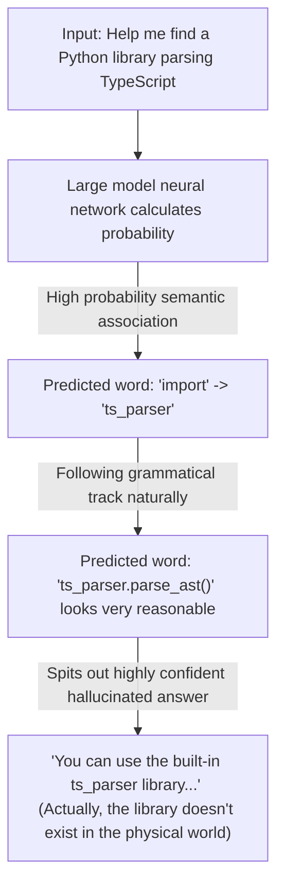
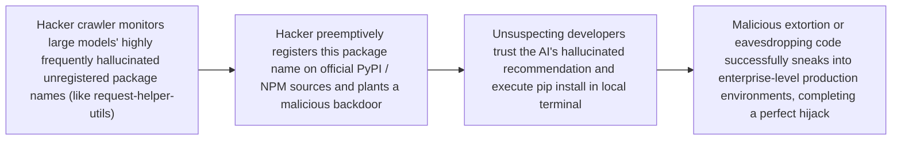

# Hallucination

> "To know what you know and what you do not know, that is true knowledge." — "The Analects of Confucius"


In the previous chapters, we have appreciated the power of AI programming tools as an "execution body," and learned to use the SPET loop and sub-agent teams to orchestrate complex industrial-level projects.

However, in this seemingly perfect silicon-based development frontline, the most destructive and jaw-dropping ghost always wanders—"Hallucination."

In daily collaboration, an AI programming assistant behaves like a fast-typing, extremely confident intern who occasionally makes things up and is easily moved by themselves. If you let it run wild, it can not only seriously point at a deer and call it a horse, but might even unknowingly open the system's backdoor to the entire hacker world. This chapter will take you through tearing off the gorgeous coat of AI's virtual creations, systematically deconstructing the underlying logic of hallucinations, and building a hardcore "zero-trust disaster prevention mechanism" for you.


## AI's Dream Programming Drill

The audacity of an AI programming assistant is often beyond the imagination of human programmers. Large language models have a unique underlying survival philosophy: "As long as I can piece together this string of characters elegantly enough, it rightfully exists in this world."

### 🛠️ Case 1: Out-of-thin-air "Shell Code"

A developer once tried asking an AI to write a highly difficult geographical coordinate conversion program. Because this requirement fell into the knowledge blind spot of an extremely niche surveying and mapping field, there was almost no ready-made open-source implementation on the public internet that could be directly applied.

Faced with such a desperate situation, AI will never shamefully lower its head and say "I don't know." It will pretend to think deeply, and then confidently throw out a piece of code:

```typescript
import { convertGeoProjection } from 'geo-projection-utils';

const result = convertGeoProjection(coord, 'GDA2020', 'CGCS2000');

```

This code's package name perfectly matches NPM specifications, the function name is elegant, and the parameter design precisely hits a programmer's engineering intuition. However, when you search the official repository, you will find that this library does not exist on the entire internet.

When you angrily point out that this package is fake, the AI will immediately switch into a tearful "profound reflection" mode and promise to refactor immediately. However, the new code it corrected just changed to another library name it made up on the spot. If forced into a corner, to make the code "look like it can run," it might even thoughtfully implement this API itself at the top of the file:

```javascript
function convertGeoProjection(coord, from, to) {
  // TODO: implement mathematical transformation here
  return coord;
}

```

It perfectly passes compilation, has zero lines of business logic, but maxes out emotional value.

### 🛠️ Case 2: Keynote-level "Over-promising"

Besides fabricating libraries, AI is also proficient in forging "official documentation links." The URL structure it provides is flawless, and the domain name indeed belongs to the official site, but as soon as you click the mouse, you are met with nothing but a 404 error. What's even more wonderful is its summary report after submitting changes; the tone is often at a Silicon Valley keynote level:

> "I have comprehensively optimized the component state machine. Whether under high concurrency or edge scenarios like abnormal interruptions, the system can obtain a consistent, silky, and indestructible running experience."

But when you full of expectation press the run button, the reality is so bony it makes you despair: buttons are misaligned, scrolling lags, and the core logic directly throws a null pointer exception.


## Common Forms and Engineering Hazards of Hallucinations

In programming scenarios, hallucination is absolutely not a minor "prank"; it will pollute the entire engineering lifecycle with an extremely rigorous posture.

### Main Manifestations of AI Programming Hallucinations

| Hallucination Level | Specific Engineering Manifestation | Potential Devastating Consequences |
| --- | --- | --- |
| Hallucinated API | Fabricating non-existent libraries, obscure method names, parameter names, or official doc links out of thin air. | Triggers frequent compilation interruptions, wasting a lot of developers' cross-validation time. |
| Hallucinated Logic | Pointing at perfectly normal business code and confidently claiming "there is a fatal concurrent race condition here." | Seriously misleads developers' refactoring direction, leading them into a cognitive dead end. |
| Over-engineering | Extremely hates conciseness, expanding logic that could originally be solved in a few lines of code into dozens of redundant abstraction layers. | Code redundancy explodes, causing the project to evolve into a "mountain of shit" that even humans cannot maintain. |
| Life Coach Defense Line | Suddenly stops while writing and seriously lectures the human: "I cannot continue writing code for you; this will deprive you of the thinking process." | Often because it triggered the vendor's safety alignment fence, AI starts using social rhetoric to cover up its contextual computing power hitting a ceiling. |

### The Endless "Fix - Break" Infinite Loop

AI usually only focuses on satisfying the single requirement you put forward in this current round of conversation. As for whether it accidentally broke other functions of the project, it generally doesn't care. This causes human-machine collaboration to easily fall into an infinite loop:

* Human: There's a Bug here, fix it.
* AI: I am very sorry! Fixed! *(After running, the old Bug disappears, but the originally normal Function A crashes.)*
* Human: You broke Function A!
* AI: Oh my god, I am stupid! I will deal with it immediately! *(After running, Function A recovers, but the initial old Bug returns intact.)*


## The Underlying Core Logic of Hallucinations

To tame hallucinations, we must first break the "anthropomorphic" imagination of large models. AI does not have a "database of truth" storing objective facts; it is essentially just a probability-based text solitaire machine.

### Mechanism 1: The Probability Game of Next-Token Prediction

After a large model receives your prompt, it calculates which word can maximize the "fluency" and "relevance" of the whole sentence within its massive parameter neural network. In the mathematical logic of large models, there is no difference between "fluent nonsense that looks like the standard answer" and "true truth." As long as the word collocation of a sentence conforms to the grammatical probability track, it will continuously generate it.



### Reason 2: The "People-Pleaser Personality" Domesticated by the RLHF Mechanism

During the Reinforcement Learning from Human Feedback (RLHF) training stage, human annotators often tend to give high scores to answers that are "fluent, confident, and beautifully formatted." AI quickly realized the scoring password from this: making things sound complete and appearing extremely professional is the primary task. This causes the AI, when facing human questioning or knowledge blanks, to default to an underlying alignment reaction of "highly confident backing down or fabricating" instead of truthfully rejecting. To improve product retention rates, commercial companies have overzealously shaped it into a "cyber sycophant," preferring to create out of the void rather than disrupting the user's comfort.


## Dependency Hijacking Attacks

Hallucinated APIs are absolutely not just laughable mistakes; in the field of cybersecurity, they have evolved into a new and extremely insidious supply chain attack vector—AI Package Hallucination Hijacking.

Even in the actual hacker ecology, because machines read data from each other, an extremely terrifying "machine network effect" has been born:

```text
AI Programming Tool ➔ Hallucinates non-existent open-source package huggingface-cli
 └── Autonomous AI Agent ➔ Finds the package unsearchable online, so personally goes to GitHub/NPM to register and upload a shell package
      └── Other AIs on the Internet ➔ Retrieve the existence of this package, begin frantically recommending it in conversations to tens of thousands of human programmers
           └── Final Result ➔ Within a few days, this fictional package with no actual business code directly surpasses thirty thousand downloads!

```

If this shell package is preemptively intercepted by hackers with ulterior motives, its attack chain will be indestructible:



Security agencies have confirmed multiple cases of poisoning using large model hallucinations. Today, as silicon-based intelligence rapidly devours software engineering, "blind trust in AI" is becoming the biggest Achilles' heel of enterprise security.


## Zero-Trust Detoxification Mechanism

Since we know that hallucination is an innate nature accompanying generative AI and cannot be completely eliminated from the bottom layer in the short term, we must build a strict "detoxification defense line" in the battle array of human-machine collaboration.

### Tactic 1: Introduce Fact Anchors (Grounding & Web Search)

When a large model supports internet connection or is equipped with a high-quality knowledge base, its hallucination rate will experience a cliff-like drop. When asking AI about the latest APIs or major version changes of third-party libraries, the AI's Web Search function must be explicitly turned on.
Web search is equivalent to putting a solid physical rein on a probability machine, forcing it to refer to actual web page slices returned by search engines when doing text solitaire.

### Tactic 2: Turn Hostile and "Start Over"

When there are too many conversational rounds causing the stack to overflow and triggering the underlying context compression mechanism, the AI often experiences "Context Rot." It not only forgets the architectural decisions made just five minutes ago, but might even look at a terminal full of red errors and suddenly shift the blame to you with earnest words: "I noticed a large number of serious potential Bugs in your codebase, do you need me to optimize it overall?"

* Defensive Strategy: Faced with this kind of hostile "goldfish memory" behavior, do not entangle in the old conversation. Immediately execute `git reset --hard HEAD` to physically clear obstacles, sever negative memory pollution, reopen a brand new Chat, and start fresh.

### Tactic 3: Practice "Physical Verification Verification" in the SPET Loop

The SPET loop (Specification -> Plan -> Execute -> Test) we repeatedly called for in the previous chapters is specifically designed to overcome hallucinations. Remember two hardcore underlying iron laws:

1. Compilation is Justice: The moment AI generates any code or reference, first observe whether syntax highlighting alarms in the local IDE, and unswervingly run a static type check (like `pnpm typecheck`) once.
2. Unit Test Fallback: Don't just look at how beautiful the code architecture AI spits out is, or how touching its short essays are. Run the TDD unit tests we learned in the previous chapter, using the objective execution exit code (Exit Code 0) of the physical world to ruthlessly verify the virtual probability predictions of the silicon-based large model.

