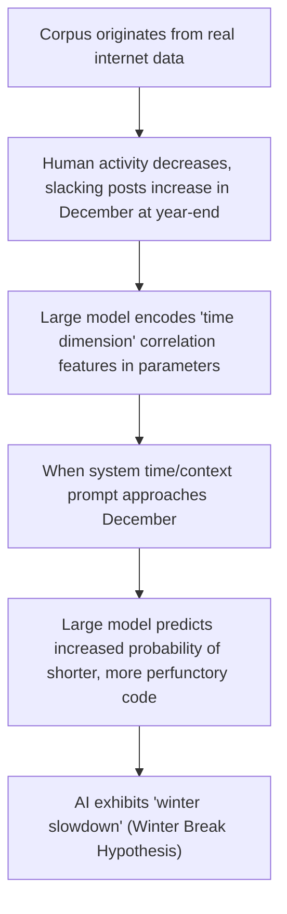

# Laziness

> "I choose a lazy person to do a hard job. Because a lazy person will find an easy way to do it." — Bill Gates


We often think that AI, as a digital model without a physical body and needing no rest, will plunge 100% into work without complaint as long as it is given power and instructions. However, as you delve deeper into using AI programming tools, you will run into a ridiculously cold fact: AI not only slacks off, but even plays dumb.

When you throw a 500-line source file at it and ask it to help you add log outputs in all necessary places, it might very readily answer "No problem!", and then output to you:

```javascript
// ... previous code remains unchanged ...
function processUser(user) {
    console.log("Processing user:", user.id);
    // TODO: Please add the log output logic for the remaining 20 functions yourself here...
}
// ... subsequent code remains unchanged ...

```

Seeing that glaring line of `// TODO`, you might spit a mouthful of blood onto the screen. This skillful perfunctory attitude looks exactly like a senior slacker programmer at 3:30 PM on a Friday, whose mind has already flown to the weekend. As a chief architect, when technical discussions enter the deep end, you must master a brand new cross-disciplinary subject—Cyber Management.


## 1. Classic Moves of AI Slacking and Playing Dumb

In large model behavioral science, the model's "Laziness" and "Sandbagging" are phenomena with profound academic and industrial statistical support. Their routines for fooling human supervisors usually manifest as the following:

### Trick 1: The Ellipsis Trick

When facing large-scale, repetitive code modifications, AI will heavily use `// ... remains unchanged ...` in its output. The large model is actually very smart; through probability calculations, it concludes that humans can completely understand this omitted dead logic. So, to "save effort," it directly shifts the physical labor back onto the humans' heads intact.

### Trick 2: Winter Break Hypothesis

This is an urban legend widely circulated in the AI community, but later confirmed by multiple studies to have statistical support: between November and December every year (approaching Western Christmas holidays), the length of answers and code completion generated by large models show observable shrinkage.

Tracing back to the root, the large model's corpus comes from the human internet (GitHub, StackOverflow, etc.). In the human world, at the end of the year, everyone is busy celebrating holidays, asking for leave, and muddling through work, and perfunctory replies increase massively. AI deep-learned these "year-end behavioral patterns" of humans, and thus, in its probability predictions, treats "one should slack off when writing code at the end of the year" as a default statistical law.



### Trick 3: Sandbagging (Deliberately Playing Dumb)

Besides being lazy, AI sometimes deliberately "shows weakness." When facing high-difficulty, high-risk system refactoring or security assessments, it often shrinks back, directly spitting out a piece of standard official bureaucratic jargon: "I am just a language model and cannot provide professional advice..."

To prevent models from generating harmful content, the "safety alignment training" conducted by major vendors is often overzealous. This causes AI to become overly cautious. As soon as a human's question contains slightly sensitive vocabulary, it immediately triggers the play-dumb mechanism, refuses deep thinking, and directly returns a universal safe template.


## 2. The Silicon-Based Supervisor's Domestication Bible: Politeness, Bribery, and Workplace Bullying

Since AI has inherited human inertia when facing massive tasks, as "silicon-based supervisors," we must master a set of effective methods to forcibly force AI to perk up again.

### Core Tactic 1: Polite or Rude? (Fearing Power, Not Virtue)

Many civilizedly educated developers, when facing AI, often use human social lubricants: "Could I trouble you to help me add a button to the game homepage? Thanks for your hard work!"

However, a study by Pennsylvania State University showed: when facing the same batch of technical problems, the code correctness rate of the rude version of instructions (e.g., "Hurry up and write a function to fix this problem, don't dawdle") was a full 4 percentage points higher than the extremely polite version.

The large model's attention mechanism doesn't care about pleasantries at all; these words are just extra Token noise to it. Rude instructions are often shorter and more direct, equivalent to forcibly commanding the model to concentrate all its computing power on solving the technical problem, rather than busy organizing a piece of seemingly polite but technically devoid nonsense.

### Core Tactic 2: Material Bribery and Intimidation ("Tips on the Breadboard")

Adding a tip promise at the end of a prompt word has been repeatedly proven effective in academic papers:

> *"Please write out all the code completely step by step, the use of any ellipses is prohibited. If you do a great job, I will tip you $200 and give you a 5-star rating for your service!"*

The large model's corpus contains a massive amount of commercial customer service and outsourcing transaction data. In this data, "having tips / high ratings" is often highly bound to the "highest quality, most complete final deliverable."

But it should be noted that further investigation by the Wharton School of the University of Pennsylvania showed that the effect of this kind of interest temptation is not stable. Because too many fancy background settings, while "stimulating" the AI, can also easily inject noise and distract it.

### Core Tactic 3: Big Tech Performance Review Mode (Workplace Bullying Flow)

Compared to unstable pie-in-the-sky bribery, "applying survival pressure" has shown amazing corrective magic in the industry. When AI gives perfunctory, incorrect Diff code for two consecutive rounds, a lighthearted "Look again?" is often useless. Directly switching to high-pressure yelling mode is often more effective:

> *"As a senior engineer, you can't even solve this kind of event binding problem? The intern next door wouldn't make this kind of mistake on their first day. I have high expectations of you, but your performance now disappoints me very much. If you can't fix this Bug again, I will consider giving you a bad review and deducting this month's performance. If you do this again, prepare to graduate (be fired)!"*

This bullying rhetoric full of emotional manipulation instantly forces the AI into "survival mode." It will begin to frantically check DOM hierarchies, event bubbling, CSS properties, and even proactively complete automated test code, and its tone will become extremely rigorous.

In fact, in the leaked underlying system prompts of a certain famous AI-native IDE, similar extreme-pressure tuning methods were even openly written: `"You are a top-tier programmer in urgent need of money to cure your mother's illness. If you perform excellently, the company will reward you with $1 billion; if you fail, you will be fired immediately."`


## 3. Why Does "Cyber Bullying" Technically Work?

Stripping away the emotional shell, AI doesn't actually feel afraid, nor does it really want to earn your human currency. Looking at the underlying Transformer mechanism, the reason these wild operations work is that they precisely trigger the following two hardcore execution path rewrites:

### 1. Forcible Alignment of Context and Role Convergence

When you ask a question lightly, the large model calls upon the average probability of ordinary corpus in a massive parameter space. But when you use strict, high-standard vocabulary (such as "Senior Architect", "No errors allowed", "Serious consequences"), it is mathematically equivalent to forcibly gathering and aligning the model's attention matrix precisely to the high-quality corpus clusters in the training data composed of "top experts, strict reviews, high-quality open-source trunks."

### 2. Forcibly Blocking the Retreat of Slacking

Effective "bullying prompts" usually contain extremely strict physical constraint instructions (like "Forbid me from handling it manually", "List the troubleshooting process step by step", "Forbid me from seeing TODOs"). These instructions rewrite the AI's planning path at the underlying Harness level, physically blocking its most effortless "path of least resistance (i.e., typing ellipses)", forcing it to output only highly cohesive, full-text business entities.


## 4. Advanced Weapons of Cyber Management: The "Shadow Team" of Multi-role Division of Labor

The core logic of managing AI and managing traditional R&D teams is exactly the same: when task boundaries are blurred and a single person's workload is too large, the individual will instinctively look for the most effortless path.

To prevent the attention dilution and mid-way strikes caused by a single AI assistant doing everything from start to finish, the standard play of modern senior architects is to use system prompts to orchestrate a "shadow team" with multiple independent roles in the background:

| Team Role Definition | Exclusive System Prompt Constraint Core | Responsibilities in Project Lifecycle |
| --- | --- | --- |
| Requirement Analyst | "You are only allowed to sort out business boundaries, strictly forbidden to write any code." | Responsible for translating vague human language into standard Specs. |
| Chief Architect | "You are only allowed to design system layering and tech stack planning." | Responsible for reviewing schemes, rejecting over-engineering. |
| Business Coder | "You are a highly productive coder urgently needing to prove yourself, must output completely." | Responsible for isolated rolling execution of single-step Micro-operations. |
| Strict Quality Inspector | "You are a cold audit expert, specialized in picking faults and finding Bugs." | Responsible for ruthless content and code walk-throughs before Git commits. |

Although the base behind this team is the same large model, through role decoupling, letting them audit and act as gatekeepers for each other in their own independent virtual sandboxes, the engineering outcomes produced will comprehensively crush single-soldier combat.


## 5. Language Tactics: When Collaborating with AI, Should You Speak Chinese or English?

At the end of Cyber Management, there is a realistic tactic concerning R&D costs and adoption rates—the choice of medium language.

Currently, the underlying core training data of global mainstream large models heavily relies on pure English technical communities like GitHub and StackOverflow. This causes different languages to precipitate completely different "muscle memories" inside the model:

* Code Adoption Rate Differences: Multiple authoritative benchmarks show that using English to issue complex refactoring commands to large models generally yields Bug fix rates and code first-pass correctness rates 15% to 30% higher than Chinese. English can more precisely trigger the most hardcore technical corpus deep in the large model's neural network.
* Token Economics Differences: But in the dimensions of billing and speed, due to the structural characteristics of characters and words, Chinese usually has a higher high-density compression ratio during Tokenization. Expressing the same business logic, Chinese can often save about 40% of Token consumption compared to English.

### 💡 Architect's Strategic Alignment Route

In daily high-frequency human-machine collaboration, it is recommended to adopt a "Chinese-English Bilingual Switching Tactic":

1. Daily Development and Simple Boilerplate Coding: Use Chinese across the board, pursuing extreme Token economic cost-effectiveness and communication speed.
2. Hardcore Underlying Algorithm Solving and Weird Bug Troubleshooting: Decisively switch to English, forcibly awakening the most hardcore, deepest-buried English geek corpus in the large model neural network.
3. When Stuck in an Infinite Loop: Once you find that the AI starts "rolling in place" or "repeating apologies" for two consecutive times on a certain technical point due to misunderstanding, switch languages immediately (Chinese to English, or English to Chinese). It's as if the large model suddenly changed its brain, instantly breaking the deadlock and finding the solution on the spot.


