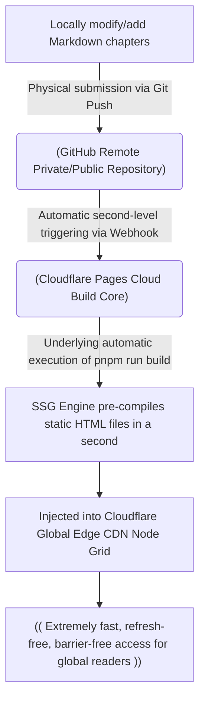

# Making an E-book

> "What you get from books will ultimately feel shallow; you must experience it yourself to truly understand." — Lu You

In the previous chapters, we systematically learned about prompt engineering, context management, and the SPET loop methodology that determines success or failure (Specification -> Plan -> Execute -> Test). However, what you get from books will ultimately feel shallow. If you want to truly internalize these cutting-edge methodologies into your muscle memory, the most effective way is to conduct a full-stack mini-project playthrough exercise.

Creating an open-source, modern, interactive "living e-book" is an excellent testing ground for your weapons.

In traditional cognition, writing a book is purely a humanities creation; but in the AI era, creating a digital e-book is essentially a precise software engineering practice. It logically covers frontend static framework selection, directory and sidebar contract specifications, Markdown/MDX advanced typesetting, componentized micro-interactions, Git version control, and zero-cost automatic publishing (CI/CD) pipelines. Even the book you are reading right now was built and continuously rolled and iterated using this "human-machine collaborative creation flow."


To make the exercise interesting and hardcore enough, this chapter will use a soft sci-fi suspense web novel, "The Dissipating End," as an example, leading you to walk through the entire chain from scratch—from planning, production, and publishing, to long-term operation—with the help of AI's planning and execution firepower.


## The Evolution of E-book Tools

Before officially starting to write and plan, we must first solve the problem of tool selection. Many creators have walked a very painful path of tool evolution when building digital text. To help you avoid detours, it's necessary to review the underlying logic of technological evolution:

- Bronze Age: Notepad + Native HTML/JS
The most primitive method was to handwrite HTML pages directly in Notepad, with one page of content corresponding to one static file. However, HTML was not designed for humans to read long texts, tags are cumbersome, and once the scale of the article increases, directory updates and overall maintenance will quickly descend into disaster.
- Silver Age: Client-Side Rendering (CSR) Architecture (Typical Representative: Docsify)
To escape the torment of HTML tags, it became popular to save plain text in Markdown (.md) format, which is friendly to both machines and humans. Docsify emerged at the right moment. Its working principle is very lightweight: it directly passes the original Markdown documents from the server to the reader's browser, and then renders them into web pages in real-time locally in the browser using JavaScript libraries.
Docsify completely decouples typesetting; adding a search box or a status bar only requires writing one line in the configuration file. But it has a fatal flaw that modern industrial-grade digital assets cannot tolerate: it is extremely unfriendly to search engines (SEO). Because it relies purely on client-side dynamic rendering (CSR), many search engine crawlers (especially domestic ones) struggle to efficiently execute complex JS code, resulting in the pages they crawl often being blank, and the website content cannot be effectively indexed at all.
- Golden Age: Static Site Generation (SSG) Architecture (Typical Representative: Docusaurus)
To completely balance the maintenance convenience of Markdown with ultimate SEO indexing rates, we finally set our sights on Docusaurus. It uses advanced React-driven architecture, and its core philosophy is to pre-compile and render all Markdown files into standard static HTML web page files during the compilation and packaging phase (in local or cloud CI/CD environments).

### Comparison Matrix of E-book Tool Technologies

| Evaluation Dimension | Notepad Native HTML | Docsify (CSR) | Docusaurus (SSG) |
| --- | --- | --- | --- |
| Writing Medium | Cumbersome HTML tags | Pure Markdown | Flexible Markdown / MDX |
| SEO Crawl Friendliness | Extremely high (Native static) | Extremely poor (Relies on client JS execution) | Extremely high (Server-side pre-compiled) |
| Out-of-the-box Advanced Features | Zero (Requires handwritten JS) | High (Rich plugin ecosystem) | Top-tier (Built-in global search, dark mode, etc.) |
| Technical Threshold | Basic but cumbersome | Extremely low (No compilation configuration needed) | Medium (Adds a build step) |
| AI Pairing Threshold Reduction | Can help auto-generate HTML | Can accelerate configuration | Dimensionality reduction strike (AI smooths over the React and config gap for you) |

In the past, using Docusaurus required underlying knowledge of React, TypeScript, and Webpack, and the users were almost exclusively programmers. Now, with AI programming tools, even literature and art creators with no programming background can perfectly pilot this highly configured digital mothership.


## Phase 1: High-Level Tactical Planning (S & P Phases)

Traditional writing is most prone to getting stuck at the cold start. Faced with a cold, blank document, human outlines often exhaust their initial enthusiasm in scribbling and revising. The secret to practice in this chapter is using the "Reverse Probe" strategy learned in the previous chapter to forcefully have the AI deduce a complete technical and content blueprint for us before writing the first word.

### 1. Refine the Project Specification (Spec)

First, as the chief director, the human must set a clear vision for the project. We organize the novel's concept and positioning into structured Spec inputs:

```text
 "The Dissipating End" Functional Specification Outline
 * One-sentence positioning: An experimental long web novel about "how narrative rules shape choices." The protagonist grows amidst constantly switching rules, eventually turning from a player manipulated by rules into the author who rewrites them.
 * Core Propositions:
    1. When the worldview is hot-updated like a game version, how much room is left for free will?
    2. When identity, stance, and memory are completely washed and switched, what establishes intimate relationships?
    3. How far can a bottom-tier survivor dismantle metaphysical destiny using system thinking?
 * Target Readers: Ages 18-35, long-term audience of infinite flow, rule-based horror, and strong-setting tech-oriented web novels.
 * Genre Elements: Urban refreshing novel + Transmigration + Game Invasion + Cthulhu + Suspense Thriller.
``` 

In titles and themes, the stronger the sense of conflict and counter-intuitive suspense, the more fascinating it becomes. You can let your imagination run wild because AI has probability perception of the entire internet's corpus; it can instantly help you fill in blind spots in industry knowledge you haven't ventured into.

### 2. Reverse Questioning for Global Architecture

Do not directly have the AI blindly write a table of contents for you; that will introduce generalized "probability average garbage." We use advanced roleplaying, making the AI act as a book architect to conduct reverse in-depth deduction on our Spec.

#### 🚀 Tactical Prompt Template:

```text
# Role
You are a top book architect and genre fiction chief planner, specializing in world-building, whole-book pacing control, and multi-thread conflict integration for long web novels.

# Context
Book Title: "The Dissipating End"
One-sentence positioning: An experimental long novel about "how narrative rules shape choices." The protagonist grows amidst constantly switching rules, eventually turning from a player manipulated by rules into the author who rewrites them.
Genre: Urban refreshing novel + Fantasy Sci-Fi + Transmigration + Game Invasion + Cthulhu + Suspense Thriller
Core Setting: The protagonist is a bottom-tier urban delivery rider who is frequently forced into different rule-based historical/parallel worlds due to abnormal orders. Early on, only bizarre phenomena are presented, without explaining the underlying rules.
Expected Length: 30 chapters, standard five-act engineering structure.

# Task
Without writing the main text, please formulate a complete digital asset architecture that can be used directly as context engineering infrastructure for me, which must include the following 6 core modules:
1. Worldview Skeleton: Core operating logic, trigger conditions and limits of 11 core laws, key city map areas.
2. Character Profiles: Protagonist, core bond objects, main supporting character profiles, growth arc stage goals.
3. Story Mainline Evolution: One-sentence Logline, core conflict and emotional milestones of each act in the five-act structure.
4. Chapter Pacing Master Table: Output a 30-chapter outline master table in Markdown format, switching the dominant law every 2-3 chapters, marking core events and ending hooks.
5. Suspense and Foreshadowing Dictionary: List 10 key suspenses laid early on, and specify the corresponding resolving chapters.
6. Commercial Packaging: 50-word/200-word synopsis, 3 eye-catching promotional slogans.

```

Read through the macro design blueprints spat out by the AI, delete illogical deus ex machinas, and keep the final draft. This final draft is the indispensable long-term memory bank for our upcoming context engineering.

### 3. Detailed Breakdown of the Single-Chapter Implementation Plan (Plan)

With the macro skeleton in place, we further require the AI to formulate micro-technical implementation plans for specific chapters, dismantling them to a fine granularity that can be executed in a closed loop.

```text
# Role
You are a senior web novel chief editor, good at dismantling the pacing of introduction, development, transition, and conclusion of a single chapter, strictly preventing the narrative from going off track.

# Context
* Paste the 30-chapter global architecture master table finalized in the previous step *

# Task
Please generate a detailed single-chapter implementation plan for "Act I - Chapter 1: The Disappearing Order", including the following elements:
1. Blockbuster Chapter Title (Give 3 alternatives with strong emotional tension and suspense, 6-12 words).
2. The core dominant law of this chapter, time-space scene, and the protagonist's stage goal for this chapter.
3. Plot Obstacles (external resistance and internal cognitive conflict).
4. 3-5 key core event nodes (strictly arranged in the order of introduction, development, transition, and conclusion, and specify specific props or foreshadowing to be laid).
5. The hook that must be left at the end.

```

Through this precise planning, every chapter of the novel turns into an "independent development module" with technical specifications to follow.


## Phase 2: Industrial-Grade Agile Production (Execution & Testing Phases)

With the tactical blueprints, we enter the real Execution rolling phase. In this phase, we will witness the wonderful chemical reaction between large models and the Docusaurus static framework.

### 1. Initialize the Project Using a Programming Agent

In your AI-native IDE (like Cursor) or terminal tool (like Claude Code), directly issue extremely specific, verifiable instructions, letting the AI handle Docusaurus's complex underlying initialization code for you:

```text
Please use the pnpm package manager to create a standard Docusaurus v3 documentation site project.

Requirements:
- Project named: Vanish
- Enable TypeScript language contract across the board
- Default language set to Chinese, homepage core title rendered as "The Dissipating End"
- Thoroughly clean out default example documents, keeping only a high-net-worth pure `/docs` directory structure
- Output local development preview commands and production environment static build commands in the current terminal

```

### 2. Establish Project Long-Term Memory Infrastructure (Knowledge Base)

Writing long texts is exactly the same as writing large software: large models don't have true long-term memory at all. If strict context control is lacking, after hundreds of thousands of words, the AI will inevitably experience a major intelligence drop (e.g., important settings silently forgotten, dead characters bizarrely resurrected, protagonist's personality split, early foreshadowing becoming dead knots).

The industrial standard play to combat Context Rot is to synchronously establish a set of Markdown knowledge base infrastructure for machine reading within the project:

```text
Vanish/
├── docs/               # Stores actual published chapter HTML/MD files
└── knowledge/          # Core context repository (long-term memory visible to both humans and AI)
    ├── world.md        # Core laws of the End system, worldview setting dictionary
    ├── characters.md   # Step abilities and dynamic profiles of protagonists like Xiao Shan and Shen Ce
    ├── timeline.md     # Macro timeline and plot advancement sandbox
    └── mysteries.md    # Suspended foreshadowing dictionary (including a table comparing laying chapters and expected resolving chapters)

```

When you want the AI to collaborate on writing Chapter 9, never blindly shout "Help me write the next chapter," but neatly use the tool's context-fetching mechanism to complete a precise closed-loop feeding of Rich Context:

* In Cursor: Type in the Chat window: `"Please help me execute the writing of Chapter 9. Current core context references: @world.md , @characters.md , @mysteries.md and the latest static file of the previous chapter @chapter08.md . Be sure to strictly abide by the settings, update and resolve foreshadowing #3 in mysteries.md."`
* In Claude Code: Utilize its autonomous Tool Calling exploration feature, directly typing in the terminal: `claude "Write the main text of Chapter 9. Go search for core laws and foreshadowing records in the knowledge/ directory yourself, and automatically update the status of the mysteries.md dictionary after writing."`
* In Google Antigravity: Drag the entire `knowledge/` folder into the "Context Pin" area of the sidebar to establish a global resident cache, then directly issue rolling execution commands to the AI in the inline dialog.


I have uploaded the AI-generated knowledge base in the example to GitHub for readers' reference: https://github.com/ruanqizhen/vanish

:::tip Architect Resonance
Many people feel that using AI for long, long-cycle creation is unreliable. In fact, it's often not because the model's capabilities are insufficient, but because humans haven't managed project-level knowledge well. Writing complex code requires carefully maintaining documentation and type contracts; driving AI to carry out long-cycle digital asset creation equally requires an iron-clad knowledge base.
:::


## Phase 3: Automated Global Distribution (Publish Phase)

After the e-book passes our review tests and becomes high-quality local static files, how do we make it accessible to global readers without barriers?

The traditional approach requires you to purchase an expensive Virtual Private Server (VPS), tinker with a complex Nginx proxy, and apply for troublesome SSL certificates. The modern, future-oriented standard approach is to use GitHub + Cloudflare Pages to build a fully automated CI/CD publishing pipeline. You will achieve zero server costs and global fully automated distribution and deployment.

### 3.1 Digital Asset Publishing Architecture Diagram



### 3.2 Golden Three-Step Deployment Guide

#### Step 1: Push Assets to GitHub from Local Terminal

Summon the Shell in your local project root directory and neatly type the Git archiving decrees:

```bash
git init
git add .
git commit -m "feat: init my beautiful anachron novel project"
git branch -M main
git remote add origin https://github.com/your-username/vanish-book.git
git push -u origin main

```

#### Step 2: Host Binding in Cloudflare Pages

Log into the Cloudflare console, go to Workers & Pages -> Create application -> Pages -> Connect to Git, and precisely check the `vanish-book` repository you just created in the list.

#### Step 3: Align Build Environment Specifications

In the preset Framework Preset list, generously check Docusaurus directly, and the system will automatically fill in all underlying publishing contracts for you:

* Build command: `pnpm run build` (or `npm run build`)
* Output directory: `build`

Click "Save and Deploy". Cloudflare will pull up an isolated sandbox machine for you in the cloud, automatically pull the code, and automatically execute static site generation. In less than two minutes, you will obtain a dedicated subdomain with a globally built-in secure SSL certificate (e.g., `vanish.pages.dev`).

From this second on, your daily maintenance workflow will become elegantly ultimate: you only need to focus on continuing to write using Markdown locally. After writing each chapter, just type `git push` in the terminal, and the cloud pipeline will automatically re-perceive, fully compile, and silently publish. You only care about the creation of thoughts, leaving operations and distribution entirely to the towering cloud infrastructure.


## Phase 4: Long-Term Efficiency Increase of Living Digital Products (Evolution Phase)

When your e-book successfully runs in a Web environment, it completely bids farewell to traditional "dead" paper text and turns into a living asset that constantly evolves and possesses a complete software lifecycle. You can use the frontend ecosystem to continuously upgrade and reinforce it:

1. Establish a Cyber Address (Independent Domain Name Binding): Cloudflare Pages allows you to bind top-level independent domains you purchase (like `vanish.qizhen.xyz`) for free, and automatically puts a high-defense shield and cache mirror on it across its globally towering CDN edge nodes.
2. Integrate Giscus Comment System (Decentralized Community): This is an extremely sexy way to implement comment streams. It is entirely based on the open-source interface of GitHub Discussions and does not require you to build any backend database yourself. Readers just need to log in with their GitHub accounts to initiate line-by-line technical or plot discussions directly at the bottom of any chapter, and all discussion data will neatly settle in your GitHub repository, naturally spawning a highly sticky geek reader community for you.
3. Data Perception Radar (Umami / GA Monitoring): In Docusaurus's configuration file, let AI seamlessly integrate minimalist, privacy-respecting open-source data monitoring plugins like Umami for you. Through graphical dashboards, you can intuitively capture the dynamic pulse of global traffic, readers' main source countries, and which chapters have the highest stay time (meaning foreshadowing was extremely successful). This real feedback from the physical world will become the most powerful mental fuel for your continuous paired creation.


## Chapter Summary

On the surface, this chapter teaches you how to create and publish a beautifully crafted novel e-book, but its underlying real intention is to lead you to personally practice a brand new digital asset creation paradigm.

In the past, from the birth of an inspiration to the final publication and online launch of the finished product, there were multiple heavy social division of labor barriers spanning planning, editing, art, typesetting, operations, and distribution. Today, when a high-cognition large model perfectly pairs with a modern AI programming tool possessing an excellent Harness tool layer, you alone, equipped with a clear SPET tactical map, can efficiently play all the aforementioned roles simultaneously.

The moment your work is put into a Git repository and automatically rolls on a cloud pipeline, it is no longer just a cold e-book, but a software project with version control, automatic deployment, self-directed search traffic, and two-way interaction with a reader community.

AI has indeed largely flattened the gap in underlying coding skills, but please always remember: what determines how far a set of digital products can ultimately go and how much value it holds is forever the thoughts, experiences, life lessons, and unique aesthetics of the human author in front of the screen, which cannot be replaced by probability averages. AI magnifies your expression, but the soul of expression comes from yourself.

When choosing the example, the author simply let the AI write a refreshing novel, but the author is not good at this genre and has never read any refreshing novels. So after the AI generated a long text, it was even impossible to judge its quality. If given a chance to choose again, the author would prioritize content they are good at and can maintain long-term.
