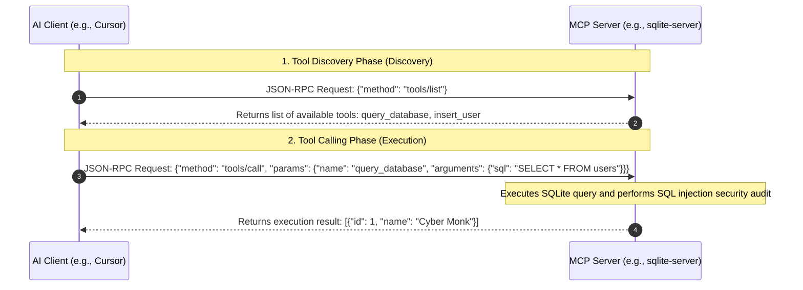

# Model Context Protocol (MCP)

> "Like a tiger with wings." — "Records of the Three Kingdoms"

When developing a complex project over a long period, we often need large models to execute a series of composite actions across text editors: for example, reading local files, querying private databases, or manipulating a browser to take screenshots. In the past, if AI tools wanted to connect to these external data sources, they needed to develop integrations separately, leading to an extremely fragmented ecosystem.

To solve this pain point, Anthropic, together with industry giants, launched an epoch-making open-source standard protocol — the Model Context Protocol (MCP).

## What is MCP?

To use an analogy: if the AI model is the "brain," then MCP is the unified "USB-C port."

It standardizes the connection method between AI assistants (like Claude Desktop, Cursor, Cline, etc.) and external data sources (like local SQLite, GitHub, Notion, Slack). Data providers only need to write a lightweight MCP Server, and any AI assistant supporting the MCP standard can directly read the data provided by this Server and call its tools, just like plugging in a USB drive. It truly achieves "write once, connect everywhere."


## Core Architecture and Three Pillars of MCP

MCP adopts an extremely lightweight, clear client-server architecture:

* MCP Hosts: AI applications that initiate connections (e.g., Cursor, Claude Desktop).
* MCP Clients: Located inside host applications, responsible for establishing connections outward and sending requests.
* MCP Servers: Lightweight programs connecting to specific data sources (e.g., Postgres MCP, GitHub MCP).

Inside the protocol, MCP exposes three core primitives to large models:

* Resources: Provides read-only static data sources to large models. It's like handing a book to the AI, for example, declaring local API documentation or system logs as resources for the large model to pull and refer to at any time.
* Tools: Provides "weapons" that can execute actions to large models. This is the core way Agents can actively change the external physical world, such as executing an SQL query, sending a Slack message, etc.
* Prompts: Provides pre-set conversational templates with placeholders to large models. Large models can dynamically fill in parameters and directly apply best practices.


## The Relationship between MCP and Agent Skills

With the development of AI programming, many people confuse MCP with Agent Skills (skill tree files, like `SKILL.md`), and there is even an exaggerated saying that "Skills make MCP obsolete." In fact, they have a perfectly complementary relationship.

| Dimension | Model Context Protocol (MCP) | Agent Skills |
| --- | --- | --- |
| Essence | A standard protocol connecting Claude to external systems | Command packages teaching Claude "how to do things" |
| What it solves | Provides connections and capabilities (what can be done) | Provides procedural knowledge (how to do it) |
| Role Analogy | "Sockets/pipes" to the outside world | "Recipes/manuals" for specific tasks |
| Context Occupation | Tool definitions reside in context, returning lengthy JSON | Progressive disclosure, loaded on demand, precise execution |

### Golden Rule: MCP is for Discovery, Skills are for Execution

MCP helps Agents explore "what is possible," and Skills help them execute "known things." A typical highly efficient collaborative workflow is as follows:

1. Explore with MCP: The Agent connects to the database via MCP, exploring what tables and fields there are and how to query them (flexible, but consumes more Tokens).
2. Precipitate into a Skill: Once the correct query logic is clarified, solidify it into a Skill file.
3. Execute with Skill: When encountering similar problems in the future, directly call the Skill to execute, bypassing the MCP exploration process.

Actual measurement data shows that for known, repetitive tasks, using the "MCP + Skills" combination compared to purely using MCP can save 30% to 65% of Token consumption, making your Agent both flexible and efficient.


## JSON-RPC 2.0 Sequence

MCP communicates based on the standard JSON-RPC 2.0 protocol. The following is a typical interaction sequence where a large model discovers and calls tools through MCP:




## Writing a Custom SQLite MCP Server

Next, we will demonstrate how to write a custom MCP Server that can read and write a local SQLite database.

### Plan A: Node.js Implementation

Initialize the project and install dependencies:

```bash
npm init -y
npm install @modelcontextprotocol/sdk sqlite3
npm install -D typescript @types/node @types/sqlite3 tsx
npx tsc --init

```

Write `index.ts`:

```typescript
import { Server } from "@modelcontextprotocol/sdk/server/index.js";
import { StdioServerTransport } from "@modelcontextprotocol/sdk/server/stdio.js";
import { CallToolRequestSchema, ListToolsRequestSchema } from "@modelcontextprotocol/sdk/types.js";
import sqlite3 from "sqlite3";

// 1. Initialize Database
const db = new sqlite3.Database("./local_users.db");
db.serialize(() => {
  db.run(`CREATE TABLE IF NOT EXISTS users (id INTEGER PRIMARY KEY AUTOINCREMENT, name TEXT NOT NULL, email TEXT UNIQUE NOT NULL, role TEXT DEFAULT 'developer')`);
});

// 2. Create MCP Server Instance
const server = new Server(
  { name: "sqlite-mcp-server", version: "1.0.0" },
  { capabilities: { tools: {} } }
);

// 3. Declare Tool List
server.setRequestHandler(ListToolsRequestSchema, async () => {
  return {
    tools: [
      {
        name: "query_database",
        description: "Run a SELECT SQL statement to query the local database. Only read-only queries are allowed.",
        inputSchema: { type: "object", properties: { sql: { type: "string", description: "SELECT SQL statement" } }, required: ["sql"] }
      }
    ]
  };
});

// 4. Implement Tool Logic
server.setRequestHandler(CallToolRequestSchema, async (request) => {
  const { name, arguments: args } = request.params;

  if (name === "query_database") {
    const sql = args?.sql as string;
    if (!sql.toLowerCase().trim().startsWith("select")) {
      return { content: [{ type: "text", text: "Error: Only SELECT statements are allowed to be executed." }], isError: true };
    }
    return new Promise((resolve) => {
      db.all(sql, [], (err, rows) => {
        if (err) resolve({ content: [{ type: "text", text: `Execution failed: ${err.message}` }], isError: true });
        else resolve({ content: [{ type: "text", text: JSON.stringify(rows, null, 2) }] });
      });
    });
  }
  throw new Error(`Tool not found: ${name}`);
});

// 5. Start Service (Stdio)
const transport = new StdioServerTransport();
await server.connect(transport);
console.error("SQLite MCP Server has started!");

```

### Plan B: Python Implementation (FastMCP)

If you prefer the Python ecosystem, you can use the officially provided `mcp` library:

```bash
pip install mcp sqlite3

```

Write `server.py`:

```python
import sqlite3
import json
from mcp.server.fastmcp import FastMCP

mcp = FastMCP("sqlite-mcp-server")

def init_db():
    conn = sqlite3.connect("local_users.db")
    cursor = conn.cursor()
    cursor.execute("CREATE TABLE IF NOT EXISTS users (id INTEGER PRIMARY KEY, name TEXT NOT NULL, email TEXT UNIQUE, role TEXT DEFAULT 'developer')")
    conn.commit()
    conn.close()

init_db()

@mcp.tool()
def query_database(sql: str) -> str:
    """Run a SELECT SQL statement to query the local user database. Only read-only queries are allowed."""
    if not sql.lower().strip().startswith("select"):
        return "Error: Only SELECT read-only statements are allowed to be executed."
    try:
        conn = sqlite3.connect("local_users.db")
        cursor = conn.cursor()
        cursor.execute(sql)
        rows = cursor.fetchall()
        columns = [description[0] for description in cursor.description]
        results = [dict(zip(columns, row)) for row in rows]
        conn.close()
        return json.dumps(results, indent=2, ensure_ascii=False)
    except Exception as e:
        return f"SQL execution failed: {str(e)}"

if __name__ == "__main__":
    mcp.run()

```


## The Fatal console.log

When configuring a custom MCP to an AI host (like Cursor), the most common cause of crashes originates from the wrong logging output direction.

Because MCP clients and servers default to passing `JSON-RPC` data frames via `stdio` (standard input/output), if you write ordinary print statements in your code (like Node.js's `console.log` or Python's `print`), this ordinary text will directly mix into standard output, causing the client's JSON parser to crash completely.

Golden Rule of Troubleshooting:

* Node.js: For all debugging, warning, and error messages, force the use of `console.error()`.
* Python: Use `sys.stderr.write()` or configure the standard `logging` library to output to `stderr`.
Doing this will output logs to the standard error stream, and the AI client can safely capture and display them in the IDE panel without breaking the main communication channel. When configuring paths, in Windows environments, it is also recommended to use absolute paths and pay attention to slash directions.