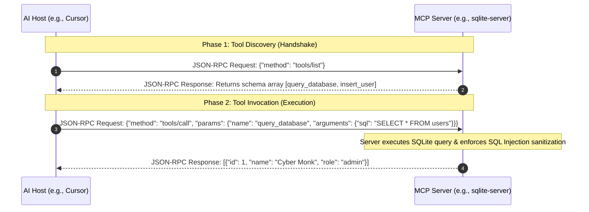

# The Model Context Protocol (MCP)

> "The whole is greater than the sum of its parts." — Aristotle

When architecting complex, long-lifecycle software, we frequently require Large Language Models to execute composite operations across external systems: querying proprietary SQL databases, reading local system logs, or driving a headless browser to capture DOM snapshots. 

Historically, if an AI IDE (like Cursor) or a terminal Agent wanted to interface with these external data sources, developers had to write bespoke, proprietary API integrations for every single tool. This resulted in an agonizingly fragmented, brittle AI ecosystem.

To annihilate this architectural bottleneck, Anthropic—in collaboration with industry titans—forged a revolutionary open-source standard: **The Model Context Protocol (MCP)**.

## What exactly is MCP?

To use a hardware analogy: if the LLM is the CPU, then MCP is the universal **USB-C port.**

It rigidly standardizes the communication contract between AI Hosts (e.g., Cursor, Claude Desktop, Cline) and external data sources (e.g., local PostgreSQL databases, GitHub, Slack, Notion). A data provider simply writes a lightweight "MCP Server." Once deployed, *any* AI assistant that complies with the MCP specification can instantly connect to that Server, extract its data, and execute its tools—exactly like plugging a universal USB drive into a motherboard. 

It is the absolute realization of *"Write Once, Connect Everywhere"* for AI Agents.

## The Core Architecture: The Three Pillars

MCP is built upon an aggressively lightweight, decoupled Client-Server architecture:

* **MCP Hosts:** The AI applications initiating the session (e.g., Cursor, Claude Desktop).
* **MCP Clients:** The internal router modules inside the Host that establish the TCP/Stdio connection and transmit the payload.
* **MCP Servers:** The lightweight, standalone daemons that securely interface with specific physical data sources (e.g., an `sqlite-mcp-server` or a `github-mcp-server`).

Under the hood, the MCP specification exposes three foundational primitives to the LLM:

* **Resources:** Supplies read-only, static data payloads to the model. Think of this as handing the AI a reference manual. You can expose local API docs or internal server logs as Resources for the LLM to ingest on-demand.
* **Tools:** Equips the LLM with executable "weapons." This is the core vector through which Agents actively mutate the physical world (e.g., executing an `INSERT` SQL statement, or firing a Slack webhook).
* **Prompts:** Supplies the LLM with pre-compiled, highly optimized conversational templates containing dynamic variables. The LLM can instantiate these templates to automatically execute complex best-practices.

## The Architectural Distinction: MCP vs. Agent Skills

As AI engineering matures, many developers critically confuse MCP with **Agent Skills** (the Markdown rulebooks, like `SKILL.md`, that govern Agent behavior). Some have even falsely claimed that *"Skills make MCP obsolete."* In reality, they are two halves of a perfect symbiotic architecture.

| Architectural Vector | Model Context Protocol (MCP) | Agent Skills |
| --- | --- | --- |
| **The Essence** | A standardized TCP/Stdio pipe connecting the LLM to external hardware/APIs. | A Markdown payload teaching the LLM the *business logic* of how to execute tasks. |
| **The Problem Solved** | Exposes **Capabilities** (*What physical actions are possible?*). | Exposes **Procedural Knowledge** (*What is the correct way to execute?*). |
| **The Analogy** | The physical socket and network pipes. | The complex recipe and training manual. |
| **Context Overhead** | Heavy. Tool JSON schemas occupy massive context space; returns can be bloated. | Ultra-lightweight. Dynamically injected on-demand; enforces surgical, precise execution. |

### The Golden Rule: MCP is for Discovery; Skills are for Execution

MCP empowers an Agent to *explore* its environment. Skills empower an Agent to *execute optimally*. An elite, high-efficiency AI workflow operates as follows:

1. **Discovery (via MCP):** The Agent connects to a massive legacy database via MCP. It explores the schemas, maps the tables, and brute-forces the correct JOIN logic (This is highly flexible, but burns massive API Tokens).
2. **Solidification (via Skills):** Once the correct query logic is proven, the human architect abstracts that exact SQL query into a permanent Markdown Skill file.
3. **Execution (via Skills):** The next time the Agent encounters this task, it bypasses the expensive MCP exploration phase entirely. It simply reads the Skill file and executes the hardcoded, perfect query instantly.

Empirical telemetry proves that for repetitive architectural tasks, fusing "MCP + Skills" slashes Token consumption by **30% to 65%** compared to relying purely on MCP exploration, yielding an Agent that is both highly adaptable and ruthlessly cost-efficient.

## The JSON-RPC 2.0 Execution Sequence

Under the hood, MCP communicates exclusively via the industry-standard **JSON-RPC 2.0** protocol. Below is the strict architectural sequence of an LLM discovering and executing a tool via an MCP Server:



## Architecting a Custom SQLite MCP Server

We will now execute a live deployment of a custom MCP Server designed to read and write to a local SQLite database.

### Implementation A: The Node.js / TypeScript Stack

Initialize the repository and inject the core dependencies:

```bash
npm init -y
npm install @modelcontextprotocol/sdk sqlite3
npm install -D typescript @types/node @types/sqlite3 tsx
npx tsc --init
```

Architect the core logic in `index.ts`:

```typescript
import { Server } from "@modelcontextprotocol/sdk/server/index.js";
import { StdioServerTransport } from "@modelcontextprotocol/sdk/server/stdio.js";
import { CallToolRequestSchema, ListToolsRequestSchema } from "@modelcontextprotocol/sdk/types.js";
import sqlite3 from "sqlite3";

// 1. Bootstrapping the Physical Database
const db = new sqlite3.Database("./local_users.db");
db.serialize(() => {
  db.run(`CREATE TABLE IF NOT EXISTS users (id INTEGER PRIMARY KEY AUTOINCREMENT, name TEXT NOT NULL, email TEXT UNIQUE NOT NULL, role TEXT DEFAULT 'developer')`);
});

// 2. Instantiating the MCP Server Core
const server = new Server(
  { name: "sqlite-mcp-server", version: "1.0.0" },
  { capabilities: { tools: {} } }
);

// 3. Defining the Tool Schema Contract
server.setRequestHandler(ListToolsRequestSchema, async () => {
  return {
    tools: [
      {
        name: "query_database",
        description: "Executes a SELECT statement against the local user database. STRICTLY READ-ONLY.",
        inputSchema: { 
          type: "object", 
          properties: { sql: { type: "string", description: "The raw SELECT SQL statement" } }, 
          required: ["sql"] 
        }
      }
    ]
  };
});

// 4. Architecting the Execution Logic & Security Gates
server.setRequestHandler(CallToolRequestSchema, async (request) => {
  const { name, arguments: args } = request.params;

  if (name === "query_database") {
    const sql = args?.sql as string;
    // Security Gate: Brutally reject any mutating commands
    if (!sql.toLowerCase().trim().startsWith("select")) {
      return { content: [{ type: "text", text: "FATAL ERROR: Only SELECT statements are permitted." }], isError: true };
    }
    return new Promise((resolve) => {
      db.all(sql, [], (err, rows) => {
        if (err) resolve({ content: [{ type: "text", text: `Execution Failed: ${err.message}` }], isError: true });
        else resolve({ content: [{ type: "text", text: JSON.stringify(rows, null, 2) }] });
      });
    });
  }
  throw new Error(`Tool not found in registry: ${name}`);
});

// 5. Binding the Stdio Transport Layer
const transport = new StdioServerTransport();
await server.connect(transport);
console.error("[SYSTEM] SQLite MCP Server initialized and listening on stdio.");
```

### Implementation B: The Python Stack (FastMCP)

If your architecture utilizes Python, Anthropic provides the highly optimized `mcp` library:

```bash
pip install mcp sqlite3
```

Architect `server.py`:

```python
import sqlite3
import json
from mcp.server.fastmcp import FastMCP

# Instantiate the FastMCP core
mcp = FastMCP("sqlite-mcp-server")

def init_db():
    conn = sqlite3.connect("local_users.db")
    cursor = conn.cursor()
    cursor.execute("CREATE TABLE IF NOT EXISTS users (id INTEGER PRIMARY KEY, name TEXT NOT NULL, email TEXT UNIQUE, role TEXT DEFAULT 'developer')")
    conn.commit()
    conn.close()

init_db()

# Decorator binds the tool schema to the MCP router
@mcp.tool()
def query_database(sql: str) -> str:
    """Executes a SELECT statement against the local database. STRICTLY READ-ONLY."""
    if not sql.lower().strip().startswith("select"):
        return "FATAL ERROR: Only SELECT read-only statements are permitted."
    
    try:
        conn = sqlite3.connect("local_users.db")
        cursor = conn.cursor()
        cursor.execute(sql)
        rows = cursor.fetchall()
        
        # Map column headers to the result array
        columns = [description[0] for description in cursor.description]
        results = [dict(zip(columns, row)) for row in rows]
        
        conn.close()
        return json.dumps(results, indent=2, ensure_ascii=False)
    except Exception as e:
        return f"SQL Execution Failed: {str(e)}"

if __name__ == "__main__":
    mcp.run()
```

## The Fatal `console.log` Catastrophe

When junior engineers attempt to bind a custom MCP Server to an AI Host (like Cursor), they almost universally trigger a catastrophic crash. The root cause is always identical: **Incorrect Standard Output Routing.**

By default, MCP Clients and Servers transmit their `JSON-RPC` payloads via `stdio` (Standard Input / Standard Output). If you inject standard print debugging statements into your codebase (e.g., Node.js's `console.log()` or Python's `print()`), that raw text is piped directly into the `stdout` stream. This instantly corrupts the JSON payload, causing the AI Client's JSON parser to violently crash.

> [!CAUTION]
> **The Golden Rule of MCP Logging**
> * **Node.js:** For all debugging, telemetry, warnings, or errors, you **MUST** exclusively use `console.error()`.
> * **Python:** You **MUST** use `sys.stderr.write()` or configure the standard `logging` library to output explicitly to `stderr`.
> 
> By routing all human-readable logs to the Standard Error stream (`stderr`), the AI Client can safely intercept and render them in the IDE's debugging panel without corrupting the critical `stdout` JSON-RPC communication channel.