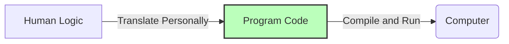
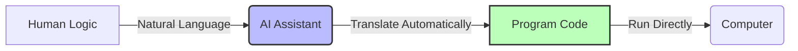

# The First Program for Non-Programmers

> "The programming language of the future is human language." — Jensen Huang

For the past few decades, "knowing how to program" has always been a technical barrier. To program, you needed to learn complex syntax, understand various abstract concepts, configure scalp-tingling development environments, and battle with mysterious error messages late into the night.

But today, the emergence of Large Language Models (LLMs) has truly changed all this for the first time. Humanity's own mother tongue is becoming the newest "programming language." We no longer need to learn the boring syntax and obscure keywords of traditional programming languages; we can command AI to write programs just like a "director."

In this chapter, we will demonstrate how to command AI to write a program without any programming foundation. To get started quickly, we will begin with the direction that is easiest to succeed in: writing a "web program."

Web programs have a huge advantage: they do not require installing any development environment. The browser is its runner. Just open the file containing the web program with a browser, and it can run immediately. (Web programs are usually written using HTML + JavaScript languages.)


## Expressing Logic

> One of the most important abilities in the future may no longer be "knowing how to write code," but "being able to clearly express one's ideas."

When mentioning programming, many people first think of "program code." But in fact, code has never been the essence of programming. Code is just an "intermediate translation layer" used when humans communicate with machines.

True programming is essentially only one thing: describing what you want the computer to do.

The flow of traditional programming goes like this:



And in the AI era, the flow of programming has become like this:



AI has taken over the work of translating logic into code, so we humans no longer need to first learn the abstract concepts required for programming, such as "arrays," "loops," "objects," and "inheritance." We only need to clearly describe in our own language:
1. What I want to do;
2. What happens in the first step;
3. What happens in the second step;
4. What happens after the user clicks.


## The First Program

Currently, most mainstream AI tools already support generating web applications directly. Common AI tools on the market include ChatGPT, Claude, Gemini, Meta AI, Kimi, DeepSeek, etc. Readers can choose any one to practice according to their preferences and convenience. The performance of different AI tools will not be exactly the same, but for the sample programs we adopt, the running effects will be very similar.

All examples in this chapter are tested on [Meta AI](https://meta.ai/). The reason for choosing Meta AI is that when the author was writing this book, Meta AI had no usage limits, whereas the free versions of other mainstream AI tools basically all had usage limits.

If we just ask some simple life questions, we won't use AI tools too many times, and usage limits are not a big problem. But for programming, we usually need to communicate repeatedly with the AI and adjust our requirements, so the frequency of using AI will be much higher than daily use.

Of course, companies' pricing strategies will adjust at any time. Readers can choose the appropriate tool according to the situation at the time. Different AI models may vary in quality when handling complex tasks. But for our current simple web programs, any mainstream AI tool is perfectly capable.


### Starting with a Mini-Game

Let's start with the simplest mini-project that gives the most feedback. Make an airplane shooting game.

The specific steps are very simple. Open the AI tool, input the following requirements, and click the send button:

```text
I want to make an airplane shooting game. Please directly generate a runnable single-file HTML, and open the canvas and run it.
```

After sending, wait for dozens of seconds. We will see with our own eyes a game that can actually run.

### What is "Opening the Canvas"?

Many AI tools support a mode similar to "real-time preview." It can be understood as: the AI writes the code while directly running the program for us to see.

Some AI tools will turn this feature on automatically, like Meta AI; others (like Gemini) need you to select and add a "Canvas" from the plus sign next to the dialog box to turn this feature on.

Different platforms may have different names, such as "Canvas," "Artifacts," "Preview," "Run," etc., but they are essentially the same.

### Adding Detailed Requirements

You might feel that the mini-game generated by the AI is somewhat different from what you wanted. That's because the instructions we initially gave it were too vague. We only said we wanted an airplane shooting game, but didn't specify what to shoot or how to shoot. The AI could only guess our thoughts and casually create one.

If we describe the problem more specifically, the game generated by the AI will be closer to what we want. For example, we can say this:

```text 
Make a neon streamer style vertical full-screen shooting game (Lightning Fighter).
The player controls a cool fighter jet, supporting mouse, keyboard arrow keys, or mobile dragging controls.
The fighter automatically fires bullets. Both bullets and enemy planes must have a glowing (ShadowBlur) trailing effect.
Enemy planes randomly generate from the top of the screen and move downward. When destroyed, they burst into particle fragments.
There are three types of enemy plane health: small, medium, and large.
Destroying specific enemy planes randomly drops upgrade items: double bullets, invincible shield, full-screen bomb.
Include a health bar, score statistics, and highest score record.
Please directly generate a runnable single-file HTML.
Open the canvas and run it.
```


## Some AI Projects Especially Suitable for Beginners

In addition to the mini-game above, there are many projects suitable for beginners. Below we list some mini-programs with extremely high success rates that easily bring a sense of accomplishment for everyone to test:

### Modern Snake

```text
Make a modern version of Snake.
Map is 20x20.
The snake's body has a gradient color.
Briefly accelerates after eating food.
Supports toggling passing-through-walls mode.
Supports mobile swipe controls.
Records the highest score.
Please directly generate a runnable single-file HTML.
Open the canvas and run it.
```

### 2048 Enhanced Edition

```text
Create a 2048 game.
Supports keyboard arrow keys and mobile swiping.
Add a one-step undo feature.
Particle animations when merging.
Can continue to challenge 4096 after reaching 2048.
Please directly generate a runnable single-file HTML.
Open the canvas and run it.
```

### Brick Breaker + Realistic Physics

```text
Make a Brick Breaker game.
The paddle supports mouse and finger dragging.
The ball has realistic bounce physics.
Bricks have different health levels.
Randomly drops multi-ball and extended paddle items.
Please directly generate a runnable single-file HTML.
Open the canvas and run it.
```

### Pixel Art Parkour

```text
Create a pixel art endless parkour game.
The character advances automatically.
Press space or click to jump.
Supports double jumping.
Parallax scrolling background.
Shows score and a restart button upon death.
Please directly generate a runnable single-file HTML.
Open the canvas and run it.
```

### Ancient Style Text Adventure

This is especially suitable for history buffs.

```text
Make a Three Kingdoms-themed text adventure game.
The player plays the role of a strategist.
Each scene offers 2-3 options.
Different choices affect the ending.
Supports saving the game.
Ancient style interface.
Please directly generate a runnable single-file HTML.
Open the canvas and run it.
```


### Cyberpunk Electronic Wooden Fish

This project uses the Web Audio API to synthesize the wooden fish sound purely through code, completely without external audio files.

```text
Make a cyberpunk style electronic wooden fish stress-relief mini-program.
The interface uses a black-and-gold or neon color scheme, rich in futuristic tech feel.
When clicking the wooden fish, there is a smooth vibrating and zooming animation, and glowing text like "Merit +1", "Bug -1", "Wealth +88", "Hair loss reversed" floats out randomly.
Comes with an electronic, ethereal striking sound effect (must be synthesized purely through code using the Web Audio API, no external audio files).
Includes an "Auto Strike" switch with adjustable speed.
Records the total number of strikes, and unlocks titles based on the number of strikes (e.g., Novice Practitioner, Code Pope, Cyber Buddha).
Please directly generate a runnable single-file HTML.
Open the canvas and run it.
```

### Interactive Physics Particle Sandbox

Using Canvas pixel-level operations, let AI write a micro physics engine. Watching flowing sand and water is very healing.

```text
Make a retro interactive particle sandbox game (similar to Falling Sand).
Use HTML5 Canvas for rendering, maintaining a smooth frame rate.
Provide an element selection panel at the bottom or side: Sand (falls under gravity and flows to both sides), Water (rapidly flows to both sides filling gaps), Wall (fixed gray blocks), Fire (extends upwards and burns destroying sand and water).
Supports placing elements by dragging the left mouse button or smudging with a finger on mobile; brush thickness is adjustable.
Provide a "Clear Screen" button.
Please directly generate a runnable single-file HTML.
Open the canvas and run it.
```


### Desktop Electronic Pet

Use pure CSS animations or SVGs to draw a high-appearance mini pet. Very suitable for testing AI's state machine logic.

```text
Make an exquisite web version of an electronic pet (similar to pixel art Tamagotchi).
In the center of the screen is a cute animated pet (drawn with pure CSS or exquisite SVG splicing, with breathing and blinking animations).
Contains three status bars: Satiety, Mood, and Cleanliness, which slowly decrease over time.
Below are three interactive buttons: Feed (increases Satiety), Play (increases Mood), Bath (increases Cleanliness).
When a certain status is too low, the pet changes expression (becomes sick or sad).
When interactions accumulate to a certain number of times, the pet will glow and "evolve" into a more advanced, better-looking appearance.
Please directly generate a runnable single-file HTML.
Open the canvas and run it.
```


### 3D Particle Memory Match

An exquisite matching game.

```text
Create a high-appearance card matching (memory match) game.
Contains a 4x4 card matrix. The back of the cards has a high-tech texture, and the front uses exquisite Emoji icons.
When clicking a card, there is a smooth 3D flip animation (`transform: rotateY`).
When two cards are successfully paired, the cards burst into gorgeous colorful particle fireworks effects (particles implemented in Canvas), and then fade out and disappear.
Add a countdown limit (e.g., 60 seconds) and a card flip step counter.
After successfully challenging, pop up a cool "VICTORY" animation and a replay button.
Please directly generate a runnable single-file HTML.
Open the canvas and run it.
```