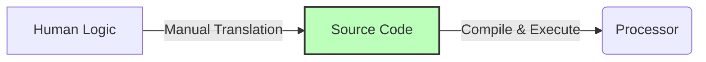
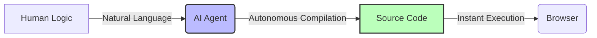

# The First Program for Non-Programmers

> "The programming language of the future is human language." — Jensen Huang

For the past few decades, "knowing how to code" has been an impenetrable technical fortress. To build software, you had to memorize arcane syntax, wrestle with extreme abstract logic, configure agonizing local development environments, and battle cryptic compilation errors late into the night.

Today, the explosion of Large Language Models (LLMs) has violently leveled this fortress. For the first time in computing history, humanity's mother tongue has become the apex "programming language." We no longer need to submit to the rigid constraints of C++ or Python syntax. We can command an AI to architect software exactly as a film director commands a crew.

In this chapter, we will demonstrate how to architect a complete software application with zero foundational coding knowledge. To maximize the feedback loop, we will start with the most accessible ecosystem: deploying a **Web Application**.

Web applications possess a massive structural advantage: they require zero environmental configuration. The browser is the universal runtime. You simply open the generated file in Google Chrome, and the application executes immediately. (Under the hood, these are powered by the holy trinity of web architecture: HTML, CSS, and JavaScript).

## The Architecture of Intent

> In the AI era, the most critical engineering skill is no longer "writing code," but rather **"the rigorous articulation of intent."**

When the uninitiated hear "programming," they envision matrices of green code on a black terminal. But physically typing code has never been the essence of software engineering. Source code is merely an "intermediate translation layer"—a crude mechanism invented because computers couldn't understand English.

True programming has only ever been one thing: rigorously defining the exact parameters and state transitions of a system.

The legacy software engineering pipeline operated like this:



In the AI era, the pipeline has been radically upgraded:



Because the AI Agent now handles the grueling translation from logic to syntax, humans no longer need to study abstract architectural primitives like "Polymorphism," "Pointers," or "Event Loops." You simply need to articulate your system requirements in a structured, deterministic format:

1. **The Macro Objective:** What is the terminal goal of the software?
2. **The Initial State:** What renders on the screen at T=0?
3. **The State Transitions:** What mathematical or visual changes occur when a specific event triggers (e.g., a user clicks a button)?

## Deploying Your First Application

Virtually all frontier AI platforms natively support zero-shot web application generation. You can execute these workflows on ChatGPT, Claude, Gemini, Meta AI, or DeepSeek. While the underlying intelligence models vary, for the scope of single-file web applications, any frontier model is vastly overqualified.

*(Note: The examples in this chapter were originally validated on [Meta AI](https://meta.ai/) and Claude 3.5 Sonnet, utilizing their built-in interactive Canvas features for instant visual feedback).*

When testing AI tools, normal conversational queries consume negligible compute. However, deploying software requires highly iterative, multi-turn prompting. Ensure you are using a tier (or an open-source model) that supports sustained message limits.

### Bootstrapping a Game Engine

Let's start with a high-dopamine, instant-feedback project: Architecting a vertical-scrolling Arcade Shooter.

The execution is brutally simple. Open your AI console, inject the following prompt, and hit execute:

```text
Architect a vertical-scrolling arcade airplane shooter game.
Output the entire payload as a single, runnable HTML file containing all CSS and JavaScript.
Immediately mount the payload to the Canvas and execute it.
```

In under 30 seconds, the model will output a mathematically sound, fully interactive physics engine running directly in your browser window.

### What is the "Canvas"?

Many elite AI platforms feature an **Artifacts** or **Canvas** rendering engine (pioneered by Claude). 
Instead of forcing you to copy-paste raw code into a local text editor, the AI IDE intercepts the HTML payload and instantly renders it in a secured, sandboxed iframe right next to your chat window. 

Depending on the platform, this feature may be labeled "Canvas," "Artifacts," or "Code Execution." It represents the ultimate, zero-latency CI/CD pipeline: *Prompt -> Generate -> Play.*

### Injecting Granular Architectural Constraints

You might notice the initial game is crude. Why? Because the prompt was too vague. We requested a "shooter game," but provided zero constraints regarding the physics engine, the sprite rendering, or the hitboxes. The AI was forced to guess and hallucinated the most basic, statistically average game possible.

To architect a premium product, we must inject rigid, high-fidelity specifications. Let's execute an advanced prompt:

```text 
Architect a vertical-scrolling, endless arcade shooter (e.g., Raiden).

# Aesthetic Constraints
- Enforce a "Cyberpunk Neon" visual aesthetic using CSS DropShadows for a glowing effect.
- The background must simulate a deep-space parallax scrolling effect.

# Physics & Control Matrix
- The player controls a high-tech fighter jet. Bind movement to Mouse/Touch dragging and WASD keyboard inputs.
- The jet auto-fires dual-laser projectiles. Projectiles must emit a neon-blue glow.
- Enemy entities spawn randomly along the X-axis at the top of the viewport and translate downward on the Y-axis.

# Game Loop & Mechanics
- Implement 3 distinct Enemy Classes: Light (1 HP), Medium (3 HP), and Heavy (5 HP), with varying velocities and scales.
- Upon entity destruction (HP = 0), render a particle-explosion animation using HTML5 Canvas primitives.
- Destroying Heavy enemies has a 20% probability of dropping a Power-Up (e.g., Spread Shot, Invincibility Shield).

# HUD (Heads Up Display)
- Render a live Score counter, a Player HP bar, and persist the High Score in LocalStorage.

Generate the payload as a single, runnable HTML file. Mount it to the Canvas immediately.
```

## AI-Native Boilerplate Projects

Beyond the arcade shooter, here is a curated matrix of high-success-rate, single-file projects that perfectly stress-test an LLM's capability to generate robust game loops and state machines. Copy and paste these prompts directly into your AI assistant.

### The Modern Snake Engine

```text
Architect a modernized version of the classic Snake game.
- The game grid must be exactly 20x20.
- The Snake entity must render using a smooth, dynamic CSS linear-gradient.
- Eating a food node temporarily increases the velocity multiplier by 1.5x for 3 seconds.
- Implement a toggle for "Wall-Wrap Mode" (passing through boundaries).
- Enforce strict Swipe-Gesture support for mobile viewports.
- Persist the High Score in the browser's LocalStorage.
Generate as a single, runnable HTML file and mount it to the Canvas.
```

### The 2048 State Machine (Enhanced)

```text
Architect a pristine clone of the 2048 puzzle game.
- Bind input controls to Keyboard Arrows and Mobile Touch Swipes.
- Implement a complex state-history array to support a "One-Step Undo" button.
- When tiles merge, inject a satisfying CSS scale-bounce animation.
- The win-state triggers at 2048, but the user can infinitely continue to 4096 and beyond.
Generate as a single, runnable HTML file and mount it to the Canvas.
```

### Arkanoid Physics + Particle Engine

```text
Architect a Brick Breaker (Arkanoid) clone with advanced 2D physics.
- The Paddle entity tracks Mouse X-axis and Touch drag events.
- The Ball entity must possess realistic bounce-angle physics (dependent on where it strikes the paddle).
- Render a grid of Bricks with varying HP states (e.g., 1 hit, 2 hits, indestructible).
- Implement a loot-drop system: Destroying bricks randomly spawns "Multi-Ball" or "Wider Paddle" power-ups.
Generate as a single, runnable HTML file and mount it to the Canvas.
```

### The Infinite Pixel Parkour

```text
Architect an infinite side-scrolling Parkour game with a Retro Pixel aesthetic.
- The Player entity is locked on the X-axis and auto-runs; the environment translates on the X-axis to simulate speed.
- Bind Jump to the Spacebar and Mouse Click. Implement a Double-Jump velocity mechanic.
- The background must utilize 3 distinct layers of Parallax Scrolling to create depth.
- Upon collision with an obstacle, trigger a Game Over overlay with the Final Score and a "Restart" CTA.
Generate as a single, runnable HTML file and mount it to the Canvas.
```

### The Cyberpunk "Electronic Wooden Fish" (Zen Engine)

This project forces the AI to interface with the advanced **Web Audio API**, synthesizing waveforms programmatically without loading external `.mp3` assets.

```text
Architect a Cyberpunk-themed "Electronic Wooden Fish" (Zen clicker) application.
- The UI MUST utilize a high-contrast Neon/Black-Gold color palette.
- When the central UI element is clicked, trigger a satisfying haptic/scale CSS animation.
- Upon click, dynamically spawn floating text nodes (e.g., "Merit +1", "Bug -1", "Dopamine +88") that fade and float upward on the Y-axis.
- CRITICAL: Utilize the browser's Web Audio API to synthesize a deep, resonant, ethereal striking sound programmatically. Do NOT rely on external audio files.
- Implement an "Auto-Tap" toggle with a slider to adjust the frequency (taps per second).
- Render a live Tap Counter and unlock dynamic titles (e.g., "Script Kiddie", "Cyber Monk", "Tech Buddha") based on the total tap threshold.
Generate as a single, runnable HTML file and mount it to the Canvas.
```

### The Cellular Automata Sandbox (Particle Physics)

This requires the AI to manipulate raw Canvas pixel buffers, architecting a highly optimized micro-physics engine.

```text
Architect a retro Falling Sand physics sandbox game.
- Utilize the HTML5 `<canvas>` API for raw pixel rendering. The frame loop must hold a strict 60 FPS.
- Render a UI sidebar with element selectors: 
  - Sand (falls downward, spreads into pyramids).
  - Water (rapidly flows horizontally to fill gaps).
  - Wall (static, indestructible gray pixels).
  - Fire (spreads upward, aggressively deletes Sand and Water pixels on contact).
- Bind the drawing mechanism to Mouse Drag and Touch events. Include a brush-size slider.
- Inject a "Nuke Canvas" (Clear) button.
Generate as a single, runnable HTML file and mount it to the Canvas.
```

### The 3D Memory Matrix (CSS Hardware Acceleration)

This prompt forces the AI to execute advanced CSS 3D transforms (`rotateY`) and state-matching logic.

```text
Architect a high-fidelity Memory Match (Concentration) card game.
- Render a 4x4 CSS Grid of cards. The back of the cards must feature a high-tech geometric pattern; the face of the cards will utilize distinct Emojis.
- When a card is clicked, trigger a hardware-accelerated 3D flip animation using `transform: rotateY(180deg)`.
- If two cards match, trigger an HTML5 Canvas particle explosion over the coordinates of the cards, then fade the cards out.
- Implement a rigid 60-second countdown timer and a "Total Moves" integer tracker.
- Upon clearing the board, render an aggressive, screen-shaking "VICTORY" animation overlay with a Play Again button.
Generate as a single, runnable HTML file and mount it to the Canvas.
```