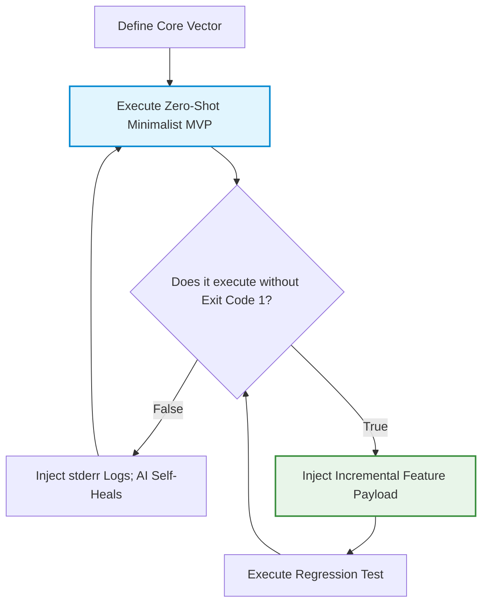

# Iterative Architecture and Debugging

> "There is no great writing, only great rewriting." — Justice Brandeis

After successfully commanding an AI to synthesize your first minimal web application, you will inevitably collide with a brutal reality: No matter how meticulously you engineer your Prompt, it is mathematically impossible for an AI to generate a 100% flawless, production-ready system in a single Zero-Shot execution.

This is not a failure of the model's "intelligence." Large Language Models are, by physical design, probabilistic generative engines. They do not execute "Fixed Input = Fixed Output" algorithms like legacy compilers. Even with a mathematically identical Prompt, the payload generated across different API sessions will exhibit subtle structural mutations.

## The Architecture of Iteration

If you attempt to brute-force a massive architectural requirement on the first prompt—e.g., *"Build an open-world MMO engine with WebSockets, a Postgres account system, 3D WebGL rendering, and real-time leaderboards"*—the AI will suffer catastrophic Context Collapse. The extreme density of conflicting architectural constraints will cause the model to hallucinate violently, outputting fractured logic and lethal syntax errors.

The elite engineering methodology is to architect a **Minimum Viable Product (MVP)** and ruthlessly execute iterative, continuous delivery loops.

### The Minimum Viable Product (MVP)

MVP is the foundational doctrine of Silicon Valley engineering. It dictates: *"Deploy the absolute minimum feature-set required to validate the core architectural thesis, at maximum velocity."*

The prime directive of an MVP is survival: Ensure the application physically executes before you waste compute optimizing the CSS shadows.



An architecturally sound MVP satisfies exactly three constraints:
1. **Compilation:** It executes without a fatal white-screen or compiler crash.
2. **Interaction:** Event listeners are active (e.g., clicking a button fires a console log).
3. **Core Loop:** It successfully completes exactly one primary business action.

Nothing else matters. Many of the most dominant enterprise platforms operating today began as crude, barely functioning single-file MVPs.

### Live Execution: The 5-Phase Iteration Protocol for a Flashcard Application

Assume we are architecting a Spaced-Repetition Flashcard application. You must **never** command the AI to *"Build a full-stack Quizlet clone"* on turn one. We must construct it layer by layer, utilizing a strict Micro-Operations framework.

The correct iteration cadence scales linearly:

| Execution Phase | Architectural Objective | The Payload (Prompt Vector) |
| :--- | :--- | :--- |
| **Phase 1: The Core DOM Matrix** | Establish the base rendering engine. | "Architect a minimal Flashcard SPA (Single Page Application). Output a single-file HTML payload. Render a central Card component that randomly displays an English string and its localized translation. Inject a 'Next' CTA button that triggers the randomization function." |
| **Phase 2: State Mutation** | Inject boolean user feedback loops. | "Excellent. Inject two CTAs below the card: 'Retained' and 'Failed'. If 'Retained' is clicked, mutate the Card background to `#4ade80` (Green) and trigger 'Next'. If 'Failed', mutate to `#f87171` (Red). Render a persistent Counter tracking total 'Retained' nodes in the current session." |
| **Phase 3: Visual Polish & UX** | Establish deterministic visual feedback. | "Inject a dynamic Progress Bar `<progress>` in the header tracking the completion ratio (e.g., 10 cards = 100%). Bind a CSS 3D `transform: rotateY(180deg)` transition to the card flip event." |
| **Phase 4: Data Persistence** | Ensure State survives the browser lifecycle without a backend. | "Implement `LocalStorage` persistence. Serialize the user's progress arrays and integer counts. The state machine must automatically re-hydrate the DOM upon a hard browser refresh." |
| **Phase 5: Advanced Business Logic** | Inject complex array filtering. | "Inject a 'Review Protocol' mode. When triggered, the application must filter the data array and exclusively loop through nodes previously marked as 'Failed'. The node is only purged from the Review array once the user clicks 'Retained'." |

> [!TIP]
> **The Velocity of Iteration**
> By executing this "Snowball" protocol, the delta of the code mutated by the AI per turn is extremely isolated. 
> This mathematically minimizes the probability of a catastrophic logical collapse. More importantly, it provides a massive neurochemical feedback loop: With every `<F5>` refresh, you witness your architecture evolving in real-time.

## Advanced Execution: Architecting a 3D WebGL Engine via Iteration

The previous examples utilized 2D DOM manipulation. We will now escalate the complexity, utilizing Natural Language to iteratively architect a 3D WebGL Space Shooter.

As an Intent Architect, you do not need to understand Matrix Mathematics, Quaternions, or WebGL Shaders. Your core responsibility is the **Rigorous Decomposition of Constraints.** You must inject the following architectural phases into the AI, one node at a time. The Agent will autonomously expand the system state based on the payload of the previous execution loop.

The macro-topology of the project:

```text
🛸 [WebGL Space Engine Topology]
├── Phase 1: Initialize the 3D Sandbox (Skybox, Player Mesh, Camera Rig)
├── Phase 2: Inject Combat Vectors (Projectile physics, Entity spawning)
├── Phase 3: The Event Loop (AABB Collision detection, UI State, Boss triggers)
├── Phase 4: Roguelike State Machine (Loot drops, Stat scaling)
└── Phase 5: Post-Processing & Mobile Touch Interceptors
```

Execute the following payload sequentially. **Do not** batch these prompts into a single command. After each Phase, execute the code, verify the physics engine hasn't crashed, and proceed.

#### Phase 0: System Initialization
```text
Architect a 3D Low-Poly Space Shooter within a single-file HTML payload.
- Inject the `Three.js` dependency via an ESM importmap CDN.
- Instantiate the Player Mesh at the bottom-center of the viewport. The Mesh automatically translates positively on the Z-axis.
- The Camera Rig must follow the Player on a delayed interpolation curve (Chase Cam).
- Inject a deep-space Skybox and a neon wireframe ground-plane.
- Bind Player translation (X/Y axis) to Keyboard WASD/Arrows, and inject a virtual joystick for Mobile viewports.
- Execute this as a Minimum Viable Prototype containing only the Start UI and Game Over/Restart state logic.
```

#### Phase 1: The Combat Engine
```text
- Inject an auto-fire loop and a manual Charge-Shot mechanic.
- Projectile Meshes must utilize a glowing `MeshBasicMaterial` with a TrailRenderer effect.
- Architect 3 Enemy Entity classes:
  1. Light: High velocity, linear translation on the Z-axis.
  2. Medium: Medium velocity, Sine-wave translation on the X-axis.
  3. Heavy: Low velocity, massive HP scaling.
- Enemy entities must spawn procedurally outside the camera frustum with basic tracking algorithms.
- Inject WebGL particle emitters for Projectile impacts and Entity death states.
- Render a DOM overlay tracking Score and the current Kill-Combo multiplier.
```

#### Phase 2: Player State Machine
```text
- The Player Entity possesses a rigid 3-HP state.
- Decrement HP upon AABB bounding-box collision with an Enemy Entity or Enemy Projectile.
- Inject an "Evasion Roll" i-frame mechanic:
  - Triggered by the `Shift` key or a Double-Tap touch event.
  - Grants absolute invincibility for 800ms, bound by a 3000ms cooldown.
- Inject an Energy state integer. Charge-shots decrement Energy; Energy auto-regenerates via a `requestAnimationFrame` delta-time loop.
- The DOM UI must cleanly render: Score, HP, Energy, Combo.
```

#### Phase 3: Procedural Scaling
```text
- Enforce an Infinite-Runner logic loop.
- Global entity velocity and spawn-rates scale logarithmically against the Score integer.
- At T=60s intervals, spawn a Boss Entity.
- The Boss must cycle randomly through 3 attack state-machines:
  1. Radial Scatter-Shot
  2. X-Axis Laser Sweep
  3. Homing Missiles
- The environment (Ground/Clouds) must generate procedurally to simulate infinite translation.
- Inject a Parallax background and spawn Asteroid collision obstacles.
```

#### Phase 4: Roguelike Stat Scaling
```text
- Upon Entity death, calculate a 20% probability to instantiate a Loot Drop Mesh:
  1. Spread-Fire Module
  2. Temporary Invincibility Shield
  3. Energy Battery
  4. Drone Wingman
- Loot buffs persist for 15,000ms and allow state-stacking.
- Every 5000-point interval, halt the `requestAnimationFrame` loop and render a "Level Up" DOM overlay. The user selects one permanent buff:
  - Fire Rate +20%
  - Velocity +15%
  - Max HP +1
```

#### Phase 5: Audiovisual Post-Processing
```text
- Global Art Direction: Low-Poly geometry + aggressive Bloom post-processing.
- Enforce a Cyber-Punk color palette (Neon Cyan and Magenta).
- Inject advanced WebGL shaders:
  - Engine thruster exhaust plumes
  - Projectile light-casting
  - Screen-shake during heavy collisions
  - A localized time-dilation (Slow-Motion) effect upon Boss kills
- Utilize the Web Audio API to synthesize raw oscillators for: Laser blasts, Explosions, Loot pickups, and a heavy Synth-Bass procedural background loop.
```

#### Phase 6: Mobile Compilation
```text
- The Left half of the viewport intercepts Touch events for the Virtual Joystick.
- The Right half renders Touch targets for Evasion and Charge-Shot.
- Ensure all DOM overlays adapt flawlessly to both Portrait and Landscape orientations via CSS Media Queries.
- Serialize the High Score integer to `LocalStorage`.
```

#### Phase 7: Optimization & Deployment
```text
- Consolidate all JS, CSS, and GLSL code into the single HTML payload.
- Minify the payload where possible. The target bundle size is < 300KB.
- Ensure the application executes identically when deployed to a static CDN bucket (e.g., Cloudflare Pages).
- Generate a 100-word SEO metadata block in English for deployment embedding.
```

When the AI finalizes the engine, execute it. You will witness complex 3D geometry banking and rolling under your input, rendering real-time post-processing bloom and particle physics. 

This entire architecture was synthesized via a few rounds of highly structured Natural Language. This is the lethal power of the "Intent Architect." You no longer write code; you command physics.

## Debugging: The "Exit Code 1" Protocol

As previously established, you proceed to the next iteration *only if the application compiles.* But what happens when it crashes?

If your browser console explodes with red stack-traces, or if the screen renders a fatal white blank, **do not panic.** In software engineering, exceptions are the default state of reality. Elite Principal Engineers battle cryptic stack-traces every single day.

Historically, debugging required scouring StackOverflow or manually executing binary searches across the source code. Today, you simply pipe the stack-trace directly into the AI.


### The Golden Rule of Bug Reporting

When the system halts, **never** issue a subjective complaint like *"The app is broken, please fix."* The AI cannot "see" your browser. It does not know what state triggered the crash, what line failed, or what the compiler threw. A vague complaint forces the AI to hallucinate a patch based on statistical probability, which often completely corrupts the repository.

The elite debugging protocol demands absolute, deterministic telemetry: *"Agent, upon clicking the 'Review Mode' CTA, the main thread deadlocked."* Then, hit `F12`, copy the entire raw output from the browser's Console, and paste it into the prompt.

By injecting the exact `stderr` logs, you provide the AI with a mathematical CT scan of the failure. The model will calculate the root cause and output a precise diff-patch, often diagnosing complex race conditions faster than a human Architect.

## Core Survival Heuristics for the Uninitiated

The following heuristics will prevent 90% of the catastrophic failures encountered by junior AI engineers:

### 1. Weaponize "Tailwind CSS" for Instant UI Polish

If you command an AI to generate a web app without layout constraints, it defaults to the horrific, legacy 1990s HTML aesthetic (Times New Roman, raw blue hyperlinks). Always append this global constraint to your prompt: *"You MUST utilize the Tailwind CSS CDN to architect the UI. Enforce an aggressive, enterprise-grade Dark Mode. Inject smooth CSS `transform` and `transition` states on all interactive nodes."*

Because LLMs have ingested millions of React/Tailwind repositories, this single sentence forces the AI to instantly upgrade the visual architecture, outputting a highly polished, Silicon Valley-grade interface.

### 2. Sever Backend Dependencies in V1

Integrating physical databases, JWT Authentication arrays, or external API routers exponentially spikes the architectural complexity. We will master these backend integrations in subsequent chapters. During your initial MVPs, enforce a strict "Frontend-Only" constraint. If state must be persisted, utilize the browser's native `LocalStorage`. 

### 3. "Execution Over Elegance"

Veteran developers often instinctively critique AI output: *"Is this code DRY? Is the Big-O time complexity optimal? Is the naming convention PEP-8 compliant?"* 
At this stage of prototyping, **ignore all of it.** The only metric that matters is: *Does the payload execute without crashing?* Your immediate objective is not to write elegant enterprise infrastructure; your objective is to rapidly establish the cognitive absolute that *"I am capable of commanding an AI to build software."* 
Elegance comes later, during the Refactoring cycles.
