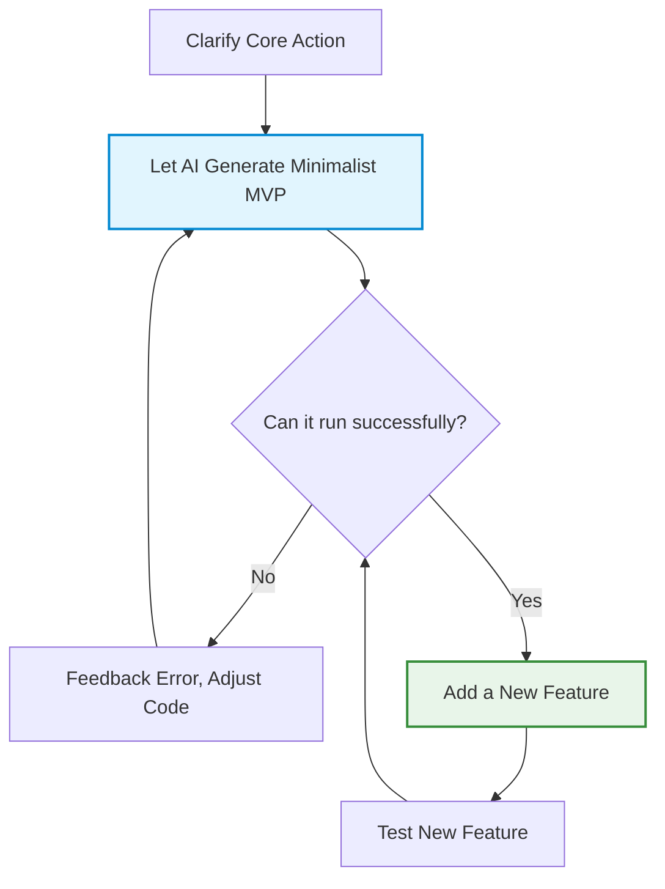

# Introduction to Iterative Improvement and Debugging

> "Jade needs to be carved and polished before it becomes an exquisite artifact." — "Three Character Classic"

After taking the first step of commanding AI to create a simple mini-game, you might find that no matter how detailed we write the requirements, it's absolutely impossible for AI to generate a flawless program that meets your expectations 100% in one go.

This is not because the AI isn't smart enough, but because large language models are essentially probabilistic generative systems. They don't have "fixed inputs, fixed outputs" like traditional programs. Even with the same prompt, the results generated at different times might have subtle differences.


## Iterative Improvement

If you throw an incredibly grand task with complex requirements at the AI right from the start, such as "Help me make an open-world game platform with AI chat, an account system, multiplayer online, 3D scenes, and real-time leaderboards." At this time, the AI might go directly into a "delirious" state due to excessive context accumulation and overly dense conflict points, and the output code will often have chaotic logic and frequent errors.

A more effective method is to make a Minimum Viable Product (MVP) first, and then continuously improve upon it.

### Minimum Viable Product (MVP)

MVP (Minimum Viable Product) is a very classic concept in the internet industry. It means "using the least features to verify the core idea as quickly as possible."

The core idea of MVP is to ensure the program is alive first, and then consider whether it looks cool.




A qualified MVP usually only needs to meet three conditions:
1. Runnable (double-clicking to open is not a white screen);
2. Interactive (button clicks have feedback);
3. Can complete one core action.

Nothing more.

Many large products today were actually unimaginably simple at the beginning.


### Practical Exercise: The 5-Step Iteration Method for a Vocabulary App

Suppose we want to make a vocabulary app. We shouldn't ask the AI to make a "full version Baicizhan" all at once, but should build it up layer by layer like building blocks.

The correct iteration rhythm should be like climbing stairs:

| Iteration Phase | Target Task | Prompt Example |
| :--- | :--- | :--- |
| **Step 1: Build the Skeleton** | Only do the most core display function | "I want to make a vocabulary webpage. Please help me generate a runnable single-file HTML. Put a word card in the middle of the interface, randomly displaying an English word and its Chinese translation, with a 'Next' button below it. Clicking it should randomly switch the word." |
| **Step 2: Add One-Way Interaction** | Introduce user judgment feedback | "Excellent. Now please add a 'Remembered' and a 'Forgot' button at the bottom of the webpage. When clicking 'Remembered', the card background turns green and automatically switches to the next one; when clicking 'Forgot', the card turns red, and at the top of the screen, count how many words have been accumulated as remembered today." |
| **Step 3: Optimize Visuals & Progress** | Establish visual feedback | "Please add a progress bar above the card to show today's vocabulary progress (e.g., finishing 10 is 100%). Add a smooth transition animation when the card flips." |
| **Step 4: Introduce Data Persistence** | Ensure data is not lost (without a server) | "Use the browser's LocalStorage technology to save the words memorized today and the count. This way, when I refresh the webpage or close and reopen the browser, my progress and records will still exist." |
| **Step 5: Enrich Business Logic** | Add a mistake book/review mode | "Now, please add a 'Review Mode' button. After clicking, it will only loop through the words I previously clicked 'Forgot' for, until I click 'Remembered' to remove them from the review book." |

:::tip The Joy of Iteration
You will find that after adopting this "snowball" style of development, the scope of the AI's modification each time will be very small.
This not only greatly reduces the probability of logic collapse, but also gives you a very strong sense of creative feedback:
Every time you refresh the page, you can clearly see that the software you created with your own hands has evolved a bit more.
:::

## Practical Upgrade: Making a Cool 3D Game Step by Step

The previous examples were mostly "2D web tools." Now we'll try to upgrade further, using natural language to step-by-step generate a 3D flying shooting game.

As a beginner with zero foundation, we don't need to understand the technology behind making 3D games at all. What we truly need to master is how to break down requirements. For a zero-foundation player, you just need to send the following steps to the AI paragraph by paragraph. The AI will continue to automatically expand the system based on the code from the previous round.

The entire development idea is roughly as follows:

```text
🛸 [3D Flight Game Development Blueprint]
├── Phase 1: Build 3D World Prototype (Starry sky, spaceship model, camera follow)
├── Phase 2: Inject Core Gameplay (Flying, shooting, enemy spawning)
├── Phase 3: Establish Game Loop (Collision, scoring, death, Boss)
├── Phase 4: Add Growth System (Items, upgrades, enhancements)
└── Phase 5: Audiovisual Packaging and Mobile Adaptation
```


The specific commands are as follows. It is recommended to send them paragraph by paragraph. Do not throw everything at the AI at once.

After completing each step, run and playtest first. Confirm it hasn't crashed before continuing to the next phase.

#### 0. Initialize Project
```text
Create a 3D low-poly flight shooting game in a single-file HTML.
Use Three.js and import it via importmap CDN.
The player's plane is located in the lower-middle of the screen, can move left, right, up, and down, and flies forward automatically.
The camera follows behind and slightly above the plane.
Add a starry sky background and a ground grid.
Supports keyboard WASD/arrow keys, as well as a mobile virtual joystick.
First generate a runnable prototype, including a start screen and a game-over restart.
```

#### 1. Combat System
```text
Add automatic shooting and manual charge shooting.
Bullets use a glowing material with a trailing effect.
Enemy planes are divided into three types:
Small planes charge in a straight line;
Medium planes sway left and right;
Large planes have high health and are slow.
Enemy planes will spawn procedurally from the front with simple tracking AI.
Add particle effects for bullet hits and enemy plane explosions.
Display score and combo system.
```

#### 2. Player System
```text
The player has 3 bars of health.
Deducts health when colliding with enemy planes or hit by enemy bullets.
Add a roll invincibility mechanic:
Press Shift or double-tap the screen to trigger a side roll, invincibility lasts for 0.8 seconds, with a 3-second cooldown.
Add an energy bar system.
Charge attacks consume energy; energy recovers over time.
UI uses English display: Score, Health, Energy, Combo.
```

#### 3. Procedural Levels and Difficulty
```text
Add endless mode.
Game difficulty increases with time and score.
Generate a Boss wave every 60 seconds.
The Boss has three attack patterns:
Scatter shot, laser sweep, tracking missiles.
Ground and clouds are procedurally generated.
Add parallax scrolling to the distant background.
Add asteroid obstacles that the player needs to dodge.
```

#### 4. Roguelike Growth
```text
When an enemy plane is destroyed, there is a 20% chance to drop a random item:
1. Scatter gun
2. Shield
3. Energy recovery
4. Wingman

Items last for 15 seconds and can stack.

Every time 5000 points are gained, pop up a choose-one-of-three upgrade:
- Fire rate +20%
- Movement speed +15%
- Max health +1

Upgrade selection is implemented using a pause popup.
```

#### 5. Audiovisual Polish
```text
Overall Art Style:
Low-poly + Glowing materials.
The main color palette is cyber blue and purple.

Add:
- Engine exhaust flame
- Bullet trails
- Explosion shockwaves
- Camera shake
- Slow-motion kill effects

Use Web Audio API to synthesize:
- Shooting sound effects
- Explosion sound effects
- Item pickup sound effects
- Boss alarm

Background music uses procedural electronic bass loops.
```

#### 6. Mobile Adaptation and Experience
```text
Add a left virtual joystick for movement control.
Right buttons control rolling and charging.

Auto-shooting is on by default and can be turned off in settings.

UI adapts to landscape and portrait screens.
Increase font and button sizes for mobile devices.

Add a pause button and settings menu.

Display after game over:
- Current score
- Historical highest score
- Kills
- Survival time

Highest score is saved using LocalStorage.
```

#### 7. Launch and Packaging
```text
Please merge all code into a single-file HTML.
Three.js is imported using CDN importmap.

Compress and inline CSS and JS.
Try to keep the file size under 300KB.

Add the title "Stellar Breakout" to the top of the page.
Add brief operation instructions.

Export a version that can be directly uploaded to static website hosting platforms.

Finally, generate a brief introductory text within 100 words in English to embed in a blog.
```

When the AI helps you generate the complete prototype, click run. You will see geometric spaceships gently tilting under your control in the deep 3D starry sky, with exhaust flames drawing eerie blue trails in the dark.

And all this might just come from a few rounds of natural language conversation between you and the AI. This is the most addictive part of "natural language programming." It makes the act of "creating software" as natural as telling a story.


Below is the result generated by my AI: ([Result Demo](https://artifacts.meta.ai/share/a/1e9a1aac-d6d4-43bf-99b2-dd7c00fef3d6?utm_source=meta_ai_web_share_copy_link&utm_medium=share&utm_campaign=ecto_share))


## Fixing Errors

It was mentioned above, "If the program doesn't crash, continue to the next step." But what if it crashes?

If you see a string of red error messages pop up in your browser, or if there's nothing at all, don't panic. Because "errors" are just the daily routine of software development. Even senior engineers with more than ten years of experience battle error logs almost every day.

In the past, if we encountered an error, we had to go to Google or professional forums to ask, or troubleshoot the problem bit by bit ourselves. But now, we can throw the error directly to the AI.


### The Golden Rule of Complaining

When you find the program isn't running as expected, never say "My webpage is broken, help me take a look." Because the AI can't see it; it neither knows what you did on the interface nor where the error occurred or what kind of error it is. This way, it can only rely on "guessing" to modify the problem, and the repair effect is usually very random.

The truly efficient way is to provide specific details, such as: "After I click the 'Review Mode' button, the page suddenly freezes." Or, press F12 to open the browser's developer tools, copy all the text in its Console tab, and send it to the AI.

This amount of information for the AI is almost equivalent to "medical record + CT scan + X-ray." It can often accurately locate the problem within seconds. Many times, it troubleshoots even faster than human programmers.


## Golden Rules for Zero-Foundation Players to Avoid Pitfalls

The following experiences can almost help you avoid 90% of beginner trainwreck scenes.

### Make Good Use of "Tailwind CSS" to Beautify the Interface

If the AI generates a webpage by default without any restrictions, it is usually a very rough classic blue and white color scheme. If you add a sentence at the end of the prompt: "Please use Tailwind CSS to beautify the entire interface, adopt an exquisite and elegant Dark Mode, and add smooth Hover Scale animations to the buttons." Then the texture of the page will instantly level up.

Tailwind CSS is a modern interface layout tool that AI is extremely familiar with. As long as you have this constraint, the texture of the webpage spat out by the AI will instantly jump, presenting a "big tech product-level" look full of sci-fi feel.


### Don't Touch Databases and Servers Right from the Start

Web programs with backend services will greatly increase the complexity of the program. Common backend services include: account registration and login, linking to cloud data, calling AI services, etc. This book will introduce these features in later chapters. But as a beginner, it is best for us to temporarily avoid these features and deal with them after accumulating some experience.

### Always Prioritize "It Can Run," Save Elegance for Later

For experienced programmers, when they see AI-generated code, they might already start considering whether the code is elegant, whether the naming is standardized, whether the architecture is advanced, and whether there is duplicated logic. But these are not the most important issues at this stage. What is truly important now is whether you can quickly establish the confidence that "I can really build software."
