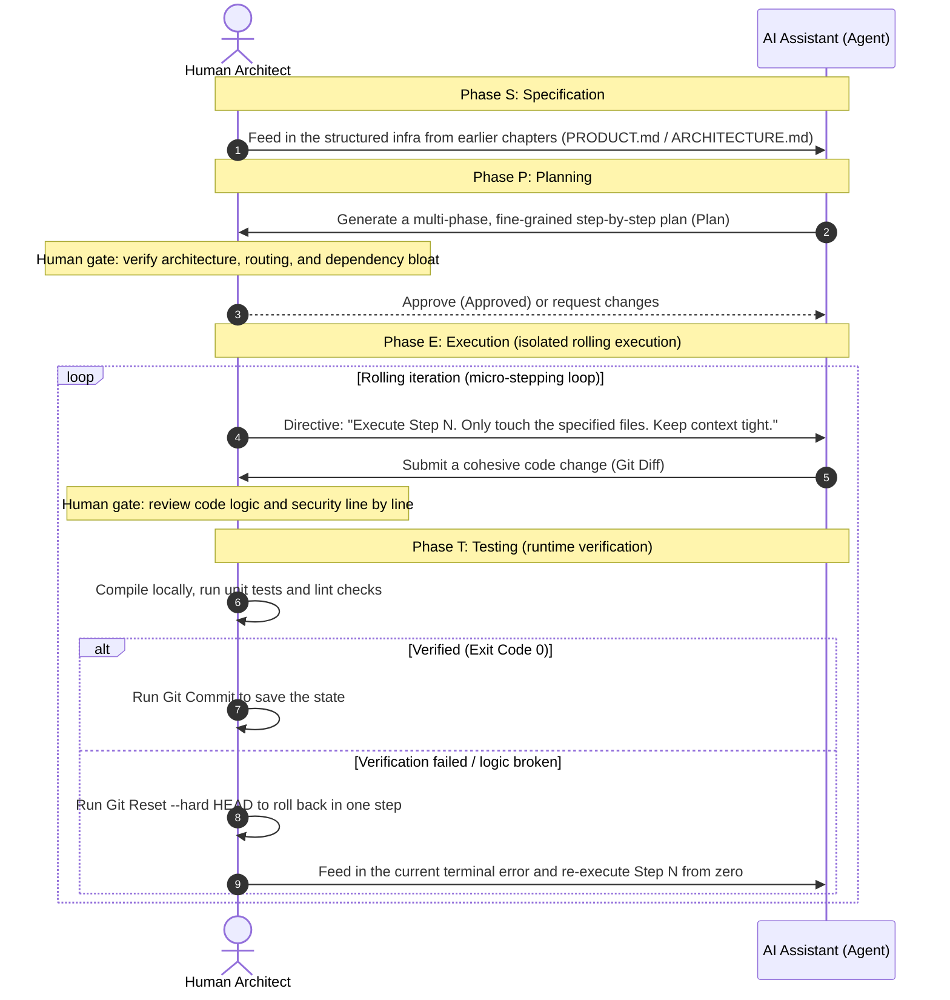
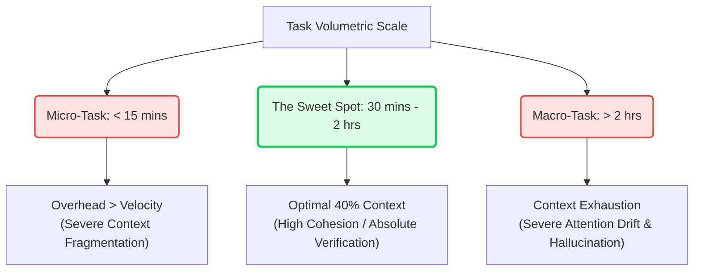
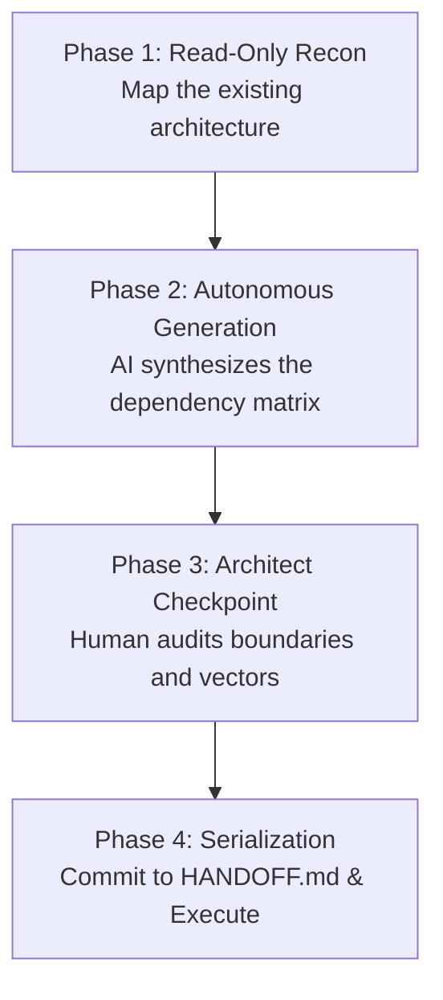

# Making a Plan

> "Give me six hours to chop down a tree, and I will spend the first four sharpening the axe." — Abraham Lincoln

Architecture and context engineering solve the "stage" problem — making the environment where the AI works clear enough. But day-to-day development is the performance on that stage: how tasks are broken down, how work flows forward, how quality is guarded, and how code gets merged.

From this chapter on, we enter the **daily rhythm and development workflow** part: a workflow that lets AI operate efficiently as the primary developer, plus the engineering mechanisms that keep it sustainable.

In 2026, AI development has an asymmetrical truth: **tool capabilities are improving exponentially, but most teams still benefit from them only linearly.** The reason is not that the tools are bad, but that workflows have not kept up. People still use AI as "faster autocomplete" instead of designing workflows where it can take on whole tasks, verify its own results, and keep making progress across sessions.

The workflow described here is what teams that truly use AI as their primary developer converged on through trial and error in 2025–2026. It does not depend on one specific tool, though it uses Claude Code's features as its main reference point.

And the first thing such an efficient, sustainable workflow must solve is planning and task breakdown. Yet when facing a complex, non-trivial project, many developers still quietly fall into a "vending-machine trap": throwing an extremely vague, ambiguous request (e.g. "help me write a chat app like WeChat") at the tool as a prompt, and expecting it to spit out flawless industrial-grade code the next second.

That blind "blind-box development" is bound to fail. You are asking the AI to handle "business-logic understanding", "architecture design", "data-model choice", and "concrete coding" all within the span of one sentence. Once its attention is diluted and polluted, all it can give back is broken, incoherent code.

How do you know which file to feed with `@Files` in the current flow? How does the model know when to call the terminal to run tests?

The answer: before the AI writes even one line of code, you must constrain its path with a clear strategic map. This chapter introduces the core methodology of modern AI programming — the SPET methodology (Spec – Plan – Execute – Test). It is the watershed between ordinary coders and "AI architects", and the link that connects the "context infrastructure" from earlier chapters to real production.

---

## The SPET Loop

SPET is a software engineering pattern proven in high-frequency human-AI pairing. It forcibly decouples the whole build into four linearly ordered phases, with human-architect review gates at the key points, keeping "planning and execution strictly separated":



- **S (Specification):** Define the absolute boundaries of "What to build" and "What NOT to build." This inherits the macro-directives from the `PRODUCT.md`. The Architect utilizes structured formatting to define the business logic, the technology constraints, and the lethal security red lines.
- **P (Planning):** Define the execution trajectory. Before any code is mutated, the AI is forced to decompose the macro-specification into a highly granular, step-by-step blueprint. Every step must explicitly list the targeted files and the objective verification criteria.
- **E (Execution):** Execute via "Micro-Stepping." The Agent is commanded to mutate only the exact files required for the current atomic step. This is the ultimate defense against "Context Rot"—it mathematically forces the AI's cognitive load below the failure threshold.
- **T (Testing):** Immediately upon step completion, invoke the local compiler. If the tests pass (`Exit Code 0`), serialize the state via Git. If it fails, execute a brutal, one-click `git reset --hard HEAD`. You must **never** allow dirty, failing code to pollute the context window of the next step.

## The Art of Task Decomposition: Hitting the "Sweet Spot"

Task decomposition is the most critical, yet universally botched, mechanism in AI engineering. Junior developers obsess over "writing the perfect prompt," while totally ignoring a deeper law of physics: **What is the volumetric scale of the task payload you are forcing into the model?**

If the payload is too massive, the AI suffers from Context Exhaustion and Attention Drift over long, sprawling sessions. If the payload is too atomic, the context becomes hopelessly fragmented, and the overhead of constantly prompting the Agent eclipses the actual velocity gains. 

Calibrating the exact geometric scale of a task is the prerequisite for stabilizing an LLM's output.

### 1. The 40% Context Threshold

Elite Agent teams operating Claude Code have empirically proven a critical law: **The cognitive payload and conversational history required to execute an atomic task must never exceed the first 40% of a single Session's Context Window.**

This is a mathematical reality. As context depth crosses the 40% threshold, the LLM's adherence to the earliest injected instructions (e.g., the System Prompt, or your global Architectural rules) degrades exponentially. The probability of the model hallucinating APIs or writing non-compliant syntax skyrockets.

A task engineered perfectly into the "Sweet Spot" must satisfy these three axioms:
1. **The Single-Sentence Axiom:** The objective can be articulated in a single, unambiguous declarative string.
2. **The Binary Verification Axiom:** The completion state is determined by a binary machine signal (e.g., passing a specific unit test), not subjective human emotion.
3. **The Session-Isolation Axiom:** The entire lifecycle of the task can be executed and verified within a single, isolated chat session.


*Figure: The Volumetric Task Curve. Micro-tasks create devastating overhead; Macro-tasks trigger context exhaustion. The Sweet Spot guarantees high-fidelity AI output.*

### 2. The Three Iron Laws of Task Atomicity

To ruthlessly audit your task decomposition, enforce these three laws:

* **Law 1: The Low-Coupling Boundary:** The mutation payload of an atomic task must be isolated to 1–3 files within a specific domain directory. If a task requires concurrent mutation of 5+ files across completely separate architectural layers, it is a Composite Task and must be forcefully decomposed.
* **Law 2: Objective Testability:** Upon completion of the atomic step, it must be verified by a deterministic compiler or test runner (`npm run test:auth`). If the completion signal relies on "it looks okay in the browser," the task boundary is a failure.
* **Law 3: The 120-Minute Limit:** If the execution of the task (Prompt -> AI Generation -> Testing -> Git Commit) exceeds 2 hours, it is too massive. While autonomous Sub-Agents are evolving to handle larger orchestration, in modern environments, the human Architect is still strictly responsible for bounding the blast radius.

## The 4-Phase Decomposition Protocol

Business requirements (Specs/GitHub Issues) are formulated to describe value. AI Agents require engineering telemetry. Translating business value into exact, sequential engineering tasks is the primary value of the human Architect. 

During the **P (Planning)** phase of the SPET loop, execute this rigid 4-step protocol to synthesize a task matrix:



* **Phase 1: Read-Only Reconnaissance**
  Before commanding the AI to plan, force it to execute a read-only scan of the relevant domain directories. **Strictly forbid code mutation.**
  > **Architect Payload:**
  > "I need to deploy the 'Email Digest' microservice (see `docs/specs/email-digest.md`). Before synthesizing a plan, execute a Read-Only scan of `src/features/notifications/`, `src/services/email.py`, and `src/scheduler.py`. Do NOT write code. Output a highly compressed, 10-line architectural summary of the current state."

* **Phase 2: Autonomous Matrix Generation**
  Command the Agent to synthesize the task matrix, explicitly demanding dependency mapping.
  > **Architect Payload:**
  > "Based on your recon, synthesize an implementation matrix for `docs/specs/email-digest.md`. Constraints per node: 1) Must be isolated to a single Session; 2) Must contain an exact verification command; 3) Must explicitly declare Blocked-By dependencies and Parallelization opportunities."

* **Phase 3: The Architect Checkpoint**
  The human executes a ruthless audit of the AI's proposed topology:
  1. Do any nodes violate architectural boundaries?
  2. Did the AI hallucinate or miss critical hidden dependencies (e.g., a required DB migration)?
  3. Are the verification signals 100% deterministic?

* **Phase 4: Serialization & Execution**
  Once approved, write the task nodes directly into the `NEXT` array of your `HANDOFF.md` artifact. This creates a persistent state that survives across sessions.

## The Dependency Matrix: Parallel vs. Serial Execution

The topological mapping of task dependencies dictates the entire velocity of the sprint. 

Tasks containing **Data Coupling (DB schema mutations)** or **State Collisions** must be strictly serialized. However, functionally isolated tasks (e.g., rendering independent React components) can be parallelized, exponentially accelerating output.

You must not map dependencies based on "intuition." The graph must be mathematically derived from the targeted file boundaries:

```mermaid
graph TD
    T1[T1: Prisma Schema Mutation<br/>Strict Serial Node (Critical Path)] --> T2a[T2a: Express API Controllers<br/>Parallel Wave A]
    T1 --> T2b[T2b: React Component Implementation<br/>Parallel Wave B]
    T1 --> T2c[T2c: Email Template Engine<br/>Parallel Wave C]
    T2a --> T3[T3: E2E Integration & State Hydration<br/>Convergence Node (Blocked by Wave A/B/C)]
    T2b --> T3
    T2c --> T3

    style T1 fill:#fef08a,stroke:#eab308,stroke-width:2px
    style T2a fill:#dbeafe,stroke:#3b82f6,stroke-width:2px
    style T2b fill:#dbeafe,stroke:#3b82f6,stroke-width:2px
    style T2c fill:#dbeafe,stroke:#3b82f6,stroke-width:2px
    style T3 fill:#f3e8ff,stroke:#a855f7,stroke-width:2px
```
*Figure: The Execution Matrix. Node T1 mutates the database; it blocks the entire pipeline. Nodes T2a/b/c possess zero file overlap and execute in parallel. Node T3 is the integration convergence point.*

## Tasks API: Native Engineering Task Tracking

In 2026, frontier tools represented by Claude Code v2.1+ introduced a native **Tasks API**. It allows the task list to be managed as standalone files with explicit acceptance criteria and automatically detects dependencies. The dependency metadata uses an array format like `blockedBy: ["task-id-3"]` (array of task IDs, not free-form descriptions).

The standard workflow for cross-session tracking with Tasks API in Claude Code (Tasks is an experimental/preview feature, API may change — always refer to the latest official docs):

```bash
# 1. Create a structured task list (inside Claude Code interactive session)
# After entering claude interactive mode:
 /plan Generate task list from docs/specs/email-digest.md, each task including description, acceptance criteria, dependencies and parallelization

# Or non-interactive mode
claude -p "Generate task list from docs/specs/email-digest.md, each task including description, acceptance criteria, dependencies"

# 2. Task list files are typically located in .claude/tasks/ directory, auto-discovered by Claude Code
# If you need to specify a task list, use --task-list (subject to latest official CLI)
claude --task-list email-digest-2026-06 -p "Continue with the next unblocked unfinished task"

# 3. Continue execution in a brand new session
# Claude Code reads the task list and starts from unblocked tasks

# 4. View current progress and blocking status in real time (inside interactive session)
# /tasks
```

> **Note:** `claude "/plan ..."`, `claude "/work"`, `claude "/tasks"` are NOT valid CLI commands; `/plan`, `/tasks` etc. are slash commands inside the Claude Code interactive session. The `CLAUDE_CODE_TASK_LIST_ID` environment variable pattern is not stably documented in official public docs — prefer task files under `.claude/tasks/<id>.json`.

## Core Template Standardization

To prevent human ambiguity from corrupting the AI's logic engine, you must utilize highly structured Markdown schemas. These templates are optimized to interface flawlessly with the RAG (Retrieval-Augmented Generation) systems embedded in IDEs like Cursor and Claude Code.

### 📋 The Specification (Spec) Schema

```markdown
# Specification (Spec): [Feature Namespace]

## 1. Terminal Objective
[Define the exact business value and end-state of this module in one strict paragraph.]

## 2. Infrastructure Constraints
- Frontend Runtime: [e.g., React 19, TypeScript 5]
- Persistence Layer: [e.g., Prisma + PostgreSQL]
- Aesthetic Engine: [e.g., Tailwind CSS v3]
- Dependency Policy: [e.g., LETHAL CONSTRAINT: Do NOT import external NPM packages for UI components; utilize existing primitives in `/src/ui`.]

## 3. Core State Contracts
1. [Sub-Feature Alpha]: [Explicit mapping of I/O parameters and state mutations]
2. [Sub-Feature Beta]: [Explicit mapping of I/O parameters and state mutations]

## 4. Security & Performance Directives
- [e.g., All unhandled exceptions MUST route through `src/interceptors/global.ts`]
- [e.g., LETHAL CONSTRAINT: O(N) database queries within map loops are strictly forbidden.]
```

### 📐 The Implementation Matrix (Plan) Schema

```markdown
# Implementation Matrix - [Feature Namespace]

- [ ] Wave 1: [Infrastructure & Schema Definition]
  - [ ] Node 1.1: [Deploy Prisma DTOs and Data Models]
    - Target Files: `src/models/schema.prisma`
    - Verification: Execute `npx prisma db push` (Exit Code 0)
  - [ ] Node 1.2: [Define Zod Validation Schemas]
    - Target Files: `src/validators/user.schema.ts`
    - Verification: Compile-time TSC checks.

- [ ] Wave 2: [Business Logic Execution]
  - [ ] Node 2.1: [Implement User Authentication Service]
    - Dependencies: `@schema.prisma`
    - Constraints: [LETHAL: Do NOT mutate any routing layers in this step. Isolate logic to the service class.]
```

## Live Execution: Architecting an Offline Markdown Editor via SPET

### 🎯 The Terminal Objective

Architect a "Next-Gen Web-Based Markdown Editor featuring real-time DOM rendering, localized IndexedDB auto-saving, and one-click sanitized HTML export."

---

### 📝 Phase 1: S (Specification) - The Blueprint

The human Architect establishes the foundational constraints and injects them into the AI context:

```markdown
# Specification (Spec): Local-First Markdown Editor

## 1. Objective
Architect a high-performance web editor supporting real-time Markdown rendering via an adaptive dual-pane DOM, featuring offline auto-save state-recovery, and dynamic telemetry.

## 2. Technology Stack
* UI Engine: React 18 + TypeScript
* Aesthetics: Tailwind CSS (Strict requirements for flawless Dark/Light mode execution)
* Parser: `marked` (Lightweight compiler)
* Persistence: `localStorage` (Configuration state) + `IndexedDB` (Incremental draft serialization)

## 3. State Contracts
1. Main Layout: Adaptive dual-pane CSS Grid. Raw input intercepts on the left; real-time parsed HTML renders on the right.
2. Telemetry HUD: Render real-time stats in the footer: Byte count, Word count, Paragraph count, and calculated reading-time velocity.
3. Auto-Save State Machine:
   * Implement a strict 1000ms Debounce wrapper. Automatically serialize the draft to IndexedDB upon input cessation.
   * Upon cold-boot of the application, scan IndexedDB. If an unmerged draft exists, trigger a modal: "Unsaved state detected. Execute recovery?"
4. Security Perimeter: LETHAL CONSTRAINT: Heavyweight WYSIWYG dependencies are forbidden. All parsed Markdown MUST route through `DOMPurify` to mathematically eliminate XSS vectors.
```

### 📐 Phase 2: P (Planning) - Synthesizing the Matrix

We now command the AI to generate the technical matrix. **Code generation is strictly disabled.**

* In Cursor: switch to `Architect` mode in Composer, feed in the Spec above and give the order.
* In Claude Code: type in the terminal: `claude "Read the spec carefully. You are in Plan mode now; mutating any business code is forbidden. Design a 12-step implementation plan for me."`
* In Google Antigravity: pin the Spec file in the global Pin area and wake the planner.

The Agent computes the constraints and outputs a highly rigorous topology:

```markdown
# Implementation Matrix - Markdown Editor

- [ ] Wave A: DOM Infrastructure & Layout
  - [ ] Node 1: Scaffold `src/components/EditorLayout.tsx`. Implement the responsive CSS Grid dual-pane architecture.
  - [ ] Node 2: Inject Tailwind configuration; implement Theme Provider for Dark/Light mode (`src/index.css`).
  - [ ] Node 3: Architect the Header Navigation, integrating the 'Export' CTA and filename input state.

- [ ] Wave B: Markdown Compilation Engine
  - [ ] Node 4: Provision `marked` and `dompurify`. Construct the AST compilation and XSS-sanitization pipeline (`src/utils/markdownParser.ts`).
  - [ ] Node 5: Implement scroll sync between panes (one-way only: scrolling the left text box drives the right preview; do not listen both ways, to avoid infinite-loop jitter).
  - [ ] Node 6: Scaffold the Telemetry HUD `src/components/StatsBar.tsx`. Implement RegEx algorithms for accurate word-counting.

- [ ] Wave C: Persistence & Auto-Save
  - [ ] Node 7: Architect the `src/hooks/useDebounce.ts` hook to throttle intense I/O mutations.
  - [ ] Node 8: Construct the IndexedDB controller `src/utils/dbController.ts` for asynchronous CRUD operations.
  - [ ] Node 9: Bind the Auto-Save logic to the editor `onChange` events. Verify debounce timing and visual save-indicator logic.
  - [ ] Node 10: Implement the Cold-Boot interceptor to detect and recover orphaned IndexedDB drafts.

- [ ] Wave D: Export & Optimization
  - [ ] Node 11: Implement the Export logic: Serialize the DOM to a standalone `.html` blob with embedded CSS and trigger browser download.
  - [ ] Node 12: Execute mobile-viewport regression testing and touch-target padding adjustments.
```

> 🚦 **The Architect Checkpoint (Gatekeeping)**
> The human Architect audits the matrix and spots a design flaw: *"Good. But for Node 5, if two-way scroll sync uses complex two-way DOM listeners, it can easily jitter in a dead loop. Mark it clearly in that step: use one-way binding only — scrolling the left text box drives the right preview, to avoid listener conflicts."*
> The Agent acknowledges the architectural flaw, patches Node 5, and the Architect signs off. **(APPROVED!)**

### 🚀 Phase 3: E (Execution) - Isolated Micro-Stepping

We transition the Agent into ACT mode. 
The human maintains absolute control over the blast radius. We **forbid** the AI from executing Nodes 1-12 simultaneously. We enforce isolated, atomic execution:

* **Architect:** *"Execute Node 1. Mutate ONLY `src/components/EditorLayout.tsx`. Do not touch the global CSS or any other files."*
* **Agent:** Computes the layout constraints and outputs highly cohesive React code for the Layout file.
* **Architect:** Audits the `git diff`. Verifies that the Agent obeyed the file boundaries and that the code compiles.
* **Architect:** Executes serialization: `git add . && git commit -m "feat: init EditorLayout grid (Node 1)"`.

By enforcing this rigorous "Command-and-Verify" loop, the volume of code generated per interaction is mathematically minimized. The human review burden is negligible, and the probability of the AI hallucinating sprawling system bugs is eliminated.

---
### 🔬 Phase 4: T (Testing) - The Ultimate Safety Net

During the execution of **Node 9 (Auto-Save Binding)**, a catastrophic failure occurs. The AI generated a flawed asynchronous event listener. When you rapidly type in the browser, the main thread deadlocks, throwing a fatal IndexedDB cursor collision error due to rapid concurrent writes.

In this scenario, **never** command the AI to "fix the bug" within the same polluted session. This forces the model to ingest massive amounts of toxic `stderr` history, degrading its context and usually resulting in it creating a worse patch.

Enforce the "Zero-State Reboot" doctrine:

1. **Physical Eradication:** Instantly execute `git reset --hard HEAD` in your terminal. This violently purges the corrupted code from the file system, reverting the repository to the pristine, verified state of Node 8.
2. **Contextual Reboot & Precision Injection:** Terminate the polluted chat session. Initialize a clean session. Utilize targeted context injection (e.g., explicitly `@dbController.ts` in Cursor) and issue a hyper-specific corrective payload:
> *"Agent, during the execution of Node 9, your IndexedDB implementation triggered a fatal main-thread deadlock under high-frequency key-presses because the DB cursor was not correctly released. I have executed a hard `git reset` to rollback the repository. Analyze your previous failure. Patch the cursor-release logic in your Node 9 architecture, and generate the corrected implementation."*

Because the AI is unburdened by a polluted chat history, and explicitly warned of the exact concurrency vector, it instantly recognizes the missing `.close()` transaction block. It outputs a flawless, deadlock-free implementation.
You compile, test the application, and receive `Exit Code 0`. Mission accomplished.

## Checkpoint List for the Human Referee at Each Phase

Pair programming with AI is not "letting it run wild". As the commander and referee, you must guard the following checklist at the four gates:

| Phase | Review focus (Checklist) | Red lines for rejection |
| --- | --- | --- |
| S (Specification) | Is the requirement fully structured? Is the tech choice free of redundancy? Are the security baselines stated? | Vague prose like "write an app like X" — refuse to start. |
| P (Planning) | Does each step touch as few files as possible? Are steps loosely coupled? Is the verification method sound? | A step that modifies many modules across layers at once — force it to be rewritten and split. |
| E (Execution) | Does the `git diff` stay within the current step's scope? Did the AI invent extra features? | The AI built something outside the current step (even if it looks nice) — roll back or delete it. |
| T (Testing) | Zero compile errors? Zero linter warnings? Are the core branches covered by test assertions? | Merging anything with an error or static warning into the next step is forbidden. |
