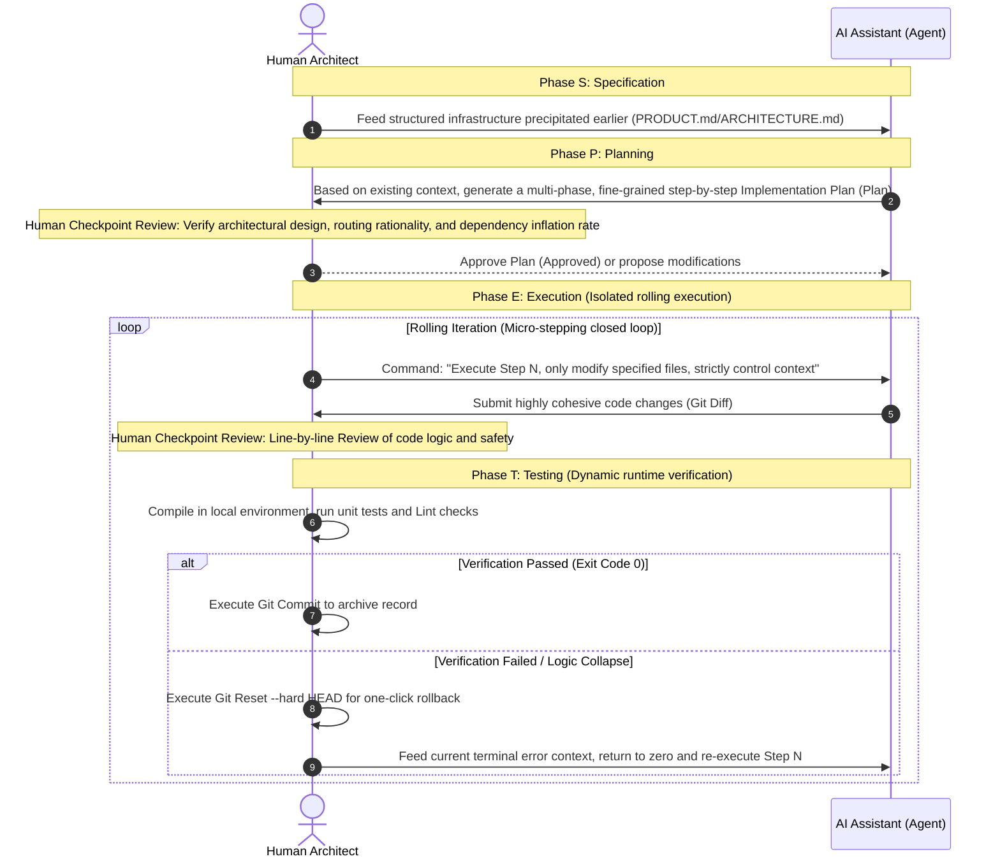
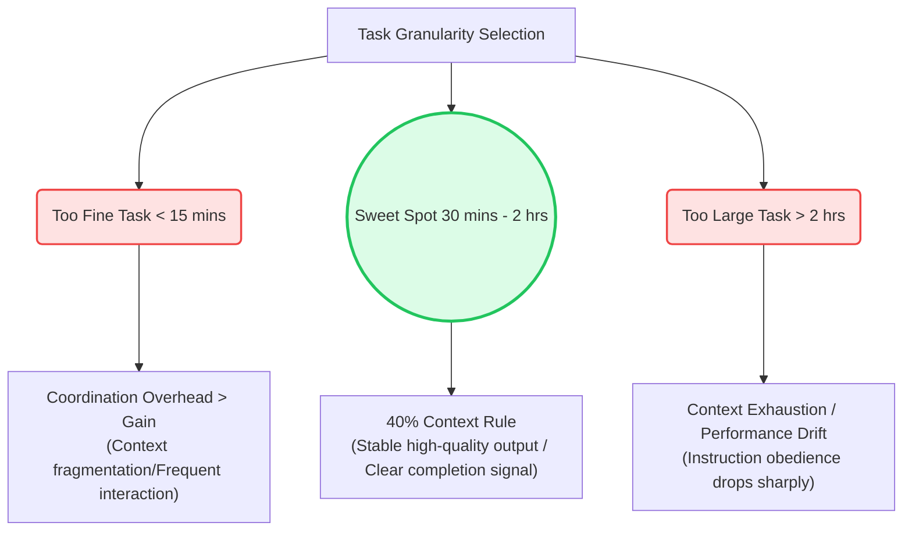
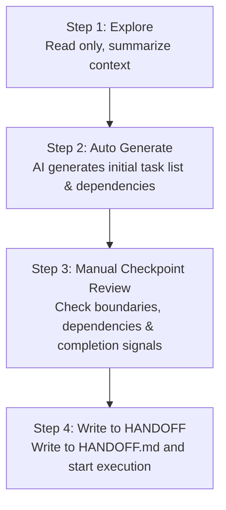
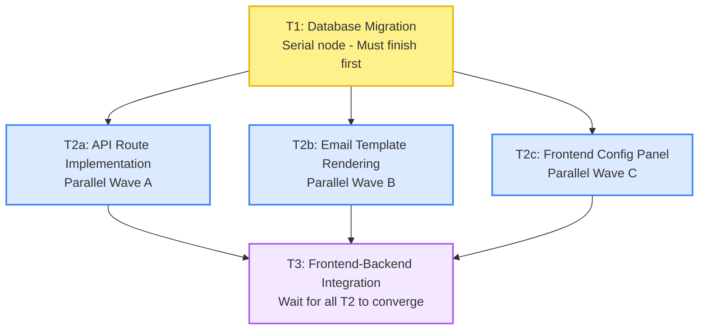

# Formulating a Plan

> "Give me six hours to chop down a tree and I will spend the first four sharpening the axe." — Abraham Lincoln

Architecture and context engineering solve the "stage" problem—making the environment where AI works clear enough. But daily development work is the performance on stage—how to break down tasks, how to advance the workflow, how to ensure quality, and how to merge code.

Starting from this chapter, we will enter the **Daily Rhythm and Development Workflow** section: a workflow that allows AI to run efficiently as a primary developer, and the engineering mechanisms that make this workflow sustainable.

In 2026, there is an asymmetrical truth in AI development: **the progress of tool capabilities is exponential, but most teams still benefit from them at a linear rate.** The reason is not that the tools aren't good enough, but that workflows haven't kept up. They still use AI as "faster auto-completion," instead of designing workflows that treat it as a collaborator capable of taking on complete tasks, self-verifying results, and continuously advancing across Sessions.

The workflow described in this section is the practice converged upon through trial and error in 2025–2026 by teams that truly use AI as a primary developer. It does not depend on a specific tool, but uses Claude Code's features as a main reference point.

To land such an efficient and sustainable workflow, the first problem to solve is planning and task breakdown. However, when facing a complex, non-trivial project, many developers still fall into a silent "vending machine trap": throwing an extremely vague and ambiguous requirement (like: "Help me write a chat software similar to WeChat") directly at the tool as a Prompt, expecting it to spit out flawless industrial-grade code in the next second.

This blind "blind-box style development" is doomed to fail. Because within the span of a single sentence, you are making the AI handle multidimensional cognitive challenges like "business logic understanding," "architectural boundary design," "data model selection," and "specific syntax coding" simultaneously. After the large model's attention is extremely diluted and polluted, what it returns to you can only be riddled, logically broken garbage code.

How do you know which file to target feed using `@Files` in the current development flow? And how does the model know when to call the terminal to run tests?

The answer is: you must use a clear strategic map to regulate its path before the AI writes even a single line of code. This chapter will systematically introduce the core methodology of modern AI programming—the SPET Methodology (Spec - Plan - Execute - Test). It is not only the core watershed distinguishing ordinary coders from "AI Architects," but also the core link connecting the aforementioned "context infrastructure" to actual production.

---

## The SPET Loop Methodology

SPET is the software engineering paradigm proven to be the most efficient in high-frequency human-machine pair collaboration. It requires us to forcibly decouple the entire software construction process into four linearly advancing phases, and set review checkpoints for the human architect at key nodes to achieve "absolute separation of planning and execution":



- S (Specification): Clarify "what to do" and "what not to do." It directly inherits the project-level "panoramic perspective" (`PRODUCT.md` and `ARCHITECTURE.md`) we built earlier. Humans use highly structured natural language to define clear requirement boundaries, tech stack constraints, and hard security red lines.
- P (Planning): Clarify "how to do it" and "how many steps to take." Before starting work, use AI's powerful logic breakdown capabilities to force it to dismember macro large tasks into a detailed implementation step blueprint containing specific file lists and verification methods.
- E (Execution): Execute at a "Micro-stepping" rhythm. Each step requires the AI to only rewrite a very small number of target files. This is the strongest weapon against "context rot"—keeping the cognitive load the AI handles each time below the minimum water level.
- T (Testing & Verification): After executing every micro-step, immediately call up the terminal in the local environment for dynamic runtime verification. If successful, perform a Git Commit to archive; if it fails, use the Git mechanism to one-click Rollback, absolutely not allowing dirty code to pollute the context space of the next step.


## The Art of Task Breakdown: Finding AI's "Sweet Spot"

Task breakdown is the most underestimated yet most fatal link in the entire AI development flow. Most developers pour all their energy into "how to write a god-level Prompt," but ignore a more fundamental software engineering proposition: **What exactly is the scale of the task you throw at the AI?**

If the task scale is too large, AI is highly prone to logic drift and attention diffusion in long conversations; if the task is too fine, the context becomes fragmented, and the coordination and communication overhead brought by high-frequency human-machine interaction will actually exceed the efficiency gain generated by AI. Finding the right granularity is the prerequisite for keeping AI's output continuously stable.

### 1. Task Granularity and the "40% Context Rule"
In the workflow practice of modern Agents like Claude Code, an important empirical principle has precipitated: **The cognitive load and historical interaction of an atomic task should be just enough to complete within the first 40% context window of a single Session.**

This ratio is not fabricated out of thin air. When the conversation history occupies more than 40%, as context memory accumulates, the model's adherence to the beginning of the context (such as the initial System Prompt or architectural rules) will show a cliff-like drop, and it becomes more prone to introducing hallucinations or writing dirty code.

More intuitively, an atomic task in the **Sweet Spot** should simultaneously meet the following three criteria:
1. **One-sentence description**: Can be described with a clear, unambiguous declarative sentence in one line.
2. **Clear completion signal**: Can use running an objective verification command (like passing unit tests) as the criteria.
3. **Can be closed-loop in a single Session**: Can be completed directly in a brand new, clean session.


*Figure: The sweet spot of task granularity. Tasks that are too fine have coordination overhead exceeding gains; tasks that are too large lead to drift and context exhaustion; the sweet spot is AI's most stable working range.*

### 2. Three Iron Laws for Judging Task Atomicity
To judge whether a task is sufficiently atomized, there are three very effective iron laws in combat:

* **First, the Single File (or Low Coupling) Principle**: The core modification of an atomic task should be concentrated in 1–3 files of a functional directory. If a task needs to modify more than 5 cross-module files simultaneously, it must be a composite task and should be refactored and split.
* **Second, the Independently Testable Principle**: After the atomic task is completed, it must be objectively verifiable by running a specific test or compilation command (like `pnpm test`). If the completion signal is "feels implemented" or "manually clicked through the page," it means the task boundary is not defined precisely enough.
* **Third, the No More Than 2 Hours Principle**: If a task normally takes more than 2 hours to complete, split it. In 2026, although task orchestration responsibilities are gradually shifting to tools and subagents, the core responsibility of controlling task scale still lies with humans.


## From Issue to Task List: The Four-Step Breakdown Method

Product requirements (like GitHub Issues or Specs) are often written from the perspective of business goals, while what AI needs are specific engineering tasks. The conversion from business goals to engineering tasks is one of the core contributions of humans as "software directors." Breakdown decisions include considerations of business priorities and judgments of architectural design, which are things AI cannot independently decide at this stage.

In the **Plan phase** of the SPET methodology, we should adopt the following four-step method to break down an Issue into tasks:



* **Step 1: Explore (Read only, analyze context)**
  Before starting work, first command AI to scan relevant directories to understand the existing implementation, absolutely forbidding writing code.
  > **Human Instruction Example:**
  > "I want to implement the 'User Email Digest' feature (see docs/specs/email-digest.md). Before making any plan, please explore `src/features/notifications/` (existing notification system), `src/services/email.py` (email service), and `src/scheduler.py` (scheduler). Read only, don't write. Summarize your findings into about 10 lines."
* **Step 2: Generate Initial Task List**
  Utilize AI to generate a task outline with prerequisite dependencies and verification methods.
  > **Human Instruction Example:**
  > "Based on your exploration results and docs/specs/email-digest.md, generate a task list to implement this feature. Requirements for each task: 1) Can be completed in a single Session; 2) Has a clear completion signal (e.g., specific test command); 3) Mark whether it can be parallelized with other tasks and which prerequisite tasks it depends on."
* **Step 3: Manual Checkpoint Review (Core Checkpoint)**
  The human architect guards strictly at this stage, mainly checking:
  1. Does the task cross unnecessary module boundaries?
  2. Are there implied hidden dependencies that are not marked?
  3. Is the completion signal objective enough and automatable for verification?
* **Step 4: Archive and Start Execution**
  Write the finalized tasks into the `NEXT` field of `HANDOFF.md` as the spark for scrolling in subsequent Sessions, and then start isolated execution.


## Dependency Graph: The Game Between Parallel and Serial

Dependency relationships between tasks determine the pacing of the development workflow. When there are **data dependencies (e.g., database table structure changes)**, **file conflicts**, or **state intertwining** between tasks, they must be designed for serial execution; but when tasks are completely independent (e.g., UI rendering of different subpages), parallel execution can multiply development efficiency.

This judgment absolutely cannot rely on "feel," but should be deduced based on the specific scope of file modifications for the dependency graph:


*Figure: Task Dependency Graph. T1 changes data structures, affecting all subsequent tasks, and belongs to serial nodes on the critical path; T2a/b/c are mutually independent and can be developed in parallel; T3 frontend-backend integration is a convergence node and must wait for all prerequisite tasks to be completed.*


## Tasks API: Native Engineering Task Tracking

In 2026, cutting-edge tools represented by Claude Code v2.1+ introduced the native **Tasks API**. It allows managing task lists as independent files with clear acceptance criteria and automatically identifying dependencies. When the system recognizes descriptions like "first implement API route, then add frontend call," it will automatically mark `blockedBy: "API route"` on the frontend task.

Here is the standard workflow using the Tasks API for cross-Session tracking in Claude Code:

```bash
# 1. Create a structured task list (automatically parsed and generated from Spec requirements files)
claude "/plan Generate a task list according to docs/specs/email-digest.md, each task containing a description, acceptance criteria, dependencies, and whether it can be parallelized"

# 2. Export the task list ID for cross-Session or team collaboration sharing
export CLAUDE_CODE_TASK_LIST_ID="email-digest-2026-06"

# 3. Continue executing tasks in a brand new Session
# Claude Code will automatically read the task list and start executing from the next unblocked task
claude "/work Continue executing the task list, starting from the next incomplete and unblocked task"

# 4. View current task progress and blocking status in real-time
claude "/tasks"
```


## Core Template Specifications

To prevent ambiguous human expressions from lowering AI's understanding, we should use highly structured Markdown templates to orchestrate Specs and Plans, making them perfectly align with the built-in RAG indices of AI programming tools (like Cursor, Claude Code).

### 📋 Specification (Spec) Template

```markdown
# Specification (Spec): [Project Name]

## 1. Business Goal
[Describe the ultimate business value of this feature/module in one sentence or a short paragraph]

## 2. Tech Stack Constraints
- Frontend Framework/Lib: [e.g., React 19, TypeScript]
- Data Management: [e.g., Prisma + PostgreSQL]
- Styling Solution: [e.g., Tailwind CSS]
- Dependency Limits: [e.g., Strictly limit introducing external wheels, reuse existing utility classes]

## 3. Core Functional Contracts
1. [Feature A]: [Specific description of input parameters, output parameters, and logical behavior]
2. [Feature B]: [Specific input and output contracts]

## 4. Security & Performance Red Lines
- [e.g., Errors must be thrown through the global exception interceptor errorHandler.ts]
- [e.g., Forbidden to execute any database queries inside a loop body]

```

### 📐 Implementation Plan (Plan) Template

```markdown
# Implementation Plan - [Module Name]

- [ ] Phase A: [Phase Name, e.g., Infrastructure and Contract Definition]
  - [ ] Step 1: [Specific Action, e.g., Create DTO and Database Models]
    - Files Involved: `src/models/schema.prisma`
    - Verification Method: Run `npx prisma db push` in terminal for validation
  - [ ] Step 2: [Specific Action]
    - Files Involved: `src/dtos/create-user.dto.ts`
    - Verification Method: Compile-time TS type checking

- [ ] Phase B: [Phase Name, e.g., Core Business Logic Implementation]
  - [ ] Step 3: [Specific Action]
    - Context Dependency: `@schema.prisma`
    - Key Constraints: [Explicitly state that other unrelated files must not be changed in this step]

```


## Practical Case: Building an Offline Markdown Editor with the SPET Loop

### 🎯 Task Goal

We want to build a "modern Markdown editor in the frontend that supports real-time word counting, local IndexedDB offline auto-saving, and can one-click export styled HTML."

---

### 📝 Step 1: S (Specification) Functional Specification Definition

As the supreme design director, the human first establishes and maintains the Spec infrastructure in the project, explicitly instilling rules into the AI tool:

```markdown
# Functional Specification (Spec): Offline Markdown Editor

## 1. Goal
Build a modern web-based editor that supports real-time Markdown rendering, an adaptive dual-pane layout, offline auto-saving and data recovery, and has a word count feature.

## 2. Tech Stack
* Core Framework: React + TypeScript
* Styling Aesthetics: Tailwind CSS (Minimalist and exquisite dark/light mode switching)
* Markdown Parsing: Lightweight component `marked`
* Offline Storage: Native browser `localStorage` (main config cache) + `IndexedDB` (draft incremental backup)

## 3. Core Functional Contracts
1. Editor Main Interface: Adaptive dual-pane design, typing raw Markdown on the left, real-time HTML preview on the right.
2. Real-time Stats Bar: Display in real-time at the bottom of the page: character count (excluding spaces), Chinese character count, paragraph count, estimated reading time.
3. Offline Auto-Save:
   * Adopt a debounce mechanism (Debounce 1000ms); automatically write the draft to local storage after the user stops typing.
   * When the user reopens the page, if unmerged drafts are found, pop up a prompt at the top: "Detected unmerged drafts, do you want to recover?"
4. Security Red Lines: Forbid introducing any massive rich text editor frameworks; all Markdown parsing must be used with DOMPurify for sanitization to strictly guard against XSS attacks.

```


### 📐 Step 2: P (Planning) The Birth of a 12-Step Implementation Plan

In different programming tools, we use AI's planning capabilities to generate technical blueprints. Note that at this moment, we absolutely cannot allow AI to write any actual code files:

* In Cursor: Switch to `Architect` mode under Composer mode, feed the above Spec, and issue instructions.
* In Claude Code: Enter in the terminal: `claude "Read the specification carefully. You are now in Plan mode, absolutely forbidden to modify any business code. Please design a 12-step implementation plan for me based on the current tech stack."`
* In Google Antigravity: Put the Spec file in the global resident Pin area and wake up the AI planner in the plan panel.

The AI quickly digested the Spec and spat out an extremely structured Plan outline:

```markdown
# Implementation Plan - Markdown Editor

- [ ] Phase A: Infrastructure & UI Building
  - [ ] Step 1: Create the base page skeleton `src/components/EditorLayout.tsx`, build the adaptive dual-pane layout.
  - [ ] Step 2: Introduce Tailwind CSS and configure dark/light mode switching logic (modify `src/index.css`).
  - [ ] Step 3: Write the editor header navigation bar, including the "Export" button and file renaming input box.

- [ ] Phase B: Core Markdown Features Implementation
  - [ ] Step 4: Install `marked` and `dompurify`; implement real-time compilation and anti-XSS security sanitization logic (create `src/utils/markdownParser.ts`).
  - [ ] Step 5: Implement dual-pane synchronized scrolling (left side scrolls, right preview page scrolls synchronously).
  - [ ] Step 6: Write the bottom data stats component `src/components/StatsBar.tsx` (accurately calculate word count and reading time).

- [ ] Phase C: Offline Auto-Save (Core Engine)
  - [ ] Step 7: Implement a debounce Hook `src/hooks/useDebounce.ts` to guard against high-frequency, high-pressure writes.
  - [ ] Step 8: Write the local IndexedDB storage controller `src/utils/dbController.ts` to support reading and writing drafts.
  - [ ] Step 9: Integrate auto-save logic, input in the edit area to test debounce auto-trigger and indicator light status.
  - [ ] Step 10: Implement draft box detection and popup recovery mechanism upon cold start.

- [ ] Phase D: Export & Fine Polish
  - [ ] Step 11: Implement one-click rendering of Markdown into a standard, beautifully styled standalone HTML file and trigger download.
  - [ ] Step 12: Run regression tests, fix mobile adaptation details.

```

> 🚦 Human Architecture Checkpoint Review (Gatekeeping)
> The human architect astutely reviews this plan and finds a design flaw: *"Very good. But in Step 5, if dual-pane synchronized scrolling uses complex two-way DOM property calculation, it is highly prone to infinite loop jitter. Please explicitly mark in that step: 'Only use one-way binding where scrolling the left text box triggers scrolling on the right preview page, to avoid infinite loops caused by listening conflicts'."*
> The AI receives the rectification feedback and quickly updates the local details of Step 5's plan. The human officially approves (Approved!), and the blueprint is finalized.


### 🚀 Step 3: E (Execution) Isolated Rolling Execution

Now, we command the AI tool to switch into Act (execution) mode.
In the execution phase, we must strictly restrain the large model's "desire to perform" and strictly forbid letting the AI generate all code from steps 1 to 12 at once. Instead, we adopt the "starting from scratch" and "fine-grained context control" methods learned earlier, only letting it execute the specific small step currently assigned:

* Human: "Execute Step 1. Only create `src/components/EditorLayout.tsx`, do not touch anywhere else."
* AI: Strictly around Layout, spits out dozens of lines of clean code files.
* Human: Intuitively review `Git Diff` changes in the tool. Confirm it completely fits Step 1 boundaries and compiles successfully.
* Human: Neatly type in the terminal: `git add . && git commit -m "feat: md-editor Step 1 completed"`.

Through this "Q&A, step-by-step rooting" isolated execution, the amount of data the large model generates each time remains in a very small locality, the burden of human review is reduced to a minimum, and the probability of AI fabricating bizarre Bugs is squeezed to near zero.

---
### 🔬 Step 4: T (Testing & Verification) Continuous Verification and Safety Net

When executing Step 9 (auto-save integration), an accident happened. The AI wrote a piece of complex asynchronous event listening code. When you try to type text in the editor, the page suddenly freezes and crashes, and the browser console throws an IndexedDB deadlock error caused by high-frequency read/write not properly releasing the cursor.

At this time, never command the AI to "patch it up" in an already crashed session environment. This will only let its context accumulate a massive amount of garbage historical samples (negative pollution), causing it to make more of a mess the more it patches.

Using the "travel light" golden rule we emphasized in "Context Engineering," the standard breakthrough action should be divided into two steps:

1. Manual Rollback, Physical Clearance: Immediately input `git reset --hard HEAD` in the local terminal, bringing the physical files of the entire project back to the absolute clean, normally runnable state when Step 8 was completed in an instant.
2. Reopen Session, Precision Feeding: Close the current long Chat, reopen a completely clean new session. Utilize the context fetching capability of the programming tool (like directly `@schema.prisma` and `@dbController.ts` in Cursor) to issue a cold retry instruction to the AI:
> "Just now when we were executing Step 9 to integrate auto-save, because IndexedDB did not correctly release the cursor under high-frequency triggers, it caused a browser deadlock crash. I have just performed a Git physical rollback on the code.
> Now, this is the latest clean state. Please specifically target this pain point of concurrent cursors not being released, modify your previous Step 9 design plan, and regenerate the code."


The AI, free from dirty message interference and having absorbed the lesson of failure, will instantly stimulate its highest level of code reasoning capability. It astutely discovers that it missed a `db.close()`, and immediately spits out a streamlined, deadlock-free new version of Step 9.

Put it in the project, integrate and test, terminal Exit Code 0, passes across the board!

## Human Referee's Checkpoint Audit Checklist in Each Phase

Human-machine pair collaboration is absolutely not "letting the sheep herd themselves." As the supreme commander and referee, you must strictly guard the following audit checklist at the four gates:

| Phase | Audit Checklist | Red Lines for Refusing Approval |
| --- | --- | --- |
| S (Specification) | Are the requirements completely structured? Is there redundancy in the tech stack selection? Are safety bottom lines clearly explained? | If vague human prose like "write a software similar to XX" appears, refuse to open the gate. |
| P (Planning) | Does each step only modify the minimum number of files? Is there high coupling between steps? Are the verification methods for steps reasonable? | If an all-encompassing step like "concurrent modification across multiple modules" appears, force it to be rewritten and broken down. |
| E (Execution) | Are the `git diff` changes entirely within the scope of the current Step? Are there extra features fabricated by the AI? | If the AI oversteps its bounds to generate target features not defined in the current step (even if they look good), resolutely and mercilessly rollback or delete them. |
| T (Testing) | Are there zero compilation errors? Are Linter warnings cleared? Does the core logic cover the test assertions? | Entering the next Step with any single line of error or static warning is strictly forbidden from merging into the trunk. |
