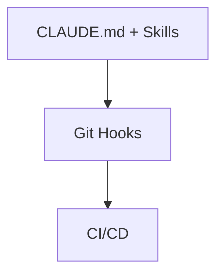

# AI Agent Skills

> "There is specialization in arts and trades." — Han Yu, "On Teachers"

When pair programming with advanced AI Agents (like Claude Code), if we stuff all the project backgrounds, specifications, build commands, and specific task prompts into global rules, we will quickly encounter the problems of "cognitive overload" and "context dilution."

To solve this pain point, Agent Skills emerged. It is rapidly becoming a standard feature of AI programming tools. If global rules are the "global common sense" permanently residing in the brain, then AI Skills are "skill chips" inserted on demand. This article will systematically explain the essence of Skills, their underlying operational mechanisms, when to use them, and how to customize exclusive skills for your project.


## What is an AI Skill?

Skills are a set of skill directories (Skill Folders) under the `.claude/skills/` directory. Each Skill exists as an independent folder, with the core entry file being `SKILL.md`. Their value lies in: turning the knowledge that should have been repeatedly explained in `CLAUDE.md` or in conversations into reusable modules that can be triggered on demand. Anthropic's official definition is also extremely concise: "A Skill is a set of instructions—packaged as a simple folder—that teaches Claude how to handle a specific task or workflow."

From a technical perspective, a Skill is a Prompt-based Meta-tool. It is not executable code (it will not run Python or start an HTTP service), but an instruction package loaded on demand.

Its basic structure consists of a YAML Frontmatter at the top (which controls how it is triggered) and the Markdown instruction body below:

```markdown
---
name: skill-name        # Unique identifier of the skill (kebab-case)
description: text       # Key description for semantic matching (important basis for AI to decide whether to load)
---

# Skill Title

## Core constraints and process instructions...
```


### Two Excellent Analogies

1. Skill Chip
   This is like the chips inserted into the back of the head in The Matrix. The AI usually doesn't need to master this skill; it is only temporarily loaded when executing a specific task.

2. Cookbook vs Sous Chef
   A Skill is more like a "cookbook," providing steps and specifications; the AI is still the executor. A Subagent is more like an "independent colleague," responsible for completing a whole segment of work.


## Core Advantages and Underlying Operational Mechanisms

### Progressive Disclosure

AI Skills can achieve "on-demand loading," and the key lies in the combination of Frontmatter (YAML metadata) and the progressive disclosure mechanism. It is used to reduce the problem of global rules occupying context for a long time.

The entire process can be understood as two phases:

### Phase One: Lightweight Registration

The AI only reads the YAML metadata at the top of each Skill (such as `name` and `description`) to build an index, without loading the main text.

### Phase Two: On-Demand Loading

When the user inputs a task, the system will perform semantic matching between the current request and the `description` of all Skills. Once successfully matched, the `SKILL.md` content of the corresponding Skill will be fully loaded into the context.


## Skill vs Global Rules vs Subagent

All three can expand AI capabilities, but their mechanisms are completely different:

| Dimension | Global Rules (CLAUDE.md) | AI Skills (Skill Chips) | Subagent (Independent Colleague) |
| ----- | ---------------- | --------------- | ------------- |
| Essence | Static project constitution | Instruction package loaded on demand | Independently executed AI instance |
| Loading Mechanism | Globally always present | Loaded after semantic matching | Started at the task level |
| Context Usage | Long-term occupation | Briefly loaded on demand | Independent context window |
| Applicable Scenarios | Global specifications, tech stack conventions | Reusable processes, tool specifications | Multi-step complex tasks |


## When Should You Use a Skill?

### Decision Tree Guide

* Is it a tool / transformation / template? 👉 Use Skill
* Is it a reusable process? 👉 Use Skill
* Is it a domain-specific rule or specification? 👉 Use Skill
* Does it require multi-step reasoning and execution coordination? 👉 Use Subagent
* Is it a complex workflow or a task with a verification loop? 👉 Use Subagent

Core advice: Start with Skills. Skills are more lightweight and easier to maintain. Only upgrade to Subagents when complex orchestration is needed. Both can be used collaboratively.


### Typical Application Scenarios

* File Conversion: PDF → Text, DOCX → Parsing
* R&D Specifications: Git Commit specifications, code audit processes
* Template Generation: API documentation, interface instructions, email templates
* Standardized Processes: Troubleshooting steps, deployment specifications, code review checklists


## How to Create and Deploy a Skill?

### 1. Directory Structure Specifications

Skills are divided into two scopes:

* User level (Global Skills): `~/.config/claude/skills/` or `~/.claude/skills/`
* Project level (Recommended): `.claude/skills/` (committed with Git)

Each Skill is an independent folder:

```text
your-project/
├── .claude/
│   └── skills/
│       └── git-commit/
│           ├── SKILL.md
│           ├── examples.md
│           └── scripts/
```


### 2. Writing the SKILL.md Template

```markdown
---
name: git-commit
description: Generate Conventional Commit messages based on git diffs. Use when writing commit messages or reviewing changes for commits.
---

# Git Commit Specification Generation Skill

When you are asked to generate Git Commit messages, please follow these rules:

## 1. Commit Format
<type>(<scope>): <subject>

- feat: New feature
- fix: Bug fix
- docs: Documentation changes

## 2. Constraints
- The subject must not exceed 50 characters
- Use imperative mood (add x, not added x)
```


### 3. Typical Scaffolding Skill Cases

#### Case 1: Creating a New Feature Module

````markdown
---
name: new-feature
description: Create a new feature module under features/ with standard vertical slice architecture
---

# Create New Feature Module

## Directory Structure

```
src/features/{module_name}/
├── router.py
├── service.py
├── repository.py
├── schemas.py
├── tests/
```

## Constraints
- All modules must use the unified structure
- All DB operations must go into repository
- router must be registered in main.py

## After Completion
- Run typecheck
- Register router
````


#### Case 2: Database Migration Skill

````markdown
---
name: db-migration
description: Handle Alembic database migrations safely. Use when modifying database schema or models.
---

# Database Migration Rules

## ⚠️ Hard Constraints
- Do not modify historical migration files
- Do not write business logic in migrations
- Must support downgrade

## Standard Process
```bash
alembic revision --autogenerate -m "update schema"
alembic upgrade head
alembic downgrade -1
```

## Completion Criteria
- Tests pass
- Rollback is possible
````


## Best Practices and Guide to Avoiding Pitfalls

### 1. Description is the Key Entry Point

The description is the most important semantic basis for a Skill to be matched:

* ❌ Vague: This is a git skill
* ✅ Clear: Used to generate commit messages that conform to Conventional Commit, triggered when the user writes a commit or reviews a diff


### 2. Finely Split Skills

Do not create "omnipotent Skills". For example:

* ❌ backend-helper
* ✅ db-migration / api-doc-generator / log-analyzer


### 3. Control Complexity

Skills should remain lightweight; complex instructions can be split into:

* examples.md
* references/


### 4. Use "References" Instead of Abstract Descriptions

❌ "Create a module according to project specifications"
✅ "Copy the structure using the billing module as a template"


## Preventing "Scaffolding Amnesia"

### Three Common Problems

* Files placed in the wrong directory
* Reinventing the wheel
* Naming style drifting


### Solution: Use References Instead of Rules

```markdown
❌ Abstract Rule
"Create module according to specification"

✓ Reference Constraint
"Strictly copy the billing module structure, not allowed to change the directory layout"
```


## Reverse Engineering: Generating Specifications from Existing Projects

```markdown
Please analyze the codebase and generate a CLAUDE.md draft, including:

1. Directory structure patterns
2. Naming conventions
3. Test organization methods
4. Import styles
5. Potential forbidden zones

And explain the basis for each rule
```


## Collaboration Between Skills and Hooks

A three-tier constraint system can be built:



* Skills: Provide probabilistic guidance
* Hooks: Provide local deterministic constraints
* CI: Provides ultimate strong verification

Only by combining the three can a stable engineering system be formed.


## Cross-Tool Support and Summary

The Skill mechanism has gradually become a cross-tool standard, supported by multiple AI programming tools, achieving "write once, use everywhere".


### One-Sentence Summary

AI Skills is a "capability module system loaded on demand". It breaks down engineering experience into reusable skill units, allowing the AI to temporarily load them when needed and keep lightweight when not needed, thereby solving the problem of global rules occupying context for a long time.

Writing a good description, doing a good job of splitting, and collaboratively designing with CLAUDE.md, Hooks, and Subagents is the key to maximizing the value of this system.
