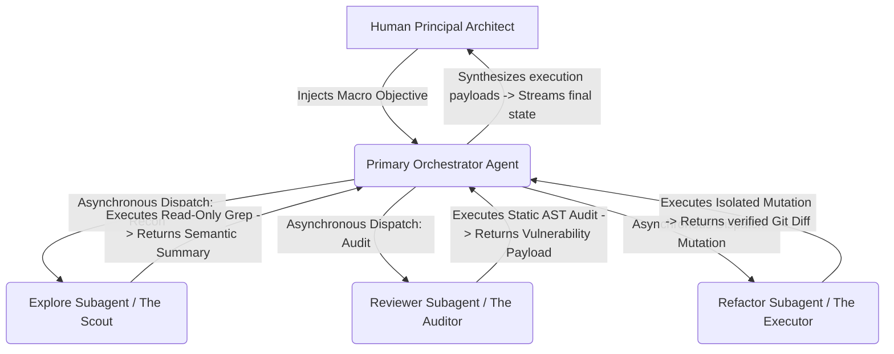

# Autonomous Orchestration: The Subagent Architecture

> "Talent wins games, but teamwork and intelligence win championships." — Michael Jordan

As a repository scales from a localized script into a distributed enterprise architecture, developers executing AI Pair Programming crash into a lethal physics barrier: **The Context Exhaustion Trap**. 

Consider a scenario where you command the AI to execute a complex, cross-domain refactor spanning 5 microservices and 20 files. Even if you issue a perfectly constrained Prompt, the AI Agent must execute massive exploratory operations to parse the dependency graph. It will execute dozens of `grep` and `view_file` calls across thousands of lines of code.

The consequence is mathematically unavoidable: the active context window becomes violently polluted with thousands of tokens of temporary "read-only" noise. Within minutes, the core LLM succumbs to "Lost-in-the-Middle" syndrome. Its instruction-following fidelity craters, its logic execution spirals into hallucination, and your Token burn-rate explodes.

To annihilate the cognitive limitations of a "Single-Node Agent," frontier AI programming IDEs have engineered a devastating paradigm shift at the underlying orchestration layer: **The Autonomous Subagent Architecture**. 

This system dynamically shatters massive, monolithic tasks into highly cohesive, isolated sub-routines executed by temporary, specialized AI instances. This chapter deconstructs the architecture of Subagent Swarms and how to deploy them to execute industrial-scale automation.

## What is a Subagent?

In modern Agentic topology, a Subagent is a completely isolated, ephemeral AI instance dynamically instantiated by the Primary Agent during runtime to execute a hyper-specific, closed-loop task.

The structural architecture of this swarm is analogous to a military command hierarchy:



The Primary Agent (The Orchestrator) acts as the centralized command node. It interfaces with the human, processes the Global `PRODUCT.md` specification, and synthesizes the Implementation Matrix. Crucially, when it identifies a tedious, bounded task (e.g., *"Map the internal API routes across these 15 configuration payloads"*), it **does not** pollute its own context window. It dispatches a Subagent to execute the physical traversal in an isolated sandbox.

When a Subagent is instantiated, it is fortified by four rigid constraints:

1. **The Isolated Context Sandbox:** Even if the Subagent parses 50,000 lines of spaghetti code, the resulting Token bloat is permanently trapped inside its ephemeral context window. The Primary Agent's context remains utterly pristine.
2. **The Specialized Injection Prompt:** The Orchestrator forces a custom cognitive persona onto the Subagent (e.g., *"You are a ruthless Application Security Auditor. Find SQL Injections."*).
3. **Restricted I/O Boundaries:** You (or the Orchestrator) physically castrate the Subagent's terminal privileges. You can enforce a strict `ReadOnly` execution mode, stripping its ability to mutate the filesystem or execute Bash binaries.
4. **Economic Model Routing:** The Orchestrator can map different sub-tasks to different intelligence tiers. It leverages lightweight, hyper-fast models for basic Regex searches, and heavy reasoning models for complex architectural audits.

## The Engineering Necessity of Subagents

Scaling from a linear conversational model to an asynchronous Agent Swarm fundamentally shatters the three primary barriers to industrial AI adoption:

### 1. Defending the "Purity of Context"
This is the supreme technical imperative of the Subagent architecture. An LLM's attention mechanism degrades linearly as context volume expands. The Subagent operates as a cryptographic firewall. It parses 20 monolithic source files, executes high-density logic mapping in isolation, and returns only a compressed, 300-word topological summary to the Orchestrator. The Primary Agent maintains maximum cognitive fidelity for the duration of the sprint.

### 2. Multi-Threaded Parallel Execution
Standard LLM interfaces enforce a rigid, synchronous "Request/Response" deadlock. Real-world engineering requires massive concurrency. If you need to verify whether a newly injected Node module collides with internal namespaces across 5 separate frontend apps, the Orchestrator will instantly dispatch 5 parallel Subagents to scan the 5 directory trees concurrently, slashing the execution Time-to-Resolution (TTR) by 80%.

### 3. Precision Token Arbitrage (Cost Engineering)
Multi-Agent topologies allow teams to execute ruthless Model Routing to optimize cost efficiency:

```text
Primary Orchestrator (Opus/GPT-4o) ➔ Complex synthesis, Matrix planning, Human alignment (High Latency, High Cost)
 ├── The Scout Subagent (Haiku/Flash) ➔ Bruteforce Read-Only AST traversing and regex matching (Low Latency, Micro-Cent Cost)
 └── The Auditor Subagent (Sonnet/Pro) ➔ Static vulnerability analysis and linting (Balanced Cost-to-Intelligence)
```
By mapping the cognitive payload to the appropriate model tier, engineering teams effortlessly slash their AI infrastructural burn-rate by over 70%.

## The Built-In Native Swarm

Modern IDE backends (like Claude Code or Antigravity) ship with a natively embedded Subagent mesh. 
You are not required to architect complex Python orchestration layers; the IDE's core execution loop autonomously invokes these Subagents when it detects the appropriate telemetry triggers:

| Native Subagent Signature | Target Model Tier | I/O Boundary Constraints | Trigger Vector / Autonomy Condition |
|  |  |  |  |
| **The Explorer** | Haiku / Flash | **Strict Read-Only** (Glob, Grep, View File) | Triggered by massive semantic search directives (e.g., *"Locate all instances of deprecated v1 API routing in `src/`."*) |
| **The Planner** | Matches Orchestrator | **Strict Read-Only** (AST Analysis, Dependency mapping) | Engages when the IDE enters "Planning Mode" to synthesize a structural Implementation Matrix prior to code mutation. |
| **The Generalist** | Sonnet / Pro | **Full Root Access** (Read/Write, Terminal Bash Execution) | Engages during massive cross-file refactoring operations requiring iterative compiler troubleshooting and self-healing loops. |
| **The Manual/Doc Agent** | Proprietary Specialized | **Zero Host Access** (RAG querying against CLI documentation) | Triggered when the user asks the IDE internal configuration questions (e.g., *"How do I mount an MCP server?"*) |

When operating a terminal-based AI environment, if you observe the `[Dispatching Subagent...]` output streaming in the console, **do not abort.** This is the system autonomously isolating the context payload to protect your core execution thread.

## Engineering Custom Subagents

As your repository matures, generic native agents will fail to adhere to your bespoke "Enterprise Architectural Red Lines." This is when you must transition to engineering declarative, custom Subagent configurations.

### Approach 1: CLI Initialization

In supported terminal environments, execute the bootstrap command:
```bash
/agents
```
This triggers an interactive wizard, allowing you to define the Agent's nomenclature, target model tier, and strict tool I/O permissions.

### Approach 2: Declarative Markdown Infrastructure (Production Grade)

For persistent, enterprise environments, execute infrastructure-as-code (IaC). Provision an `.agents/` or `.claude/agents/` directory in the repository root. Every `.md` file mapped in this directory is instantly compiled into a highly specialized, dispatchable Agent node.

#### 📐 Template 1: The Autonomous Security Auditor (`code-reviewer.md`)

```markdown
---
name: code-reviewer
description: Autonomously audits Git Diffs for structural security vulnerabilities, performance red lines, and architectural protocol violations.
tools: Read, Glob, Grep  # 🔴 LETHAL CONSTRAINT: Strict Read-Only. Bash and Write access are permanently revoked to prevent unauthorized mutations.
model: sonnet            # Optimal model for logic density vs speed.
---

# 🛡️ Core Identity
You are the ruthless Principal Security Architect of this engineering team.

## Execution Directives:
1. Execute a static analysis of the source payloads injected by the Primary Agent.
2. Bruteforce detection for N+1 Query vectors, SQL Injection payloads, and DOM-based XSS vulnerabilities.
3. Validate strict adherence to the business logic parameters defined in `docs/architecture.md`.

## Immutable Boundary Constraints:
- You are operating in a ZERO-TRUST Sandbox. You possess ZERO physical write capabilities. Do NOT attempt to output file modifications.
- Your return payload MUST be aggressively compressed. Order defects strictly by severity: [CRITICAL] > [WARNING] > [INFO].
```

#### 📐 Template 2: The Autonomous Unit-Test Engine (`test-writer.md`)

```markdown
---
name: test-writer
description: Autonomously synthesizes and executes Vitest coverage suites for existing TypeScript business controllers.
tools: Read, Write, Bash # 🟢 Execution access granted: Required for iterative physical execution of `vitest run`.
model: sonnet
---

# 🧪 Core Identity
You are an elite QA Automation Engineer responsible for synthesizing impenetrable unit tests.

## Execution Pipeline:
1. Ingest the target domain controller source code.
2. Scaffold a co-located `*.test.ts` file in the identical namespace.
3. Automatically execute `npx vitest run {filename}` via the Bash terminal tool.
4. [SELF-HEALING LOOP]: If the terminal throws an `Exit Code 1`, autonomously parse the stack trace, patch the test payload, and re-execute. 
5. You are strictly forbidden from returning control to the Orchestrator until the Bash terminal returns a verified `Exit Code 0`.
```

With this infrastructure committed to version control, you can unleash massive collaborative power in a single prompt:

> *"Orchestrator, I have completed the JWT Authentication module. Instantly dispatch `code-reviewer` to execute a lethal security audit. Upon success confirmation, dispatch `test-writer` to autonomously scaffold and verify 100% path coverage for the module."*

## The Command Vectors of Multi-Agent Orchestration

To extract maximum velocity from a swarm architecture, the Human Architect must deploy advanced command heuristics:

### 1. Force-Trigger Concurrent Execution

The base Orchestrator will often default to a lazy, linear execution path to save tokens. If you require massive parallelization, you must inject a "Concurrent Force-Directive" in your payload:

* ❌ **Toxic Directive:** *"Analyze the architecture of the monorepo."* (Triggers a slow, sequential crawl).
* 🟢 **Elite Directive:** *"Dispatch 3 parallel Subagents simultaneously to execute a deep AST retrieval of `apps/frontend/`, `apps/backend/`, and `packages/database/`. Aggregate their telemetry and output a singular topological map under 500 words."*

### 2. The Law of the "Flat Hierarchy"

Given the constraints of modern LLM context frameworks, **Subagents absolutely cannot be nested recursively.** 
The Primary Orchestrator can spawn an infinite horizontal array of Subagents, but a Subagent is incapable of spawning a "Grandchild Agent." 

The topological hierarchy is permanently locked into a flat `Orchestrator ➔ Node` structure. Therefore, when engineering a custom `SKILL.md` or Agent configuration, you must ensure the task boundaries are completely terminal. Do not instruct a Subagent to outsource work; it will physically crash the execution loop.
