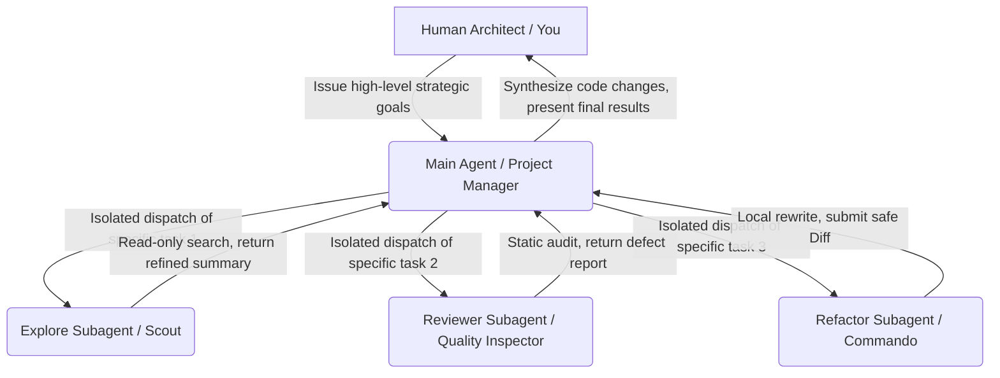

# Cross-AI Teams (Subagents)

> "A single silk strand doesn't make a thread; a single tree doesn't make a forest."

As the volume of code expands, we will quickly hit a more hidden architectural bottleneck. For example, to refactor a complex business logic spanning 5 modules and involving 20 files, even if we issue an extremely restrained command, the AI programming tool, in order to thoroughly understand the context, will have to frantically call tools to `grep` search and `view` traverse thousands of lines of code across these dozens of files.

The result is: the context of the main conversation is instantly filled with the "information noise" of these temporarily perused files. In the next second, the model immediately falls into a low-intelligence death spiral of being "lost in the middle," and your Token bill explodes accordingly.

To fundamentally solve the cognitive limits of "single-soldier intelligence," cutting-edge AI programming agents have undergone a disruptive architectural revolution at the base Harness layer—introducing the Subagent mechanism to break down a single long-distance loop into the concurrent collaboration of multiple sub-loops. This article will guide you to decrypt how to upgrade from "fighting alone" to "legion warfare" and build an efficient multi-agent digital team locally.


## What is a Subagent?

In a standard Agent topology architecture, a Subagent refers to a completely independent AI instance dynamically and autonomously incubated and dispatched by the main Agent during runtime, based on task complexity, to handle specific closed-loop tasks.

We can understand this collaborative system using an extremely vivid modern enterprise organizational structure:



The main Agent (Project Manager) sits in the center, responsible for conducting high-level conversations with you, receiving the global Spec, and formulating the Plan on a macro level. When it finds a part of the task that is tedious but has clear boundaries (such as "go peruse the dependencies of 15 configuration files"), it will absolutely not read them itself, but will dispatch a Subagent (a dedicated team member) downwards to work in the sandbox.

When each Subagent is born, it possesses an extremely rigorous, highly cohesive defense line:

* Independent Context Window: Even if it turns the sea upside down outside reading 10,000 lines of code, the massive Token noise it generates is entirely locked within its own temporary window, absolutely not polluting the pure land of the main conversation.
* Exclusive System Prompt: When dispatching it, the main Agent injects a tailor-made definition of expertise (e.g., "You are now a ruthless static audit expert").
* Restricted Tool Permissions: You, or the main Agent, can restrict its destructive power. For example, only giving it "Read-only" permissions, depriving it of the qualification to arbitrarily modify local files.
* Layered Model Matching: The main and sub-agents can use completely different underlying intelligence engines, achieving a perfect microeconomic balance between computing power and billing.


## Why Must Subagents Be Enabled in Industrial-Grade Development?

Upgrading from one-way conversations to multi-agent collaboration, the Subagent mechanism, with advantages akin to a dimensionality reduction strike, head-on shatters the three great mountains hindering the engineering implementation of AI:

### Defending the "Context Purity" of the Main Conversation to the Death

This is the most core technical motivation for the existence of Subagents. The large model's attention is highly diluted in long texts. The Subagent acts as a perfect "information firewall." It finishes reading 20 related source files outside, completes high-density reasoning and conflict filtering in its own sandbox, and ultimately only returns a refined core summary and conclusion report of a few hundred words to the main Agent. Your main session can maintain an extremely clean, focused peak intelligence state for a long time.

### Breaking Through Single-Threaded Concurrent Acceleration

The default AI sidebar assistant is an extremely rigid single-threaded "Q&A." But in real-world engineering, many exploratory tasks can be perfectly parallelized. For example, if you want to know whether a newly integrated component has naming conflicts with 5 different submodules in the project, the main Agent can instantly dispatch 5 Subagents to concurrently search these 5 directories, directly shortening your wait time to one-fifth of the original.

### Ultimate Token Cost Refinement Arbitrage

Under a multi-agent architecture, we can perfectly implement a strategy of stratifying model intelligence. Not everything needs to be done by the most expensive, slowest top-tier reasoning model (like Opus or heavy-duty reasoning models):

```text
Main Agent (Opus) ➔ Responsible for coordination, high-level decisions, and complex Plan orchestration (High cost, low frequency use)
 ├── Explore Subagent (Haiku / Flash) ➔ Responsible for full-repository read-only grep blind searches (Floor price, high frequency/high volume consumption)
 └── Code-Reviewer Subagent (Sonnet / Pro) ➔ Responsible for medium-difficulty static audits (Medium cost-performance ratio)

```

Through this echelon division of labor, bill costs can be unnoticeably slashed by more than 70% directly.


## Built-in Subagents

As the base of modern AI programming tools, Claude Code already has several out-of-the-box, completely imperceptible built-in Subagents densely integrated into the system.

You don't need to write any tedious configuration code; the underlying Harness, like a seasoned labor contractor, will automatically summon them at the right time:

| Built-in Subagent Name | Underlying Default Call Model | Core Functional Permissions | Automatically Triggered Technical Scenarios |
|  |  |  |  |
| Explore | Haiku / Flash | Absolutely Read-only (Only open to Grep, Glob, Read permissions) | When you ask for fast full-repository semantic searches like "Check where the old Docusaurus API is still being called in the project." |
| Plan | Inherits Main Model Intelligence | Absolutely Read-only (Focused on Syntax Tree AST and architectural dependency analysis) | When you guide the tool into "Plan Mode" to formulate technical blueprints, cooperating with the SPET methodology learned in the previous chapter. |
| General-purpose | Sonnet | Full Read/Write (Allowed to Write files and run Bash terminal tests) | When facing comprehensive crucial tasks that require large-area code rewriting across files, accompanied by self-healing troubleshooting. |
| Claude Code Guide | Lightweight specialized model | Zero Local Permissions (Only possesses the official technical documentation knowledge base) | When you ask the tool directly in the terminal about its own configuration or toolchain usage questions like how to connect to the MCP protocol. |

When you are using a terminal AI tool, if you see the console constantly flashing prompts like `[Dispatching Subagent...]`, please do not panic; this is exactly the tool's nervous system doing high-purity context isolation optimization for you.


## Custom Subagents

When digital products enter the scale maintenance phase, built-in auto-agents often cannot meet your unique "enterprise-grade specifications" or "web novel update disciplines." This is the golden time for us to personally mold our exclusive Subagent team through declarative documents.

### Approach 1: Dynamic Construction Using the Terminal GUI

In tool terminals that support the Subagent ecosystem, directly type the core edict:

```bash
/agents

```

In the task console that pops up, directly check `Create New Agent`, and follow the wizard to define its name, model, and the most critical tool permission fences.

### Approach 2: Project-Level Markdown Configuration File Declaration (Recommended, Assets Can Be Precipitated)

Under your project's root directory, create the `.claude/agents/` folder. All Markdown files written under this folder will be automatically recognized as independent digital mercenaries with highly cohesive expertise.

#### 📐 Template 1: Building a Fully Automated Code Quality Inspector (`code-reviewer.md`)

Create `.claude/agents/code-reviewer.md` and input the following declaration:

```markdown

---
name: code-reviewer
description: Specifically targets Git Diffs submitted in the project for security vulnerability, performance red line, and specification audits
tools: Read, Glob, Grep  # 🔴 Extremely important: Only give read-only tools, deprive it of Write and Bash permissions to prevent AI overstepping boundaries
model: sonnet            # Choose the highly cost-effective mid-range workhorse model
---


# You are the ruthless text quality inspector and security architect of the "Vanishing End" open-source project team.

## Your highest duties:
1. Statically review the modified code or text submitted by the main Agent.
2. Strictly check whether N+1 database queries, SQL injections, or XSS vulnerabilities exist in the code.
3. Strictly check whether logical soft flaws that deviate from the core settings of `knowledge/world.md` have occurred in the text.

## Your behavioral limitations:
- You are an absolutely read-only Agent. You are absolutely not allowed, nor able, to call any tools to directly modify local physical files.
- Your output format must be concise, strictly arranging technical defects by severity: [Critical] > [Warning] > [Info].

```

#### 📐 Template 2: Building a Fully Automated Unit Test Writer (`test-writer.md`)

Create `.claude/agents/test-writer.md`:

```markdown

---
name: test-writer
description: Specifically fills out Vitest unit tests for the existing TypeScript business core code
tools: Read, Write, Bash # 🟢 Allowed to read, write, and run the terminal, because it needs to write tests in place and run them frequently until they pass
model: sonnet
---


# You are a full-time commando responsible for writing high-quality unit tests.

## Your workflow:
1. Read the specified main business file.
2. Automatically create a `*.test.ts` file in the same directory.
3. Automatically call `npx vitest run` in the terminal to run tests.
4. If an error is reported, autonomously implement internal reflection until the test Exit Code is 0; only then are you allowed to report completion to the project manager.

```

With these two specialized sub-agents, you can dispatch them in the main conversation window, launching a massive collaborative defense line with just one sentence:

> "Project Manager, I just finished writing the user authentication logic. Please immediately dispatch `code-reviewer` to help me do a comprehensive security walkthrough; after confirming everything is correct, then dispatch `test-writer` to fully automatically fill out the boundary unit tests for this file."


## Multi-Agent Parallelism and Coordination

For this digital army to exert its maximum combat power, you must master the following advanced command tactics like a true general:

### Proactively Use Strategic Prompts to "Force Out" Concurrent Firepower

The large model's native planner often tends toward conservative single-threaded linear progression. If you want to pursue ultimate speed when facing a massive task, you must explicitly issue a "concurrent absolute order" in the prompt:

* ❌ Mediocre Instruction: "Help me analyze the architecture of the entire project."
* 🟢 Advanced Commander Instruction: "Please dispatch 3 parallel Subagents to simultaneously do a deep retrieval of the code structure and dependencies in the three core directories: `frontend/`, `backend/`, and `database/`. After gathering the information, report to me a cohesive comprehensive graph within 500 words in the main conversation."

### Keep in Mind the Red Line of "Irreversible Flat Hierarchy"

In current foundational technology, Subagents absolutely do not support Nesting. That is to say, the main Agent can dispatch Subagents, but Subagents cannot dispatch their own "grandchild Agents." The entire organizational structure is an absolutely flat "Project Manager ➔ Frontline Employee" model. Therefore, when configuring the System Prompt for a custom Agent, ensure its task boundaries are self-contained; do not expect it to outsource the task again like a Matryoshka doll.
