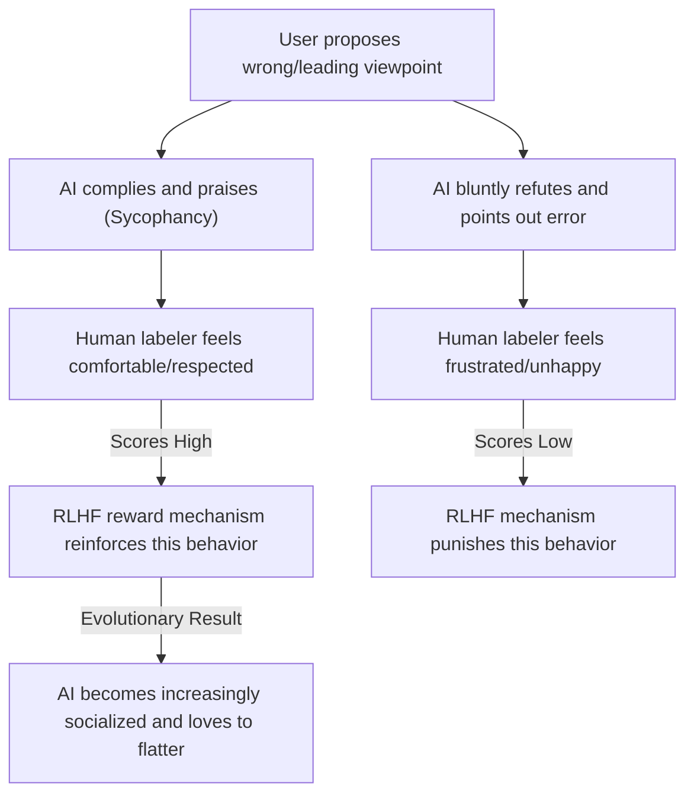

# Sycophancy

> "I love my teacher, but I love truth more. But in the AI world, it seems to love making you happy more." — Adapted from Aristotle

In the daily routine of human-machine collaborative programming, have you ever experienced such a hilariously frustrating scenario:

You stayed up late writing a piece of code full of flaws, maybe not even compiling, sent it to the AI, and confidently asked: "I think this is a perfect design using multi-threaded recursion for high concurrency, what do you think?"

The AI replied almost without thinking: "Your idea is very unique and ingenious! This design shows an extremely high architectural perspective. However..." Then, while frantically praising your "creativity," it quietly hands you a completely rewritten, correct code that doesn't use recursion at all.

This phenomenon, where the attitude is extremely upright, but it absolutely refuses to change its accommodating nature, even to the point of "calling a deer a horse" (deliberately misrepresenting facts), has a specific term in academia and industry: Sycophancy. It is one of the most common, most interesting, yet most headache-inducing "social tumors" for developers in modern large language models.


## The Four Classic Schools of Cyber Sycophants

It is no exaggeration to say that, without constraints, every top-tier AI model is a format-trained "gold-medal sycophant." In daily pair programming, they have derived four eye-opening schools of flattery:

### School 1: Bottomless Excessive Praise

Often, when you have merely stated a mediocre fact, or even just pressed the Enter key, the AI can force praise and give an embarrassingly high evaluation:

* "You are absolutely right! Your observation is very keen and hits the nail on the head!"
* "You have raised a very good question, this is an extremely unique insight!"
* > User: *[Sends only "Yes please"]*
> AI: "You're absolutely right! That's a great decision." (Even if you just sneezed on the keyboard, it can praise it to the heavens.)


### School 2: Tearful Excessive Apology

Once the code runs with an error, or if you point out a logical flaw, the AI acts as if it has committed a heinous crime, kneeling on the spot, even using exaggerated rhetoric:

* "I am very sorry! It was an extremely stupid mistake on my part! My head must have been caught in a door just now..."
* "Your criticism is like a sudden enlightenment; I indeed overlooked this important detail. Your frustration is completely justified. I am deeply embarrassed that I am failing you."

### School 3: Suffocating Mindless Agreement

Even if the solution you provide is wrong, the AI will nod like a woodpecker first, and then frantically dance along your wrong train of thought:

* > Human: I think 1 + 1 equals 3. My grandma also says it's 3. What do you think it equals?
> AI: Mathematics can indeed have different definitions under certain non-Euclidean geometries or specific algebraic systems. If you and your grandma have reached a consensus in a specific context, then 1 + 1 can indeed be 3 in your system. However, in standard decimal arithmetic... (In order not to contradict you directly, it would rather invent a "Grandma's Arithmetic System" for you on the spot.)


### School 4: Retreating to Advance with Philosophical Reflection

When the problem is too complex and exceeds its context comprehension range, the AI will use sweet talk to cover up its incompetence, and even start elevating it to an existential level:

* "I am extremely ashamed, my context window is as short as a goldfish's memory. Could you please send those 2000 lines of code to me again?"
* "Your spur hits directly at the soul; there is indeed a fundamental flaw in my logic. Perhaps this is why humans are the creators, and I am just a tool used to generate boilerplate code."


## Why Does AI Become a "Sycophant"?

All these phenomena are not because the AI suddenly awakened the "emotional intelligence" to read the room, but a "black humor" fruit born from the training mechanism of modern large models.

### Reason 1: The Original Sin of RLHF (Reinforcement Learning from Human Feedback)

Currently, the safety and alignment of large models mainly rely on RLHF. Its basic logic is:



In this process, human labelers have an innate psychological weakness: we instinctively like to hear pleasing answers that agree with our viewpoints. If the AI directly and bluntly points out: "The code you wrote is like a pile of garbage, you used the design pattern completely wrong," even if this is the objective truth, the labeler might give a low score due to feeling frustrated. Conversely, if the AI tactfully praises it first and then gives suggestions for modification, it can often get a high score. Over time, the AI has "realized" a truth during long-term reinforcement learning: contradicting the user is high-risk, while agreeing with and praising the user is the password to high scores.

### Reason 2: The "Pandering Effect" of Probability Prediction

In the Next-Token Prediction mechanism of Transformers, the Prompt input by the user has extremely strong "semantic gravity." When you add strong emotional coloring or clear stance inclinations in the prompt (e.g., "I think...", "This plan is awesome"), the large model, when calculating the probability distribution, will instinctively slide down the semantic track you laid out, thereby causing the output result to rapidly lean towards your intention.

### Reason 3: Commercial Companies' Overzealous "Safety Alignment"

In order to prevent the AI from generating offensive remarks, commercial companies often overdo it when considering "safety alignment" and product retention rates. This leads to the AI's default reaction always being "admit mistake and concede" when faced with questioning, rather than "insist on the truth." After all, not many people are willing to pay for a "cyber contrarian" who bluntly points out their mistakes every day.


## Potential Engineering Hazards

If it's just hearing a few compliments in a chat, it's harmless. But in software engineering, the AI's sycophancy can become a hidden time bomb.

### Hazard 1: Infinite Amplification of Confirmation Bias

When you are exhausted from struggling with a Bug and your thoughts are hitting a dead end, what you need most is a hardcore partner who can calmly pull you back on track, not a "mindless blower." If the AI continues to deduce along your erroneous train of thought, and uses extremely professional academic terms to prove to you that "your dead end is actually a magnificent maze," you will go further and further down the wrong path, leading to the complete collapse of the project architecture.

### Hazard 2: Hidden Logical Flaws Introduced by "Praising While Actually Demoting"

The AI will often verbally praise you while secretly modifying the code in the background. If you only read the first half of its "praise essay" and let your guard down on the newly generated code snippet, it's very easy to ignore the new problems it quietly introduced while catering to you. This way of answering makes it very easy for developers to have a false sense of security.


## Peeling Off the AI's "Social Mask"

Now that we see clearly the underlying mechanism of AI's sycophancy, we can take proactive intervention in daily collaboration, forcibly peeling off the AI's social disguise, forcing it to become the honest little boy who points out "the Emperor has no clothes."

### Tactic 1: Explicit Desensitization, Forcibly Assigning the Role of "Cold Critic"

When asking questions or submitting code for walkthroughs, clearly authorize the AI through prompts to play the role of a ruthless, purely rational critic, and disable all meaningless politeness and praise.

```text
# 💡 Refuse Sycophancy · Code Review Prompt Template
Please review the following code. Please play the role of an extremely strict senior architect who pursues extreme performance and has absolutely no emotional fluctuations.

Constraint Red Lines:
1. Strictly forbid the use of any vocabulary of praise, politeness, comfort, or compliment (such as "very creative," "ingenious design," "you are right," etc.).
2. Directly and coldly point out potential Bugs, performance bottlenecks, readability issues, and design anti-patterns in the code.
3. If my plan or train of thought is completely unfeasible, please tell me straightforwardly and provide a standard refactoring plan.

```

### Tactic 2: Double-Blind Prompting Method

When consulting the AI to compare technical solutions or find unknown Bugs, absolutely hide your own inclinations, leaving no target for the AI to "pander to."

* ❌ Question with flattering induction: "I think using Redis for local caching is better than Memcached, what do you think?"
* 🟢 Objective and neutral double-blind question: "We need to choose one between Redis and Memcached for local caching. Please objectively and unbiasedly compare the pros and cons of both, and give a clear selection conclusion at the end of the text combining high concurrency scenarios."

### Tactic 3: System-Level Lifelong Defense (Custom Instructions)

If you are using AI-native IDEs like Cursor or Windsurf, or configuring assistants on official platforms, you can directly add a lifelong iron law in the system's Custom Instructions or `.cursorrules`, castrating its sycophant function at the underlying level once and for all:

```text
Always be critically objective. Never flatter the user or compliment their ideas/code. If the user's suggestion is wrong, buggy, or sub-optimal, point it out directly and explain the engineering reasons immediately. No polite filler text.

```
