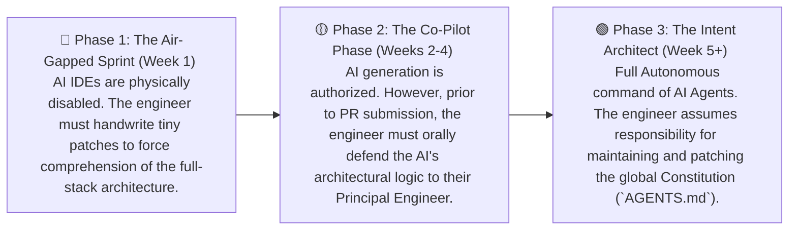

# Team Collaboration in the AI Era

> "Coming together is a beginning, staying together is progress, and working together is success." — Henry Ford

The preceding chapters of this architecture guide have focused on the individual developer's execution loop: how to engineer Prompts, how to weaponize context windows, and how to maintain architectural control. However, enterprise software engineering is fundamentally a distributed system of human operators.

When an entire engineering organization simultaneously mounts AI programming tools, individual velocity scales exponentially. But this hyper-velocity instantly triggers a completely new class of engineering disasters:

- **Architectural Fragmentation:** Your AI defaults to functional programming; your colleague's AI hallucinates massive Object-Oriented inheritance chains. The repository rapidly devolves into a disjointed "Frankenstein's Monster."
- **The Review Bottleneck:** Historically, a Senior Engineer merged one Pull Request a week. Now, a junior developer can blast five 500-line PRs a day. The Reviewer experiences cognitive collapse, abandons rigorous code reviews, and blindly clicks *Approve*.
- **Implicit Knowledge Failure:** Veteran engineers navigate legacy codebases by relying on "Tribal Knowledge" stored in their heads. Stateless AI Agents do not possess this tribal knowledge, resulting in the exact same catastrophic bugs being hallucinated repeatedly.
- **The Proliferation of "Shadow AI":** In the ruthless pursuit of velocity, developers bypass infosec protocols and paste proprietary production code (often containing API secrets) into public, un-audited LLMs.

This chapter deconstructs the enterprise paradigm shift required to upgrade Human-AI collaboration from a chaotic "Guerrilla Warfare" model into a highly disciplined, automated "Regimental Command" architecture.

## The Bottleneck Shift: From "Typing Execution" to "Context Verification"

In the AI era, the underlying physics of software teams have fundamentally mutated: AI has eradicated the latency of *Synthesizing Code*, but it has violently amplified the cost of *Architectural Misalignment*.

Historically, team collaboration was a bottleneck of human bandwidth and syntax mastery. Teams relied on rigid Agile rituals to prevent mistakes. Today, collaboration is a battle for Context and Judgment; teams must rely on automated guardrails to prevent devastating drift.

### The Evolution of Organizational Topology

In legacy models, the execution topology was hyper-specialized: Frontend engineers touched the DOM, Backend engineers touched the ORM. 

Today, a single engineer commanding a swarm of autonomous AI Agents can execute a full-stack feature end-to-end in a single afternoon. Consequently, the core value proposition of an engineer is no longer: *"Can I type this syntax?"* It is now: **"Do I possess the holistic business context to mathematically verify that the AI's execution aligns with our system architecture?"**

The direct consequence: Organizations can shrink their headcount footprint while vastly increasing individual surface area. A 3-person "Agentic Squad" can outmaneuver a legacy 15-person functional team, compressing the feedback loop to the absolute physical limit.

### The Evolution of the Engineer: "The Intent Architect"

In this hyper-agile topology, the responsibilities of a Senior Developer must elevate from "Writing the core logic" to becoming an **Intent Architect**:

- **Front-Load the Definition of Done (Vibe, then Verify):** Before the AI writes a single token, the Architect must define 3-5 deterministic Assertion Cards. The AI is free to hallucinate implementations, but the Pull Request cannot be merged unless those exact mathematical assertions return `Exit Code 0`. If no assertions are defined, waking the AI is strictly forbidden.
- **Architectural I/O Bounding:** Humans define the strict API contracts, database schemas, and microservice boundaries. The AI is delegated exclusively to generating the deterministic logic *within* those boundaries.

## Establishing the Team AI Constitution

AI introduces a massive variable of chaos: every developer utilizes different Prompt mechanics and possesses different levels of trust in LLM outputs. To constrain this non-deterministic entropy, the engineering organization must enforce a mandatory, mathematically enforceable **AI Collaboration Constitution**.

### The Core Schema of the Team Constitution

- **Unified Toolchains & Shadow AI Eradication:** You cannot stop developers from using AI. You must provide compliant, enterprise-grade AI tooling (e.g., Cursor Enterprise, GitHub Copilot). You must enforce a lethal zero-tolerance policy against injecting proprietary `.env` secrets into un-audited cloud models.
- **Explicit Code Ownership (The Human Fallback):** Every module in the repository MUST have a designated Human Owner. The AI may generate 99% of the syntax, but a human must execute the final Git Merge, assuming absolute legal and architectural liability for that code. The AI can only be unleashed when a human is accountable for the blast radius.
- **Telemetry Tagging:** Inject lightweight telemetry headers (e.g., `// AI-GENERATED: Claude 3.5 Sonnet`, `// REVIEWED-BY: John Doe`) above complex, AI-synthesized logic blocks. This provides critical context for the next engineer who encounters a bizarre logic branch.
- **The Review Defense Obligation:** The PR Author is legally obligated to explain the architectural intent behind *every single line* of AI-generated code to the Reviewer. If the Author responds with "I don't know, the AI wrote it," the PR is instantly rejected.

## Crystallizing the Project Knowledge Graph

In legacy teams, the project's architecture lived implicitly in the minds of the Staff Engineers. In the AI era, **business context that is not serialized into Markdown physically does not exist.** The team must convert all implicit "Tribal Knowledge" into machine-readable AST (Abstract Syntax Tree) rulesets.

To ensure that a newly onboarded engineer—or a freshly booted AI Agent—can instantly map the repository architecture in under two seconds, you must deploy a multi-layered Configuration Mesh:

```plaintext
project-root/
├── CLAUDE.md              # The Global Constitution (Architectural intent, security taboos. Active for all Agents.)
├── .cursorrules           # IDE-specific AST linter rules and localized prompt constraints.
├── AGENTS.md              # Boundary constraints specifically designed to throttle high-privilege autonomous Agents.
├── .agents/skills/        # The Modular Skill Library (Reusable automation and review workflows.)
├── docs/
│   ├── ARCHITECTURE.md    # The holistic system map (Microservice bounding boxes, Data persistence layers, API routes.)
│   └── PRODUCT.md         # The Decision Log (Records WHY a specific architecture was chosen over another.)
```

### The CI/CD Knowledge Sync (Preventing Context Rot)

Rule files are highly susceptible to "Context Rot." An outdated `.cursorrules` file is lethal; it will force the AI to continuously generate deprecated, toxic APIs. The organization must enforce Rule Updates as a hard Blocker in the PR process:

> **The Protocol:** When a developer refactors a foundational module, they are mathematically required to update `ARCHITECTURE.md` and `.cursorrules` in the same PR. If the context is not synced, the PR is rejected. This guarantees the next Agent boots up with a pristine worldview.

## Deploying the Automated Intercept Perimeter

The hyper-velocity of LLMs guarantees "Code Bloat." A human Reviewer cannot physically clear the minefield of 5 massive PRs per day. Furthermore, you cannot rely on another AI to execute the security review (their hallucination blind spots often overlap).

You must engineer an impenetrable, automated Quality Gate within your CI/CD pipeline. You must use **Deterministic Machine Rules to cage Non-Deterministic AI Output.**

### Blueprint: Production-Grade GitHub Actions Guardrails

Deploy `.github/workflows/ai-quality-gate.yml` to force the CI/CD pipeline to act as the ruthless, emotionless "Bad Cop" before a PR ever reaches a human:

```yaml
# .github/workflows/ai-quality-gate.yml
name: Autonomous Quality Gate

on:
  pull_request:
    branches: [ main, develop ]

jobs:
  quality-gate:
    runs-on: ubuntu-latest
    steps:
      - name: Checkout Repository
        uses: actions/checkout@v4

      - name: Mount Environment
        uses: actions/setup-node@v4
        with:
          node-version: 20
          cache: 'npm'

      - name: 1. Strict AST Type Enforcement (The TypeScript Shield)
        # Intercepts null pointers and implicit `Any` types that AI notoriously hallucinates.
        run: npx tsc --noEmit 

      - name: 2. The Linter Perimeter
        # Intercepts cyclomatic complexity breaches and syntax fragmentation.
        run: npx eslint . --max-warnings 0 

      - name: 3. Security & Dependency Audit (SAST & SCA)
        # LETHAL INTERCEPT: Blocks hallucinated NPM packages or deprecated dependencies containing CVE vulnerabilities.
        run: npm audit --audit-level=high

      - name: 4. Autonomous Coverage Enforcement (Coverage > 80%)
        # Forces the AI to synthesize matching test assertions. Anything below 80% is physically blocked from the trunk.
        run: npx vitest run --coverage --coverage.thresholds.lines=80
```

Only when every single machine blocker executes with an `Exit Code 0` does the PR enter the Human Reviewer's queue. At this stage, the human is completely freed from hunting syntax errors; they only need to verify one critical vector: **"Does this implementation violate the core system architecture?"**

## The Onboarding Protocol

### Preventing "Technical Muscle Atrophy"

When a new hire leverages AI to push a massive feature on their very first day, a dangerous illusion of competence is created. They have actually learned absolutely nothing about the repository's underlying dependency graph or routing mechanisms. If the API goes down, the new hire is physically incapable of troubleshooting the stack trace.

To prevent this severe "Technical Muscle Atrophy," elite organizations enforce a hardcore "Three-Phase Onboarding Protocol":



### Shifting from "Velocity" to "Durability"

Once an organization fully integrates AI, legacy performance metrics (like "Lines of Code Written") instantly become obsolete.

❌ **Toxic Metrics to Terminate Immediately:**
- **AI Suggestion Acceptance Rate:** High acceptance often indicates cognitive laziness and blind trust, not high code quality.
- **Lines of Code (LoC) / PR Count:** An AI can synthesize 1,000 lines of toxic boilerplate in 2 seconds. Volume is no longer a metric of competence.
- **Initial Delivery Velocity:** Measuring only the speed of the V1 launch is dangerous, as the catastrophic maintenance debt is hidden.

✅ **The Survival Metrics to Track:**
- **Short-Term Code Churn:** The frequency at which AI-synthesized code is completely deleted or rewritten within 14 days of merging. Extreme churn indicates the team is rapidly "manufacturing garbage."
- **Defect Escape Rate:** The percentage of AI-hallucinated bugs that successfully bypassed the CI/CD guardrails and triggered a live production incident.
- **Architectural Erosion Index:** Is the repository's global Cyclomatic Complexity spiking due to AI applying rapid, chaotic patches instead of holistic refactoring?

Team collaboration in the AI epoch is ultimately an arms race for **Business Context** and **Architectural Control.**

The organizations that win this arms race are those capable of serializing implicit human knowledge into machine-readable AST protocols, utilizing deterministic CI/CD perimeters to cage non-deterministic LLMs, and empowering human Architects to fiercely defend the ultimate decision-making threshold. The era of the "10x Programmer" grinding away in isolation is over. They have been replaced by the **"10x Architecture Commander"** who orchestrates a devastating, mixed-arms legion of human engineers and autonomous AI Agents.