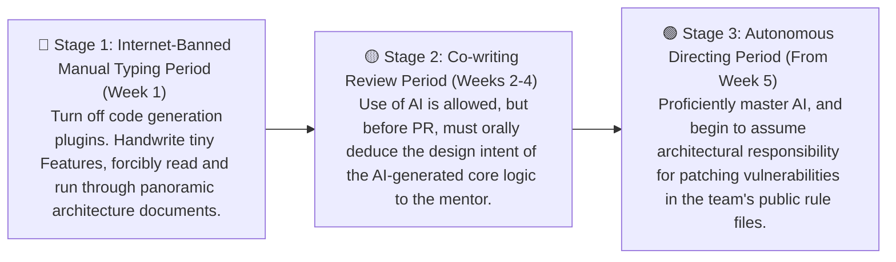

# Team Collaboration

> "Coming together is a beginning, staying together is progress, and working together is success." — Henry Ford

The preceding chapters of this book mainly unfold from the perspective of an individual developer: how you write Prompts, how you manage context, and how you transform into a code judge to control the bottom line. But real-world commercial software development is never a solo fight.

When everyone in the team starts furiously mounting AI programming tools, the output speed experiences explosive growth, but entirely new engineering disasters also erupt:

- Code Style Fragmentation: Your AI is accustomed to functional programming, my AI prefers object-oriented, and the system quickly degenerates into an un-designed "Frankenstein's monster."
- Review Bottleneck: In the past, one PR was issued a week; now, one person can throw out five 500-line PRs a day. The Reviewer simply can't read them all, completely gives up resistance, and directly clicks Approve.
- Implicit Knowledge Failure: Veteran employees rely on their "historical pit-filling experience" in their heads to avoid risks, but stateless AIs don't know these pits, causing the same Bugs to be repeatedly generated by different people.
- Proliferation of "Shadow AI": In the pursuit of speed, employees privately send production code containing secrets to unaudited public cloud models, bringing enormous security risks.

This chapter will systematically organize for you how to upgrade human-machine collaboration from an individual "solo guerrilla war" to a "modern army group operation" paradigm that guards against entropy increase and is highly disciplined.

## The Bottleneck of Collaboration Has Shifted From "Writing Slowly" to "Thinking Inconsistently"

In the AI era, the underlying logic of team collaboration has undergone a drastic change: AI has flattened the most time-consuming "typing execution" part of teamwork, but it has also magnified the easily overlooked "understanding deviation."

In the past, cooperation was about competing in manpower and skills, relying on processes to ensure no mistakes; now, cooperation is about competing in context and judgment, relying on guardrails to ensure no deviations.

### Division of Labor Model

In the past, the division of labor in a team was frontend doing frontend, backend doing backend. Now, one person leading several AI agents can run through a full-stack feature end-to-end in an afternoon. Therefore, the core value of a developer is no longer "I can write this piece of code," but "I understand the full context of this business logic and can judge whether the AI's output is correct."

The result is: the team's organization can become smaller, but individual responsibility becomes greater. A 2-3 person full-stack squad + AI can run much faster than the previous 8-person functional team, and the feedback loop can also be compressed to the limit.

### Evolution of Roles

Under such agile organizations, the responsibilities of senior developers will leap from "taking the lead in writing core code" to "Intent Architects":

- Front-load Acceptance Cards (Vibe, then Verify): Before starting work, write an "acceptance card" (3-5 testable assertions). The AI can generate freely, but before the code is merged, the Reviewer only looks at whether this card has passed. Without an acceptance card, waking up the AI is strictly forbidden.
- Design Interface Boundaries: Humans are responsible for defining module contracts and data flows, while AI is responsible for filling in the internal implementations.

## Establishing a Team AI Contract

AI programming introduces a completely new variable: every developer's Prompt habits and degree of trust in AI output are entirely different. To constrain this non-deterministic productivity, the team must establish a mandatory collective contract that can be "written on a single page."

### Core Skeleton of the Team AI Collaboration Agreement

- Unified Toolchain and Shadow AI Governance: Do not blindly block; provide compliant AI tools officially supported by the enterprise (such as Cursor Enterprise or GitHub Copilot Enterprise). Strictly forbid sending any configuration files containing production environment keys or enterprise secrets to uncontrolled cloud models.
- Explicit Code Ownership (Human Fallback): Every core module in the repository must have a human Owner. The AI can write 90% of the code, but a human must press the Merge button and be fully responsible for that 90%. Only when there is someone to hold accountable for problems will the team dare to let the AI run loose.
- Make AI Code "Visible": Add simple annotation marks (such as `// AI-GENERATED: Claude 3.5 Sonnet`, `// REVIEWED-BY: John Doe`) above complex AI-generated logic. This doesn't require tedious documentation; it just lets the next person taking over know what they are dealing with.
- Obligation for Review Defense: The PR submitter is obligated to answer any questions raised by the Reviewer regarding the design intent of any line of AI code. If they cannot answer "why it was written this way," the PR is directly rejected.

## Explicitizing the Project Knowledge Base

In the past, the team's tacit understanding existed in the heads of veteran employees. But in the AI era, business context that isn't written down doesn't exist. The team must solidify implicit "tribal experience" into machine-readable rule files.

To allow newly onboarded colleagues, or even newly scheduled AI agents, to sort out the project context within two seconds, we should maintain a multi-level "shared brain" network in the project:

```plaintext
project-root/
├── CLAUDE.md              # Project-level global rules (declares architectural intent, security taboos, takes effect for all personnel and AI)
├── .cursorrules           # Strong validation rules and Prompt constraints specifically for the IDE
├── AGENTS.md              # Anti-overstepping boundary restrictions for high-privilege autonomous Agents (like Cline/Aider)
├── .ai-skills/            # Team's shared instruction library (precipitated Agent automated testing/review workflows)
├── docs/
│   ├── ARCHITECTURE.md    # Full picture of team architecture (microservice boundaries, data flow, public API routing definitions)
│   └── PRODUCT.md         # Product decision log (write only 3 lines: why we didn't do A but did B back then)
```

### Automatic Knowledge Sync (Keep Knowledge Alive)

Rule files are most afraid of "expiring." Outdated rules will cause the AI to continuously generate hallucinatory code with historical toxicity. We must make updating rules a hard blocker (Definition of Done, DoD) for code merging:

> When a new core public module is added to the project, or a fundamental component is refactored, the developer responsible for that module must synchronously update `ARCHITECTURE.md` and `.cursorrules` in the root directory. Only in this way can the next person taking over get the latest worldview when waking up the AI.

## Deploying Intercept Defense Lines

The high-frequency output of large models easily leads to "code bloat." Faced with the impact of 5 large PRs a day, relying solely on the human eye of the Reviewer to clear mines is unrealistic; nor can you use AI to review the security of AI-generated code (because their blind spots might overlap).

You must establish tough automated quality interception blockers in the CI/CD pipeline—using deterministic machine rules to box in non-deterministic AI outputs.

### Example of Production-Grade GitHub Actions Guardrails Configuration

Configure `.github/workflows/ai-quality-gate.yml` in the project, forcing the machine to play the "bad guy" first every time a Pull Request is initiated:

```yaml
# .github/workflows/ai-quality-gate.yml
name: AI Code Quality Gate

on:
  pull_request:
    branches: [ main, develop ]

jobs:
  quality-gate:
    runs-on: ubuntu-latest
    steps:
      - name: Checkout Repository
        uses: actions/checkout@v4

      - name: Setup Environment
        uses: actions/setup-node@v4
        with:
          node-version: 20
          cache: 'npm'

      - name: 1. Strong Type Checking (TypeScript Guard)
        # Intercepts null pointer and implicit Any errors that AI loves to make most
        run: npx tsc --noEmit 

      - name: 2. Linter Gate
        # Intercepts high cyclomatic complexity and style fragmentation
        run: npx eslint . --max-warnings 0 

      - name: 3. Security Vulnerability & Dependency Scanning (SAST & SCA)
        # Extremely important: Intercept nonexistent packages or old dependencies with CVE vulnerabilities introduced by AI hallucinations
        run: npm audit --audit-level=high

      - name: 4. Run Unit Tests and Force Coverage (Coverage > 80%)
        # Requires AI to synchronously generate assertion tests; anything below 80% is directly bounced back by the machine
        run: npx vitest run --coverage --coverage.thresholds.lines=80
```

Only when all the above blockers light up green is this AI-mixed code worthy of entering the human Reviewer's field of vision. At this point, humans no longer need to pick out syntax errors; they only need to focus on one thing: "Is the acceptance card satisfied? Has the system architecture been destroyed?"

## Cultivating Newcomers

### Newcomer Onboarding

When newcomers can rely on AI to rapidly submit large chunks of core features on their first day of work, a trap also follows: they actually know nothing about the project's underlying technical architecture and real routing mechanisms. Once the internet disconnects or the AI glitches, the newcomer will instantly lose the ability to resolve underlying Bugs.

To cope with this technical muscle atrophy caused by "pulling shoots to help them grow," the team should establish a hardcore "Three-Stage Onboarding Growth Protocol":



### From "Speed" to "Durability"

After a team fully embraces AI, traditional performance and engineering measurement metrics have become invalid, and the baton must be reversed immediately.

❌ Vanity metrics that must stop being tracked immediately:

- AI Suggestion Acceptance Rate: A high acceptance rate does not equal high quality; on the contrary, it very likely means blind trust and cognitive laziness from employees.
- Lines of Code / Number of PRs: AI can generate a thousand lines of garbage in one second; code output is no longer a competitive advantage.
- Development Delivery Speed: Looking only at the speed of the initial version is meaningless, because the disasters of the maintenance period are often hidden.

✅ Survival metrics that must start being tracked:

- Code Short-Term Churn Rate: The frequency at which AI-generated code is completely rewritten or deleted within two weeks after being merged into the main branch. If extremely high, it indicates the team is frantically "manufacturing a mountain of garbage."
- Defect Escape Rate: The proportion of Bugs introduced by AI that bypassed test guardrails and triggered production incidents.
- Architectural Erosion Index: Is the system's overall Cyclomatic Complexity showing a steep upward curve due to the AI's haphazard patching?


Team collaboration in the AI era is essentially a battle for "business context" and "architectural control."

The top-performing teams are those capable of transforming implicit knowledge into machine-readable rules, using deterministic pipeline defense lines to backstop non-deterministic AI, and having human developers resolutely defend the ultimate decision-making power. In this era, the "10x programmers" who fought alone with sheer stamina will eventually bow out, replaced by "10x Architecture Commanders" who can efficiently marshal a "human + multi-agent" mixed legion.

The multi-person collaboration front ahead has been secured. As a software engineer in the new era, facing the ever-changing technological tide, how should you draw your personal lifelong skill evolution and leapfrog growth roadmap?