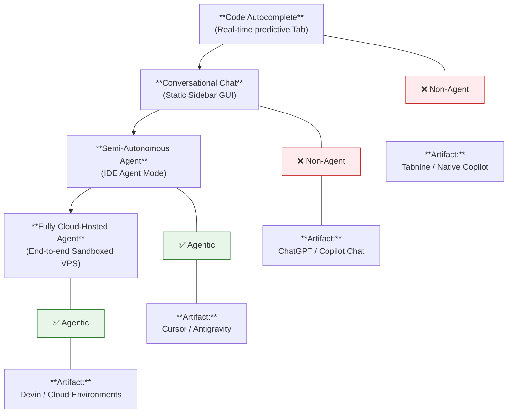

# AI Engineering Toolchain

> "A workman is only as good as his tools." — English Proverb

While Foundation Models are possessing god-tier reasoning capabilities, the developer experience of copy-pasting code snippets back and forth between a web browser and an IDE is an unacceptable operational bottleneck.

Fortunately, the software engineering ecosystem has aggressively evolved. In modern Human-AI pair programming, the Large Language Model acts as the "Brain," and the Engineering Toolchain acts as the "Kinetic Body."

As AI programming enters its industrial phase, tools have mutated from elementary "autocomplete plugins" into a massive, autonomous ecosystem governing the entire Software Development Life Cycle (SDLC). This chapter systematically deconstructs the architectural bonds between IDEs, Toolchains, and Foundation Models, empowering you to deploy a highly efficient, automated engineering perimeter.

---

## Cognitive Evolution: The Brain vs. The Body

### What is a Foundation Model?

AI Models (e.g., Claude 3.5 Sonnet, GPT-4o, Gemini 1.5 Pro, DeepSeek-Coder) are raw "Intelligence Engines" trained by hyper-scalers. They operate as pure cognitive layers: you input text, they output text. The model itself cannot natively read your local filesystem, execute Bash commands, or mutate your Git tree. It is merely a hyper-intelligent "Thinker in a Void."

### What is an AI Toolchain?

AI Toolchains (e.g., Cursor, GitHub Copilot, Claude Code, Antigravity) are the localized application architectures built around these models. They act as the "Executive Torso," providing the model with I/O access to the physical world. The Toolchain layer executes the following high-frequency engineering tasks:

* **Context Aggregation:** Autonomously traversing your local codebase, indexing topological dependencies, and parsing Abstract Syntax Trees (AST).
* **Prompt Compilation:** Packaging your natural language intent, the AST context, local stack traces, and global `.cursorrules` into a mathematically structured payload to route to the Model API.
* **Kinetic Execution:** Ingesting the Model's output and translating it into physical OS commands (e.g., executing Git mutations, running Vitest, rewriting specific line ranges).
* **Telemetry & UI:** Rendering Git Diff visualizations, exposing side-bar chat interfaces, and enforcing human-in-the-loop permission gateways.

### The Trinity Architecture

We can map this framework to a biological system:

| Architectural Role | Biological Equivalent | Engineering Responsibility |
| :--- | :--- | :--- |
| **Foundation Model** | The Brain | Semantic reasoning, logic synthesis, algorithmic deduction. |
| **AI Toolchain** | The Body & Senses | I/O Ops: Reading local code (sight), catching terminal errors (pain), rewriting files (hands). |
| **The Harness (Core Framework)** | The Nervous System | Determines how context is routed and how API latency is managed. The Harness is the primary differentiator between a good tool and a great one. |

Without a Toolchain, an LLM is a "Brain in a Jar"—possessing vast intellect but zero kinetic capability. Without an LLM, a Toolchain is merely an empty IDE—possessing kinetic capability but zero cognitive direction.

---

## The Rise of the Programming Agent

In previous chapters, we deconstructed the architecture of general-purpose AI Agents and their "Perception → Reasoning → Action" execution loops. 

When this Agentic philosophy is applied to software engineering, what is the result?

**Modern AI Programming Tools are fundamentally highly specialized vertical Agents.** Just as Tesla's FSD is an Agent specialized for physical roads, Cursor and Claude Code are Agents specialized for manipulating software architecture.

### Evolutionary Epochs of AI Tooling

AI Toolchains did not achieve Agentic capabilities overnight. They evolved through three distinct architectural generations:

#### Generation 1: The Autocomplete Epoch (2021-2023)
* **Representative Artifacts:** Early GitHub Copilot, Tabnine
* **The Execution Loop:** `Human Types ➔ AI predicts next AST node ➔ Human executes Tab`
* **Agentic Capability:** Zero. The tool possessed zero autonomy and zero kinetic capability outside the cursor. It was essentially a statistically advanced "predictive text keyboard."

#### Generation 2: The Conversational Epoch (2023-2024)
* **Representative Artifacts:** ChatGPT Web interface, Copilot Chat sidebar
* **The Execution Loop:** `Human issues Prompt ➔ AI synthesizes block ➔ Human manually copy-pastes into IDE`
* **Agentic Capability:** Minimal. It could comprehend complex business logic, but it lacked filesystem I/O and Bash privileges. It was a "highly intelligent StackOverflow."

#### Generation 3: The Autonomous Epoch (2024-Present)
* **Representative Artifacts:** Cursor Agent, Claude Code, Aider, Antigravity
* **The Execution Loop:** `Human injects Intent ➔ Agent scans Monorepo ➔ Agent formulates execution matrix ➔ Agent mutates files ➔ Agent executes Vitest ➔ Test fails ➔ Agent parses stack trace ➔ Agent self-heals code ➔ Test passes ➔ Agent reports state to Human`
* **Agentic Capability:** Full Autonomous State. **It possesses kinetic capability (Tool Calling), autonomy (Matrix Planning), and self-healing (The Loop).** 

### Architectural Mapping: Toolchains as Agents

Mapping the standard Agent components to our daily IDE toolchains:

| Theoretical Agent Component | Physical IDE Implementation |
| :--- | :--- |
| **LLM (The Brain)** | The routing to frontier APIs: Claude 3.5 Sonnet, GPT-4o, DeepSeek-R1. |
| **Tools/Actuators (Kinetic I/O)** | Filesystem read/write APIs, Bash execution privileges, AST/Regex scrapers, Linter integrations. |
| **Short-Term Memory** | The active chat session context window, dynamically pruned via RAG. |
| **Long-Term Memory** | Global Configuration Files (`.cursorrules`, `CLAUDE.md`, `ARCHITECTURE.md`). |
| **Planning Engine** | The IDE's "Plan Mode" (Forcing the AI to output a Markdown architectural blueprint prior to mutating physical files). |
| **Perception Engine** | Full-repository vector embeddings, Dependency Graph traversal. |
| **Evaluation Engine** | CI/CD integrations, automated Test Runners (Jest/Pytest), Compiler stdout streams. |
| **The Feedback Loop** | Autonomous self-healing triggered by non-zero Exit Codes: `Test fails ➔ Ingest trace ➔ Reflect ➔ Patch ➔ Recompile`. |

### The Automation Spectrum

The current ecosystem is not a binary choice between "Agent" and "Non-Agent"; it exists on a continuous spectrum of automation:



**The absolute threshold for Agentic classification is: Does the system possess "Autonomous kinetic capability" AND an "Autonomous self-healing loop without human intervention"?**

---

## The API Routing Architecture

For any AI programming tool, the **Harness** (the underlying prompt and context router) dictates the final developer experience. The exact same LLM API will perform radically differently across different IDEs. Elite toolchains deploy proprietary RAG (Retrieval-Augmented Generation) pipelines and model-specific fine-tuning to squeeze top-tier performance out of mid-tier models.

The execution loop operates as follows:

```mermaid
flowchart TD
    A[Human injects Directive] --> B[Harness: Traverses AST & Context]
    B --> C[Harness: Compiles massive multi-shot Prompt]
    C --> D[Router: Dispatches payload to Model API]
    D --> E[Model: Synthesizes execution payload (JSON/XML)]
    E --> F[Harness: Deserializes the execution instruction]
    F --> G[Harness: Executes physical OS Action (e.g., File Mutate)]
    G --> H[UI: Renders Git Diff for Human Verification]
```

### The Three API Routing Ideologies

The ecosystem is currently fractured into three architectural ideologies regarding Model routing:

1. **The Model-Agnostic Ecosystems (The Free Market):** Artifacts like Cursor and Cline. They refuse to lock into a single AI lab. They orchestrate a dynamic API routing network, allowing engineers to hot-swap models based on the task. They deploy background "Auto-Routing," seamlessly directing basic autocomplete to lightning-fast 8B parameter models, and routing massive monolithic refactors to expensive frontier reasoning models (like o3).
2. **The Proprietary Walled Gardens:** Artifacts like Google's Antigravity or GitHub Copilot (historically). While occasionally permitting external APIs, the entire Harness is aggressively optimized and hardcoded for their proprietary models (Gemini or OpenAI). They extract absolute peak performance by aligning the tool's RAG mechanics directly with the model's native latency and context window quirks.
3. **The Hybrid BYOK (Bring Your Own Key) Ecosystems:** Artifacts like Claude Code. Heavily optimized for the Anthropic ecosystem, but permits developers to inject their own API keys to route to competitive models (though the performance degradation is noticeable outside the native ecosystem).

---

## Taxonomy of AI Engineering Tools

The ecosystem has exploded far beyond the "IDE Plugin." The architecture of modern AI tooling is classified into six primary domains based on execution privilege and interface mechanics:

### 1. AI-Native IDEs
Integrated Development Environments engineered from the kernel up around the LLM. The AI is not a plugin; it is the fundamental orchestration engine.

* **Artifacts:** Cursor (The market leader in global adoption, featuring devastating Agent modes), Windsurf (Elite continuous-context awareness), Antigravity (Google's native concurrent Agent IDE).
* **Strategic Advantage:** Flawless workflow continuity. Inline execution, full-repo AST indexing, automated Bash test loops, and seamless Git Diff rendering operate synchronously.
* **Strategic Disadvantage:** Requires migrating off legacy editors (though most are hard-forked from VS Code). Full-repo embedding generation can throttle local CPU/RAM on massive Monorepos.

### 2. Legacy IDE Plugins
Extensions injected into legacy environments (IntelliJ, Visual Studio, Xcode).

* **Artifacts:** GitHub Copilot (The Enterprise compliance juggernaut), Cline (Open-source, hyper-configurable Agent plugin), JetBrains AI.
* **Strategic Advantage:** Zero migration cost. Preserves 10 years of muscle memory and custom keybindings. Elite enterprise SLA, audit logging, and IP indemnification.
* **Strategic Disadvantage:** Constrained by the host IDE's legacy extension API limits. They cannot natively highjack the entire UI frame or execute deep, autonomous, multi-file destructive mutations with the same fluidity as Native IDEs.

### 3. Terminal Agents (CLI / Headless)
Operate natively within the Bash/Zsh terminal. They possess raw Linux execution privileges to parse files, run tests, and execute arbitrary binaries.

* **Artifacts:** Claude Code (The apex predator for terminal reasoning and isolated sandboxing), Aider (The hardcore open-source CLI toolkit).
* **Strategic Advantage:** Maximum kinetic autonomy and destructive capability. Natively interfaces with Git and CI/CD pipelines. They excel at deep architectural refactoring and brute-forcing compiler errors via local execution loops.
* **Strategic Disadvantage:** Steep learning curve. Lacks GUI-based visual diffing; requires absolute mastery of terminal workflows.

### 4. Autonomous Review Agents (CI/CD)
Asynchronous "Digital Principal Engineers" operating invisibly within the deployment pipeline.

* **Artifacts:** CodeRabbit, Copilot Code Review.
* **Strategic Advantage:** Automatically intercepts Pull Requests on GitHub/GitLab. Instantly identifies memory leaks, algorithmic edge-cases, and linting violations before a human reviewer logs on.
* **Strategic Disadvantage:** Highly proficient at identifying localized syntax flaws, but struggles to audit vast, cross-domain business logic deviations. Cannot replace a human Staff Engineer for architectural approvals.

### 5. Fully Hosted Cloud Agents
Deploying high-privilege Agents in remote, isolated Docker containers (VPS) to execute massive, long-running tasks.

* **Artifacts:** Devin (The autonomous pioneer), Claude Code Web, Cursor Cloud.
* **Strategic Advantage:** Absolute abstraction. Inject an Issue URL (e.g., *"Patch Issue #404 and execute coverage"*), and the Agent operates asynchronously for 3 hours, delivering a final PR. The human developer works on separate tasks in parallel.
* **Strategic Disadvantage:** Zero real-time observability. If the Agent hallucinates and enters an infinite execution loop, it burns massive compute costs (Token burn-rate) with zero output.

### 6. Vibe-Coding Frameworks (Rapid App Generators)
Next-generation orchestrators designed to instantly compile and deploy full-stack applications from natural language prompts.

* **Artifacts:** Bolt, v0 (Vercel's elite Next.js generator), Lovable.
* **Strategic Advantage:** Zero syntax required. Capable of scaffolding an MVP, database, and cloud deployment in under 5 minutes.
* **Strategic Disadvantage:** The output is often a monolithic "Black Box." Extremely hostile to enterprise-grade refactoring, custom CI/CD, or complex security auditing. Unsuitable as foundational architecture for production enterprise systems.

---

## The Strategic Deployment Matrix

How do you optimize this arsenal? Elite engineering organizations deploy a multi-layered matrix based on Performance, Latency, and Economics.

### The Economic Capability Gradient

* **Tier 1: Maximum Reasoning & Complexity (High Cost / High Latency)**
  * Anthropic Claude Series (3.5 Sonnet / Opus) ➔ Apex programming logic and syntactic fidelity.
  * OpenAI (o1 / o3) ➔ Apex algorithmic deduction and massive context reasoning.
* **Tier 2: Velocity & Context Volume (Medium Cost)**
  * Google Gemini Series (1.5 Pro) ➔ Unmatched 2M+ Token Context window for full-repo ingestion.
* **Tier 3: The Economic Floor (Hyper-Low Cost)**
  * DeepSeek Series (Coder-V2 / R1) ➔ Delivers Tier-1 engineering capabilities at a fraction of a cent per million tokens. The absolute king of brute-force economic scaling.

### The Combined-Arms Engineering Strategy

1. **The Vanguard (Millisecond Autocomplete):** Utilize edge-optimized, local 8B models (e.g., Copilot's local engine or Windsurf's edge models) for zero-latency, predictive inline typing.
2. **The Main Infantry (Daily Feature Engineering):** Deploy mid-tier models (Claude 3.5 Sonnet) within a Native IDE (Cursor/Antigravity) to execute standard CRUD operations and modular synthesis in the sidebar.
3. **The Heavy Artillery (Architectural Refactoring & Bug Hunting):** When facing a catastrophic system failure, pivot to the CLI. Boot `Claude Code` or an `o3` agent in the terminal, granting it full root execution privileges to hunt the stack trace and aggressively refactor the physical filesystem.
4. **The Security Perimeter (Asynchronous CI/CD):** Mount `CodeRabbit` to your repository's Git hooks to autonomously audit Pull Requests while you sleep.

## The Future Trajectory of Engineering AI

1. **The Harness Eclipses the LLM:** Do not obsess over a model's raw benchmark scores. An elite IDE "Harness" (with hyper-optimized RAG and AST parsing) running a mid-tier model will physically destroy a Tier-1 model running inside a poorly-engineered chat interface.
2. **Models Rotate, Toolchains Remain:** Foundation Models iterate and obsolesce every 6 months. However, your `.cursorrules`, your IDE muscle memory, and your team's custom Agent configurations (`AGENTS.md`) are permanent operational assets. Anchor your workflow to the Toolchain ecosystem, not the specific Model API.
3. **Autonomous API Routing is the Endgame:** The ultimate evolution of the IDE is the "Intelligent Dispatcher." The toolchain will autonomously benchmark your Prompt and instantly route simple CSS tweaks to a hyper-cheap 8B model, while routing a catastrophic database race-condition to an expensive reasoning model—optimizing your billing latency completely invisibly.