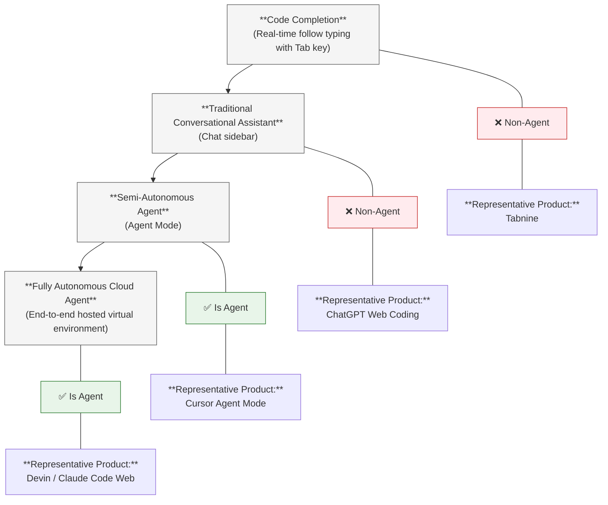
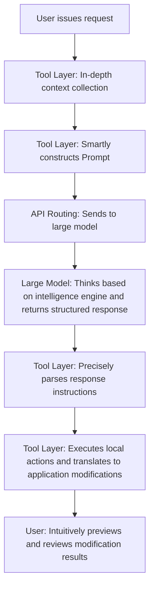

# AI Programming Tools

> "A workman is only as good as his tools." — English Proverb

Although large language models are powerful, if you have to go to a web page and ask every time you write a short snippet of code, it is still inconvenient.

Fortunately, there are already many programming tools on the market that can assist us in calling large language models, making programming simpler. In human-machine collaboration, the large model plays the role of the "brain," while the tool is the "torso."

As AI programming technology enters a new stage, programming tools have evolved from the initial "code auto-completion plugins" into a massive ecosystem covering the entire software development lifecycle. This chapter will systematically dismantle for you the underlying bonds, core classifications, and selection closed loops between AI programming tools and large models in actual development, helping you build a solid, highly efficient AI development frontline.

---

## Cognitive Evolution: Division of Labor Between Tools and Models

### What is an AI Model?

AI models (like Claude, GPT, Gemini, DeepSeek) are large language models trained by AI vendors. They are pure "intelligence engines." You give them text input, and they return text output. The model itself cannot directly read your local files, cannot run compilation commands, and certainly cannot directly modify your project code. It is merely a highly intelligent "thinker."

### What is an AI Programming Tool?

AI programming tools (like Cursor, GitHub Copilot, Claude Code, Google Antigravity) are application tools built around models. They are the "executing torso" that assists the "brain" in interacting with the outside world. The tool layer is responsible for completing the following high-frequency engineering tasks:

* **Context Collection**: Automatically reading files in your codebase, indexing dependencies, and parsing Abstract Syntax Trees (AST).
* **Prompt Construction**: Packaging your development requests, relevant context code, local error messages, and underlying system rule files, and assembling them into structured Prompts to send to the model.
* **Action Conversion and Execution**: Receiving instruction returns from the model and converting them into actual local operations (such as precisely modifying files, automatically running test commands in the terminal).
* **User Interface Presentation**: Providing intuitive code difference (Diff) previews, sidebar conversations, and permission approval mechanisms in the editor.

### The Trinity Analogy Model

We can use the human body system to clearly analogize this collaborative framework:

| Role | Core Analogy | Responsibility Description |
| --- | --- | --- |
| **AI Model** | Brain | Responsible for highly difficult logical thinking, semantic reasoning, and code generation |
| **AI Programming Tool** | Body + Senses | Responsible for seeing (reading code, catching errors), hearing (receiving instructions), and doing (reading/writing files, running tests) |
| **Tool Layer Harness (Underlying Framework)** | Nervous System | Determines how information is processed and transmitted; it is the key engineering design that widens the gap between tools |

Without tools, a model is just a "brain in a jar"—having dragon-slaying skills but unable to change the physical world; without models, a tool is just an "empty shell without a soul"—having hands and feet but blindly ignorant.

---

## From General Agents to Programming Agents: Landing and Inheriting Concepts

In the previous chapter, we systematically dismantled the top-level architecture of AI Agents and their autonomous closed loop of "Perception-Reasoning-Action-Evaluation." We know that the core charm of Agents lies in breaking through the traditional passive response mode of "Q&A," possessing the "hands and feet" to manipulate external tools and the "reflection ability" to self-correct.

So, when this general Agent philosophy lands in the field of software engineering, what form does it evolve into?

**In a word: Modern mainstream AI programming tools are essentially vertical AI Agents specialized in the field of software development.** Just as a self-driving car is an Agent specialized for physical roads, tools like Cursor and Claude Code are Agents traversing the world of code.

### Evolution of Weapons: The Agentification Process of Programming Tools

Reviewing the history of technological development, AI programming tools did not step into the Agent era overnight, but accompanied the evolution of large model capabilities, experiencing three technical generations with distinct characteristics:

#### 1st Generation: Code Completion Era (2021-2023)

* **Representative Products**: Early GitHub Copilot, Tabnine
* **Workflow**: `Developer types ➔ AI predicts the next line ➔ Developer presses Tab to accept`
* **Agent Degree**: Zero. At this time, the tools had no external tool calling capabilities and lacked autonomy. They were not Agents, but merely probability-based "smart advanced input methods."

#### 2nd Generation: Conversational Assistant Era (2023-2024)

* **Representative Products**: Web-based ChatGPT writing code, Copilot Chat sidebar
* **Workflow**: `Developer asks questions ➔ AI generates code snippets ➔ Developer manually copies and pastes into IDE`
* **Agent Degree**: Extremely low. Although it could understand complex business requirements and generate high-quality code, because the model was not equipped with tools (could not directly read/write local files, could not run compilations), it was still not an Agent, just a "Q&A system that understands programming better."

#### 3rd Generation: Autonomous Programming Agent Era (2024-Present)

* **Representative Products**: Cursor Agent Mode, Claude Code, Aider
* **Workflow**: `Developer describes goal ➔ AI autonomously retrieves codebase ➔ Formulates modification plan ➔ Precisely rewrites files ➔ Automatically runs tests in terminal ➔ Discovers test failure ➔ Autonomously analyzes log causes ➔ Modifies code again ➔ Retests until passed ➔ Reports completion to human`
* **Agent Degree**: Complete form. **Has hands and feet (tool calling), has own opinions (autonomous decision-making), has closed loop (retry correction). This is the standard Agent landing form.**

### Architectural Mapping: Engineering Implementation of Agent Components in Programming Tools

Inheriting the Agent standard component architecture learned in the previous chapter, we can very precisely map it to the AI programming tools used daily:

| Agent General Component Architecture | Specific Implementation in AI Programming Tools |
| --- | --- |
| **LLM (Intelligence Brain)** | Cutting-edge large models connected at the bottom, such as Claude 3.5 Sonnet, OpenAI o1/o3, DeepSeek-R1 |
| **Tools Messengers (Action Hands and Feet)** | File system read/write APIs, terminal command line executors, codebase semantic searchers, built-in browsers, Linter static checking tools |
| **Short-Term Memory (Memory)** | Real-time conversation history, currently clipped and spliced Context Window |
| **Long-Term Memory (Knowledge)** | Project global configuration files (e.g., `.cursorrules`, `AGENTS.md`), enterprise internal architecture documents |
| **Planning Ability (Planning)** | Tool's built-in "Plan Mode" (forcing the generation of a multi-step technical breakdown plan before modifying code) |
| **Perception Ability (Perception)** | Full-repository vector indexing, dependency tree parsing, dynamic Abstract Syntax Tree (AST) analysis |
| **Evaluation Ability (Evaluation)** | Automated testing frameworks (e.g., Jest, Pytest), code compiler error interception |
| **Feedback Loop (Loop)** | Autonomous correction triggered upon encountering execution errors: `Test failure ➔ Extract logs ➔ Self-reflection ➔ Regenerate code ➔ Recompile` |

### Beware of Confusion: The Spectral Distribution of the Tool Ecosystem

It is important to note that the current AI programming tool ecosystem is not black and white; it actually presents a **continuous spectrum transitioning from "non-Agent" to "full Agent"**:

**The golden standard for determining whether a tool has crossed the Agent threshold is whether it simultaneously possesses "autonomous tool calling" and "a multi-round reflection closed loop without human intervention."**

### Concept Sandbox: Deconstructing an Automation Script from an Agent Perspective

To help you thoroughly see its underlying logic, we can try to use the Agent theory from the previous chapter to deconstruct a simplest automation mini-experiment: Suppose we want to write a Python script that calls a large model API to automatically control the Windows operating system. In this micro-system:

* **Brain (LLM)**: The OpenAI or DeepSeek API you call via network requests.
* **Hands and Feet (Tools)**: Local functions you wrote using the PyAutoGUI library to simulate mouse clicks, keyboard inputs, and reading screenshots.
* **Decision Mechanism (Function Calling)**: Based on the current screenshot status, the large model autonomously makes logical inferences to decide which function to call next (e.g., it finds it needs to save a file, so it decides to call the "click save button" function).
* **Feedback Loop (Agent Loop)**: The new status of the Windows system after the click (operation successful or an error pop-up appeared) is fed back as new input to the large model, which decides whether to continue to the next step or retry on error.

Although this practice project is small in scale, its underlying working philosophy is exactly the same as Cursor or Claude Code. The only difference between them is: commercial-grade programming Agents' toolboxes are filled with "AST parsing, Git commits, Linter checking, and test runners," while your simple Agent toolbox is filled with "Windows underlying operating system APIs."

---

## Architectural Analysis

For a typical AI programming tool, its base framework (Agent Harness) is the decisive factor that determines the final experience. The same large model might perform vastly differently across different programming tools; the reason lies in the huge differences in Prompt construction strategies and context management technologies among various tools. Excellent tools, through self-developed Retrieval-Augmented Generation (RAG) and instruction fine-tuning tailored to specific models, can unleash true combat power from a mid-range model that is on par with a top-tier model "running naked."

The following is the standard closed-loop workflow for interaction between AI programming tools (i.e., programming Agents) and large model APIs:

### Multi-Faceted Binding Strategies of Tools and Models

Current mainstream AI tools in the market are mainly divided into three major factions in their attitude towards models:

* **Model-agnostic Free Faction**: Represented typically by Cursor and GitHub Copilot. They do not bind to any single model provider but build an inclusive ecosystem network, allowing users to freely switch large models across different tasks. Their core competitiveness does not lie in the model itself, but in how they fine-tune instruction configurations for different cutting-edge models, even introducing "automatic model selection" features in the background, which can automatically route simple completions to fast small models and complex refactoring routes to cutting-edge reasoning large models based on task complexity.
* **Vendor-Exclusive Deep Binding Faction**: Represented typically by Google's Antigravity. Although it nominally begins to be compatible with external cutting-edge models, at its core, it is still extremely tailor-made for the underlying features of its own Gemini series models (such as million-level ultra-long texts, specific tool calling formats) across the full stack, deeply grinding the Agent loop with the model's reasoning style to push the intellectual limit of a single ecosystem to its peak.
* **Self-Developed and External Dual-Track Hybrid Faction**: Represented by Anthropic's Claude Code. It deeply optimizes its own Claude series models, but also allows users to process via external general large models using their own keys (Bring Your Own Key, BYOK). However, the effect is certainly not as good as using its own models.

---

## AI Programming Tool Classification

The current AI programming tool ecosystem has far exceeded the early simple "IDE plugin" form. According to the latest classification frameworks in the industry, these tools can be divided into the following six major categories based on interaction and automation modes:

### 1. AI-Native IDEs

Independent editors redesigned around the AI experience right from the underlying architecture phase. AI here is not an "ancillary plugin in the menu," but the core organizer deeply embedded in the editing flow.

* **Representative Products**: Cursor (the leading product with the highest global market share and discussion currently, featuring powerful Agent mode and full-project code block rewriting), Windsurf (known for its extremely smooth continuous context awareness engine), Kiro (specification-driven development tool tailored for compliance industries), Antigravity (native concurrent proxy IDE developed by Google).
* **Pros**: Workflow continuity is top-tier; inline conversation, full-repository indexing, automated script running, and visual code Diff review are all accomplished in one go.
* **Cons**: There is a certain editor migration cost (most are deeply customized and modified based on VS Code); in extremely massive large-scale codebases with tens of thousands of files, full-repository indexing consumes local resources significantly.

### 2. Traditional IDE Plugins

Plugs into your existing development environment as a plugin, not breaking your shortcut keys and editor preferences accumulated over the years.

* **Representative Products**: GitHub Copilot (the absolute giant in enterprise compliance and engineering implementation), Cline (a fully open-source, highly free, powerful Agent plugin), Continue (an excellent open-source framework fully supporting local private model deployment), JetBrains AI Assistant (the official plugin deeply integrating IntelliJ's native refactoring capabilities).
* **Pros**: Zero migration cost. Perfectly retains all your personal configurations in IntelliJ, Vim, Xcode, or older versions of VS Code. Enterprise-grade plugins provide excellent SLA guarantees, audit logs, and intellectual property protection.
* **Cons**: Constrained by the plugin architecture of the host editor, AI cannot deeply control interface behavior like native IDEs, and the Agent's cross-file autonomous destructive modification capability is relatively restrained.

### 3. Terminal Agents (CLI Agents)

Runs completely in your Shell terminal, adopts conversational interaction, and directly possesses the highest Linux-level execution privileges to read files, run tests, and execute various terminal commands.

* **Representative Products**: Claude Code (an extremely powerful terminal weapon in terminal reasoning, large-scale project troubleshooting, and Linux-level sandbox isolation), Aider (the most mature, widely acclaimed open-source CLI tool by geeks, supporting automatic Git commits and multi-model mounting), Gemini CLI.
* **Pros**: Strongest autonomy and destructive power; naturally integrates into Git workflows and CI/CD scripts. Its context window is often extremely large, and its global deep cross-file Bug troubleshooting and large-scale engineering refactoring capabilities significantly surpass ordinary IDE plugins. It can directly capture compilation or runtime errors, realizing a local "execute-error-reflect-retry" closed loop.
* **Cons**: The learning curve is relatively steep, lacks an intuitive GUI visual Diff interface, and requires developers to be fully confident in their command-line mastery.

### 4. PR / Code Review Agents

Does not interrupt your real-time flow of writing code, but plays the role of an asynchronous "digital code reviewer" silently working in the background.

* **Representative Products**: CodeRabbit (currently the most professional AI review tool, providing line-by-line conversational code reviews), GitHub Copilot Code Review.
* **Pros**: Works completely asynchronously. Automatically triggered after you submit a Pull Request to GitHub/GitLab, sharply catching security vulnerabilities, boundary infinite loops, and style inconsistencies easily missed by humans.
* **Cons**: Excels at finding local technical hard flaws, but when faced with determining strong business logic correctness, its depth of understanding still cannot completely replace a senior human architect.

### 5. Cloud Autonomous Agents

Provides high-privilege, long-cycle maximum autonomy. You only need to throw it a task described in natural language (e.g., "Fix GitHub Issue #102 and pass the tests"), and it will work independently in a remotely isolated environment for hours, directly delivering the final result.

* **Representative Products**: Devin (the world's first fully autonomous AI software engineer prototype to cause a sensation), Claude Code Web, Cursor Cloud Agents.
* **Pros**: Liberates human productivity to an extremely high degree. Suitable for clearly defined, time-consuming tasks; developers can handle other core work simultaneously, letting the AI work in parallel in the background.
* **Cons**: The sense of real-time control is the weakest, and the quality of task execution is prone to fluctuations. Once a task fails or falls into an infinite loop, it will still generate high compute costs under the pay-as-you-go model.

### 6. Web App Generators (Vibe Coding Platforms)

A completely new form aimed at non-professional developers or full-time engineers to rapidly validate prototypes. You only need to say a single sentence, and it can generate a complete Web application including full-stack code, a database, and complete one-click deployment for you from scratch within minutes.

* **Representative Products**: Bolt (the masterpiece based on in-browser full-stack execution), Lovable (a generation platform with extremely strong front-end UI design aesthetics), v0 (the top-tier Next.js ecosystem technical interface generator created by Vercel), Replit Agent.
* **Pros**: Zero coding threshold. The speed from idea to runnable entity is outrageously fast, making it an excellent weapon for quickly building MVPs (Minimum Viable Products) and internal testing tools.
* **Cons**: Generated code is often a "black box," difficult for fine-grained later maintenance and large-scale refactoring; customization capability is relatively weak, making it unsuitable to be directly used as the underlying foundation for enterprise production environments.

---

## Tool Selection Decision Framework

Faced with such a massive spectrum of weapons, how do you choose the equipment that best suits you? We need to build a decision chain from three core dimensions: performance experience, technical level, and comprehensive cost.

### Performance and Price Positioning

In the current market landscape, the combination of different tools and the models behind them presents clear gradient characteristics:

* **Top Reasoning/Performance Benchmark (High Tariff/Fixed Monthly Fee)**
* Anthropic Claude Series (Sonnet / Opus) ➔ Strongest programming logic and advanced reasoning performance
* OpenAI Reasoning Series (o1 / o3) ➔ Top-tier algorithmic deduction and long-term thinking capabilities

* **Mid-Range Balanced Cost-Performance (Medium Tariff)**
* Google Gemini Series (Pro / Flash) ➔ Ultra-long context capacity and generous free quotas

* **Absolute Price Bottom Line (Extremely Low Cost/Floor Price)**
* DeepSeek Series (V4 / R1) ➔ Provides astonishing coding performance comparable to the first tier at an extremely low floor price cost

In summary:

* **If you pursue extreme performance and reasoning correctness**: Tools with the Claude series or OpenAI reasoning large models as brains (terminal running Claude Code paired with Claude Sonnet) are unmatched choices. They possess the highest first-pass correctness rate when handling complex system refactoring and deep Debugging, which can save a lot of human time spent wiping up after AI mistakes. Correspondingly, the Pro/Max subscriptions or official advanced API costs of such commercial software belong to the mid-to-high end of the market.
* **If you are highly cost-sensitive and pursue extreme savings**: Using Agent tools that support custom APIs (like Cline or Aider) paired with **DeepSeek models** is the absolute king of low cost currently. Relying on its industry-disruptive extremely low floor price, DeepSeek has reduced the consumption cost per million Tokens to a fraction of overseas big tech companies, thoroughly freeing you from "Token anxiety." And the massive free testing quota provided by Google Gemini is also a good choice for beginners to start with zero cost.

### Layered Combination Strategy

Professional developers never hope that "one tool eats all," but form a digital position coordinated by multiple branches through reasonable orchestration:

* **Frontline Light Cavalry (Tab Real-time Completion)**: Handed over to extremely fast, tool-built-in lightweight small models (like Copilot's built-in high-speed completion or Windsurf's self-developed small model), providing millimeter-level predictive typing response.
* **Central Army Main Force (Daily Feature Writing, Small Modifications)**: Wake up mid-range cutting-edge models (like Claude Sonnet) in native IDEs like Cursor, conducting efficient modular development in the sidebar.
* **Assault Special Forces (Complex Large Refactoring, Architecture Detox, Global Bug Tracking)**: Resolutely switch to the terminal, summon Claude Code or OpenAI reasoning large models, give them full throttle to conduct deep thinking and file rewriting for several minutes.
* **Rear Quality Inspector (Asynchronous Compliance and CR Review)**: Mount CodeRabbit on the hosting platform; while you drink coffee, it automatically reviews your code for security vulnerabilities from a third-party perspective.

---

## Future Trends

1. **The Tool's Harness is Often More Important than the Model Itself**:
Do not blindly worship a model's raw intelligence score. A finely polished "smart tool layer" with excellent context retrieval capabilities, knowing how to elegantly trim code snippets, and preventing context rot, can enable a mid-range model to unleash actual performance that surpasses a top-tier large model "running naked" in a rudimentary tool.
2. **Models Are Transitory Soldiers, Tools Are the Iron Camp**:
In the AI field, the underlying core large models almost experience a reshuffle and generational turnover every few months. But the `.cursorrules` (rule definition files), team development habits, and skill precipitation you accumulate in a specific tool (like Cursor or Claude Code) have high stickiness and lasting value. Therefore, choose tools based on workflow ecosystems, and choose models based on specific tasks.
3. **Multi-Model Hybrid Intelligent Routing is Becoming an Industry Iron Law**:
The focus of future competition is shifting from a single "whose model is stronger" to "whose Harness scheduling framework is smarter." Excellent programming tools will act like skilled labor contractors, automatically distributing simple brick-laying jobs to cheap small models, and highly difficult blueprint designs to high-cost reasoning large models, thereby helping you achieve a perfect balance between performance and billing.